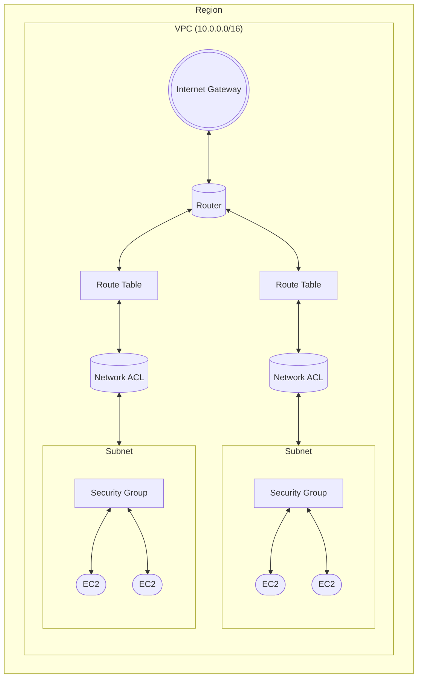

### 1. Assume Role

Assuming an AWS role allows you to obtain temporary security credentials (access key, secret access key, and session token) to access AWS resources in another account or use different permissions within the same account. The `sts:AssumeRole` action allows you to assume a role that exists in another AWS account or within your own account. When you assume a role, you temporarily gain the privileges associated with that role.

- **Cross-account access**: You can assume a role in another AWS account to access resources in that account.
- **Within the same account**: Assume a role with different permissions than the user or service executing the current command.

The following explains how to use Assume Role to grant Account A access to Account B's EKS resources.

#### Step 1: Create an IAM Role in Account B

Create an IAM role in Account B with a trust policy that allows Account A to assume this role. This role grants permission to manage EKS resources in Account B.

**Example trust policy for the AssumeRole role in Account B**:

  This policy allows users or roles in Account A to assume the role:

  ```json
  {
    "Version": "2012-10-17",
    "Statement": [
      {
        "Effect": "Allow",
        "Principal": {
          "AWS": "arn:aws:iam::123456789012:root" // Account A ID
        },
        "Action": "sts:AssumeRole"
      }
    ]
  }
  ```

  Alternatively, you can specify a specific role in Account A:

  ```json
  {
    "Version": "2012-10-17",
    "Statement": [
      {
        "Effect": "Allow",
        "Principal": {
          "AWS": "arn:aws:iam::123456789012:role/AccountARole" // Replace with specific role in Account A
        },
        "Action": "sts:AssumeRole"
      }
    ]
  }
  ```
- Attach EKS permissions to the role in Account B:
  - Attach the required EKS policies, such as AmazonEKSClusterPolicy or custom permissions, to the role to manage EKS resources.

#### Step 2: Create an IAM Policy in Account A

To allow a user or service in Account A to assume a role in Account B, create an IAM policy in Account A.

**Example IAM policy for Account A**:
```json
{
  "Version": "2012-10-17",
  "Statement": [
    {
      "Effect": "Allow",
      "Action": "sts:AssumeRole",
      "Resource": "arn:aws:iam::111122223333:role/EKSAdminRole" // Role ARN in Account B
    }
  ]
}
```
- Attach this policy to the required users, groups, or roles in Account A.

#### Step 3: Assume a Role in Account A
A user or service in Account A that has permission to assume the role can do so using the AWS CLI, SDKs, or AWS Console.

**Example with AWS CLI**:
```json
aws sts assume-role \
  --role-arn arn:aws:iam::111122223333:role/EKSAdminRole \
  --role-session-name eks-session
```
- This command assumes the role in Account B and provides temporary credentials (access key, secret key, and session token) that can be used to access and manage resources.

#### Step 4: Use Temporary Credentials to Access Resources
Using temporary credentials, you can manage resources in Account B with Account A's permissions.

**Example for updating kubeconfig to manage an EKS cluster in Account B**:
```json
aws eks --region us-west-2 update-kubeconfig --name eks-cluster \
  --role-arn arn:aws:iam::111122223333:role/EKSAdminRole
```
- This lets you use kubectl from Account A to manage the EKS cluster in Account B.

#### `sts:AssumeRoleWithWebIdentity`
Used to temporarily acquire a role based on a federated identity from an external provider (OIDC or SAML) such as Google, GitHub Actions, AWS Cognito, or an OIDC-compatible identity provider.

### Authentication Method
Requires an OIDC token or SAML assertion instead of AWS IAM credentials.

##### Key Use Cases
- **OIDC Integrated Access**: Used with GitHub Actions, Kubernetes service accounts, AWS Cognito, or external identity providers.
- Enables secure, short-term access to AWS resources without long-term IAM credentials.
- An OIDC provider issues an OIDC token to a user or service, which is included in the `AssumeRoleWithWebIdentity` API call to access AWS resources.
- AWS validates the token against the configured OIDC provider and, if the token and conditions are valid, issues temporary credentials for the role.

### `sts:AssumeRole` vs `sts:AssumeRoleWithWebIdentity`

| Features                      | `sts:AssumeRole`                          | `sts:AssumeRoleWithWebIdentity`                 |
|-------------------------------|-------------------------------------------|-------------------------------------------------|
| **Authentication Method**     | AWS IAM Credentials (Access Key and Secret Key) | OIDC token or SAML assertion                   |
| **Use Case**                  | Cross-account access within AWS           | Integrated access from external providers       |
| **Supported ID Types**        | AWS IAM entities (users, groups, roles)   | Federated ID (e.g., Google, GitHub, Cognito)    |
| **CI/CD Integration**         | Rarely used                               | Frequently used in GitHub Actions, Kubernetes, etc. |

---

### 2. Ingress Group

- In AWS, ingress group is a function that allows you to manage multiple ingress resources by consolidating them into one load balancer (ALB).
- This allows multiple Kubernetes namespaces or applications from different teams to share the same ALB and set different Ingress rules.
- Using an ingress group can save network resources and increase management efficiency.
- Basically, ingress does not belong to an ingress group, and ingress is an "implicit IngressGroup", that is, it exists as an independent entity.

#### Ingress Setting the group name

- Define the group name using the `alb.ingress.kubernetes.io/group.name` annotation.
- Ingress resources with the same group name share one ALB.
- Ingress resources assigned to the ingress group ALB search for the AWS tag `ingress.k8s.aws/stack` (it is a tag in the listener rule). The value of this tag is the name of the IngressGroup.
- Resources that do not use the ingress group set the tag value in the format `namespace/ingressname`.
- If you change the groupName assigned to the ingress resource, Ingress will be moved from the existing group to the new IngressGroup and managed in the ALB of the new IngressGroup.
- If the ALB for the new IngressGroup does not exist, a new ALB is automatically created.
- The ALB of the ingress group can be found by searching the AWS tag `ingress.k8s.aws/stack` with the name of the ingress group as the value.
- Example: `alb.ingress.kubernetes.io/group.name: my-team.awesome-group`

#### Setting Ingress Group ranking

- You can specify the order using the `alb.ingress.kubernetes.io/group.order` annotation.
- Ingress rules with lower numeric order values are applied first, and specific priorities can be specified for the same path or host.
- Example: `alb.ingress.kubernetes.io/group.order: 10`

#### Ingress Group Example

In the example below, two ingress resources share a group called `my-shared-group` and requests are processed by one ALB.

```yaml
# Ingress for Service A
apiVersion: networking.k8s.io/v1
kind: Ingress
metadata:
  name: service-a-ingress
  annotations:
    alb.ingress.kubernetes.io/group.name: "my-shared-group"
    alb.ingress.kubernetes.io/group.order: "10"
spec:
  rules:
    - host: "service-a.example.com"
      http:
        paths:
          - path: /
            pathType: Prefix
            backend:
              service:
                name: service-a
                port:
                  number: 80

# Ingress for Service B
apiVersion: networking.k8s.io/v1
kind: Ingress
metadata:
  name: service-b-ingress
  annotations:
    alb.ingress.kubernetes.io/group.name: "my-shared-group"
    alb.ingress.kubernetes.io/group.order: "20"
spec:
  rules:
    - host: "service-b.example.com"
      http:
        paths:
          - path: /
            pathType: Prefix
            backend:
              service:
                name: service-b
                port:
                  number: 80
```

- `service-a` and `service-b` will each belong to the ingress group `my-shared-group`, and `service-a` will be applied first as `order` 10.

#### Reference

- [Ingress annotations](https://github.com/kubernetes-sigs/aws-load-balancer-controller/blob/main/docs/guide/ingress/annotations.md)

---

### 3. Ingress Traffic Listening

#### listen-ports- Specifies the ports on which the ALB listens.

- Example: `alb.ingress.kubernetes.io/listen-ports: '[{"HTTP": 80}, {"HTTPS": 443}, {"HTTP": 8080}, {"HTTPS": 8443}]'`- Applies to all Ingresses within an IngressGroup, so each Ingress can define its own port, and the rule only applies to the ports specified for each Ingress.
- If the same listening port is defined by multiple Ingresses within an IngressGroup, it is applied according to the order of the IngressGroup.
- Default: If `listen-ports` is not specified and no certificate is used, the default is `{"HTTP": 80}` and, if a certificate is provided, `{"HTTPS": 443}`.
- WARNING: You cannot have duplicate load balancer ports within the same group. (Exception: Specifying `alb.ingress.kubernetes.io/group.order: 10`)
- Defining `listen-ports` on one Ingress within an IngressGroup is sufficient, as the ALB consolidates these settings for all Ingresses in the group.

#### ssl-redirect- Enables SSL redirect by specifying the port to which HTTP traffic is redirected (usually HTTPS port 443).

- Example: `alb.ingress.kubernetes.io/ssl-redirect: '443'`- SSL redirect (`ssl-redirect`), if defined in an IngressGroup, affects all Ingresses within the group.
- When SSL redirect is enabled, all HTTP listeners are configured to redirect to HTTPS by default, ignoring other HTTP rules.

#### etc- **`alb.ingress.kubernetes.io/ip-address-type`**:

- Allows you to specify whether the ALB should use `ipv4` or `dualstack` to support IPv4 and IPv6 traffic.
- Example: `alb.ingress.kubernetes.io/ip-address-type: ipv4 or dualstack` - **ipv4**: Configures the ALB to use only IPv4 addresses, meaning that the ALB handles IPv4 traffic exclusively.
- **dualstack**: The ALB will have both IPv4 and IPv6 addresses and can route traffic for both address types.

- **`alb.ingress.kubernetes.io/customer-owned-ipv4-pool`**:
  - Specifies a customer-owned IPv4 address pool for the ALB when using an Outpost environment.
  - **Warning**: This annotation cannot be changed. To change or restrict it, you must recreate the Ingress.
  - Example: `alb.ingress.kubernetes.io/customer-owned-ipv4-pool: ipv4pool-coip-xxxxxxx`

#### Reference

- [Ingress annotations](https://github.com/kubernetes-sigs/aws-load-balancer-controller/blob/main/docs/guide/ingress/annotations.md)

---

### 4. Ingress Traffic Routing

- `alb.ingress.kubernetes.io/load-balancer-name`  
  - All Ingresses within an IngressGroup must use the same load balancer name.  
  - The name must not exceed 32 characters, otherwise, it will result in an error.

- `alb.ingress.kubernetes.io/target-type`  
  - `instance` mode routes traffic to all EC2 instances in the cluster with an open NodePort for the service.  
  - When using `instance` mode, the service must be of type `NodePort` or `LoadBalancer`.  
  - `ip` mode routes all traffic directly to pods.  
  - The network plugin must use secondary IP addresses of ENIs for pod IPs when using `ip` mode.  
  - [amazon-vpc-cni-k8s](https://github.com/aws/amazon-vpc-cni-k8s)  
  - To make sticky sessions work with an application load balancer, `ip` mode is required. The service type is not important when using `ip` mode.

- `alb.ingress.kubernetes.io/target-node-labels`  
  - Specifies the nodes to include in the target group for instances with the `target` type.  
  - Example: `alb.ingress.kubernetes.io/target-node-labels: label1=value1, label2=value2`

- `alb.ingress.kubernetes.io/backend-protocol`  
  - Specifies the protocol used when routing traffic to the pods.

- `alb.ingress.kubernetes.io/backend-protocol-version`  
  - Specifies the application protocol used when routing traffic to pods. Valid only when HTTP or HTTPS is used as the backend protocol.  
  - Example:  
    - `alb.ingress.kubernetes.io/backend-protocol-version: HTTP2`  
    - `alb.ingress.kubernetes.io/backend-protocol-version: GRPC`

- `alb.ingress.kubernetes.io/actions.${action-name}`  
  - Provides a way to configure load balancer listener rules, such as for redirection actions.  
  - The `serviceName` in the annotation must match the `serviceName` in the Ingress rule, and the `servicePort` must always be set to `use-annotation`.

- `alb.ingress.kubernetes.io/conditions.${conditions-name}`  
  - Provides a way to specify routing conditions beyond the host/path conditions in the Ingress.  
  - The `serviceName` in the annotation must match the `serviceName` in the Ingress rule, and the `servicePort` must always be set to `use-annotation`.

```yaml
apiVersion: networking.k8s.io/v1
kind: Ingress
metadata:
  namespace: default
  name: ingress
  annotations:
    alb.ingress.kubernetes.io/scheme: internet-facing
    alb.ingress.kubernetes.io/actions.rule-path1: >
      {"type":"fixed-response","fixedResponseConfig":{"contentType":"text/plain","statusCode":"200","messageBody":"Host is www.example.com OR anno.example.com"}}
    alb.ingress.kubernetes.io/conditions.rule-path1: >
      [{"field":"host-header","hostHeaderConfig":{"values":["anno.example.com"]}}]
    alb.ingress.kubernetes.io/actions.rule-path2: >
      {"type":"fixed-response","fixedResponseConfig":{"contentType":"text/plain","statusCode":"200","messageBody":"Path is /path2 OR /anno/path2"}}
    alb.ingress.kubernetes.io/conditions.rule-path2: >
      [{"field":"path-pattern","pathPatternConfig":{"values":["/anno/path2"]}}]
    alb.ingress.kubernetes.io/actions.rule-path3: >
      {"type":"fixed-response","fixedResponseConfig":{"contentType":"text/plain","statusCode":"200","messageBody":"Http header HeaderName is HeaderValue1 OR HeaderValue2"}}
    alb.ingress.kubernetes.io/conditions.rule-path3: >
      [{"field":"http-header","httpHeaderConfig":{"httpHeaderName": "HeaderName", "values":["HeaderValue1", "HeaderValue2"]}}]
    alb.ingress.kubernetes.io/actions.rule-path4: >
      {"type":"fixed-response","fixedResponseConfig":{"contentType":"text/plain","statusCode":"200","messageBody":"Http request method is GET OR HEAD"}}
    alb.ingress.kubernetes.io/conditions.rule-path4: >
      [{"field":"http-request-method","httpRequestMethodConfig":{"Values":["GET", "HEAD"]}}]
    alb.ingress.kubernetes.io/actions.rule-path5: >
      {"type":"fixed-response","fixedResponseConfig":{"contentType":"text/plain","statusCode":"200","messageBody":"Query string is paramA:valueA1 OR paramA:valueA2"}}
    alb.ingress.kubernetes.io/conditions.rule-path5: >
      [{"field":"query-string","queryStringConfig":{"values":[{"key":"paramA","value":"valueA1"},{"key":"paramA","value":"valueA2"}]}}]
    alb.ingress.kubernetes.io/actions.rule-path6: >
      {"type":"fixed-response","fixedResponseConfig":{"contentType":"text/plain","statusCode":"200","messageBody":"Source IP is 192.168.0.0/16 OR 172.16.0.0/16"}}
    alb.ingress.kubernetes.io/conditions.rule-path6: >
      [{"field":"source-ip","sourceIpConfig":{"values":["192.168.0.0/16", "172.16.0.0/16"]}}]
    alb.ingress.kubernetes.io/actions.rule-path7: >
      {"type":"fixed-response","fixedResponseConfig":{"contentType":"text/plain","statusCode":"200","messageBody":"multiple conditions applies"}}
    alb.ingress.kubernetes.io/conditions.rule-path7: >
      [{"field":"http-header","httpHeaderConfig":{"httpHeaderName": "HeaderName", "values":["HeaderValue"]}},{"field":"query-string","queryStringConfig":{"values":[{"key":"paramA","value":"valueA"}]}},{"field":"query-string","queryStringConfig":{"values":[{"key":"paramB","value":"valueB"}]}}]
spec:
  ingressClassName: alb
  rules:
    - host: www.example.com
      http:
        paths:
          - path: /path1
            pathType: Exact
            backend:
              service:
                name: rule-path1
                port:
                  name: use-annotation
          - path: /path2
            pathType: Exact
            backend:
              service:
                name: rule-path2
                port:
                  name: use-annotation
          - path: /path3
            pathType: Exact
            backend:
              service:
                name: rule-path3
                port:
                  name: use-annotation
          - path: /path4
            pathType: Exact
            backend:
              service:
                name: rule-path4
                port:
                  name: use-annotation
          - path: /path5
            pathType: Exact
            backend:
              service:
                name: rule-path5
                port:
                  name: use-annotation
          - path: /path6
            pathType: Exact
            backend:
              service:
                name: rule-path6
                port:
                  name: use-annotation
          - path: /path7
            pathType: Exact
            backend:
              service:
                name: rule-path7
                port:
                  name: use-annotation
```

#### Reference

- [Ingress annotations](https://github.com/kubernetes-sigs/aws-load-balancer-controller/blob/main/docs/guide/ingress/annotations.md)

---

### 5. Ingress Access Control

- `alb.ingress.kubernetes.io/scheme`
  - Used to define load balancer access types in Kubernetes Ingress configurations with AWS Application Load Balancer (ALB).
  - This annotation tells AWS whether the ALB is Internet-facing (public) or internal (private).
    - `internet-facing`: Makes the ALB publicly accessible via the internet.
    - `internal`: Makes the ALB private by restricting its access to only within the VPC or connected network.

- `alb.ingress.kubernetes.io/inbound-cidrs`
  - Allows only specified IP ranges (CIDRs) to connect to the ALB, restricting access.
  - Particularly useful for controlling access to private applications or internal resources by limiting the range of IPs that can access the ALB.
  - If the Ingress is part of an IngressGroup, the `inbound-cidrs` annotation applies to all Ingress resources in the group.
  - However, `inbound-cidrs` applies only to ports defined for the corresponding Ingress.
    - Therefore, to avoid collisions when multiple Ingresses share the same listening port, `inbound-cidrs` must be defined for only one of those Ingresses.
  - If you specify `alb.ingress.kubernetes.io/security-groups` in Ingress, the `inbound-cidrs` annotation is ignored.
  - If you do not specify the `inbound-cidrs` annotation:
    - `0.0.0.0/0` (all IPv4 addresses) will be allowed if the ALB’s **IPAddressType** is set to `ipv4`.
    - `0.0.0.0/0` and `::/0` (all IPv4 and IPv6 addresses) will be allowed if the ALB's **IPAddressType** is set to `dualstack`.

- `alb.ingress.kubernetes.io/security-groups`
  - Specify the security group to connect to the load balancer.
  - If there is no corresponding annotation, the controller automatically creates a security group, connects the security group to the load balancer, and allows `listen-ports` access to `inbound-cidrs` and `security-group-prefix-lists`.
  - Additionally, the Node/Pod security group is modified to allow inbound traffic in this security group.
  - In other words, if you want to apply the security group you created to Pods and Nodes, you can use it.
  - Example: `alb.ingress.kubernetes.io/security-groups: sg-xxxx, nameOfSg1, nameOfSg2`

- `alb.ingress.kubernetes.io/manage-backend-security-group-rules`
  - Specifies whether the controller will configure security group rules on the Node/Pod for traffic access.
  - Applies only when a security group is specified through `alb.ingress.kubernetes.io/security-groups`.
  - Example: `alb.ingress.kubernetes.io/manage-backend-security-group-rules: "true"`

#### Reference
- [Ingress annotations](https://github.com/kubernetes-sigs/aws-load-balancer-controller/blob/main/docs/guide/ingress/annotations.md)

---

### 6. AWS Network ACL vs Security Group

| Security Group(Stateful)                      | AWS Network ACL(Stateless)                       |
|-----------------------------------------------|--------------------------------------------------|
| Applied per instance (first layer of security) | Applied per subnet (second layer of security)     |
| Only supports allow rules                       | Supports both allow and deny rules                |
| Automatically allows responses to outbound requests | Requires explicit rule for outbound responses |
| Evaluates all rules to allow traffic            | Allows or denies traffic based on rule number order |
| Applies only to specified instances             | Automatically applies to all instances in the subnet |



---