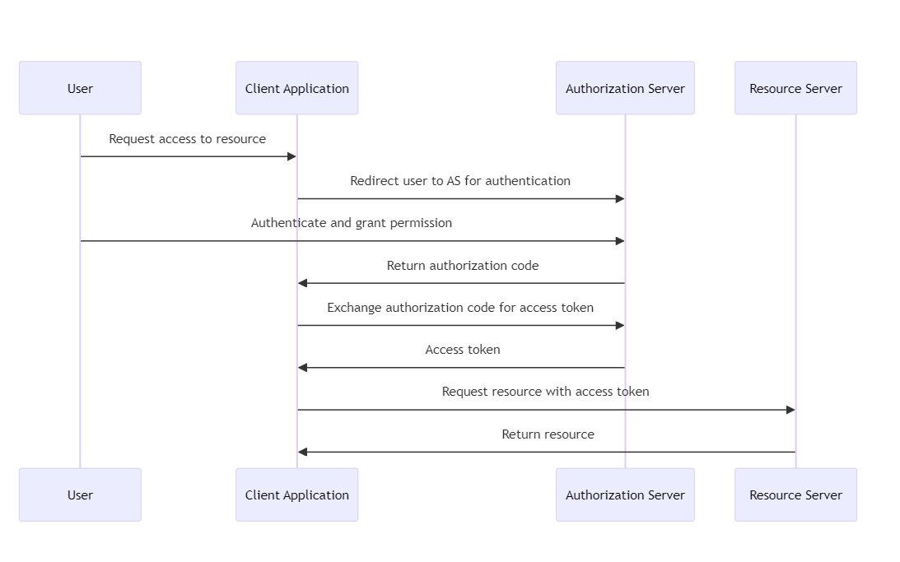
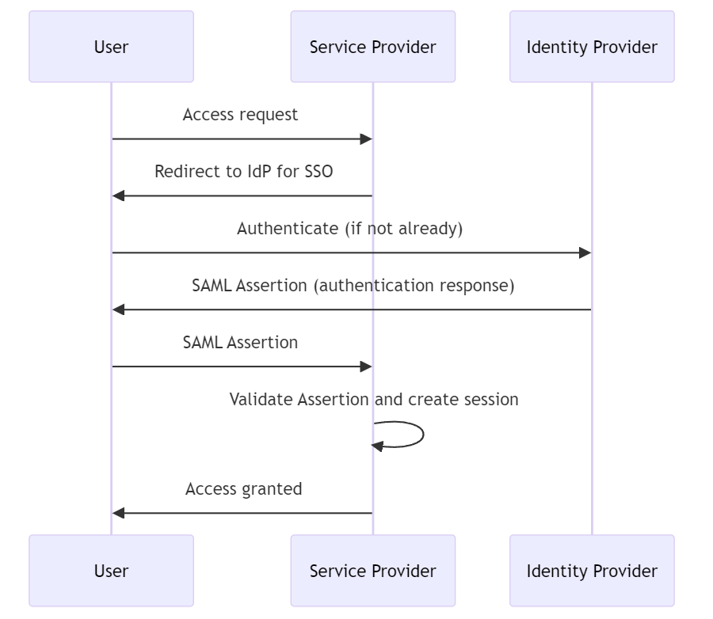
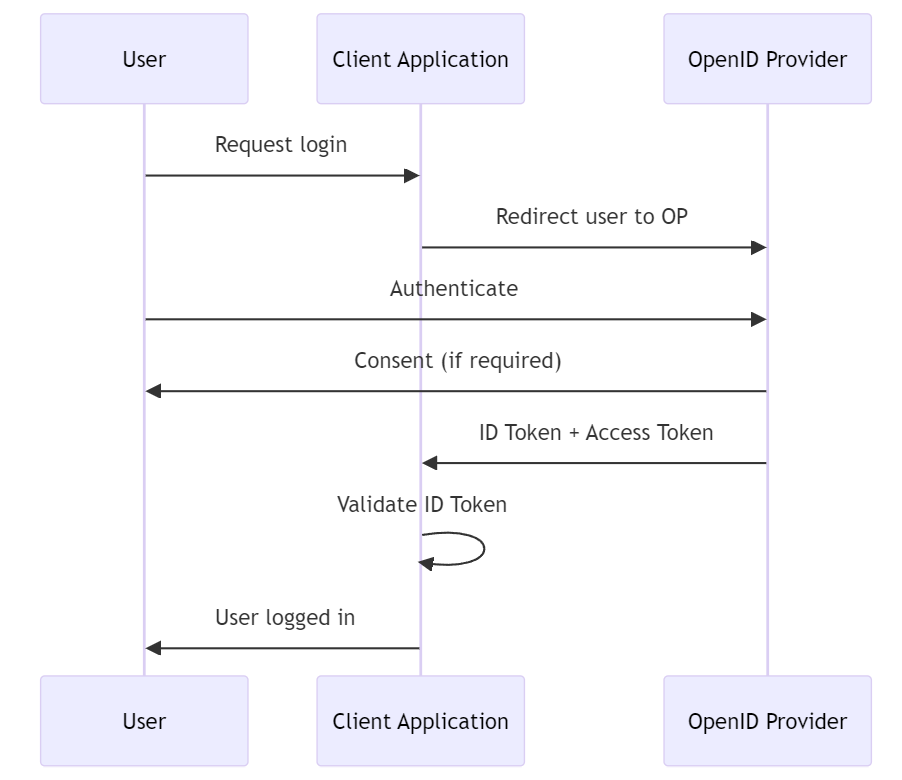
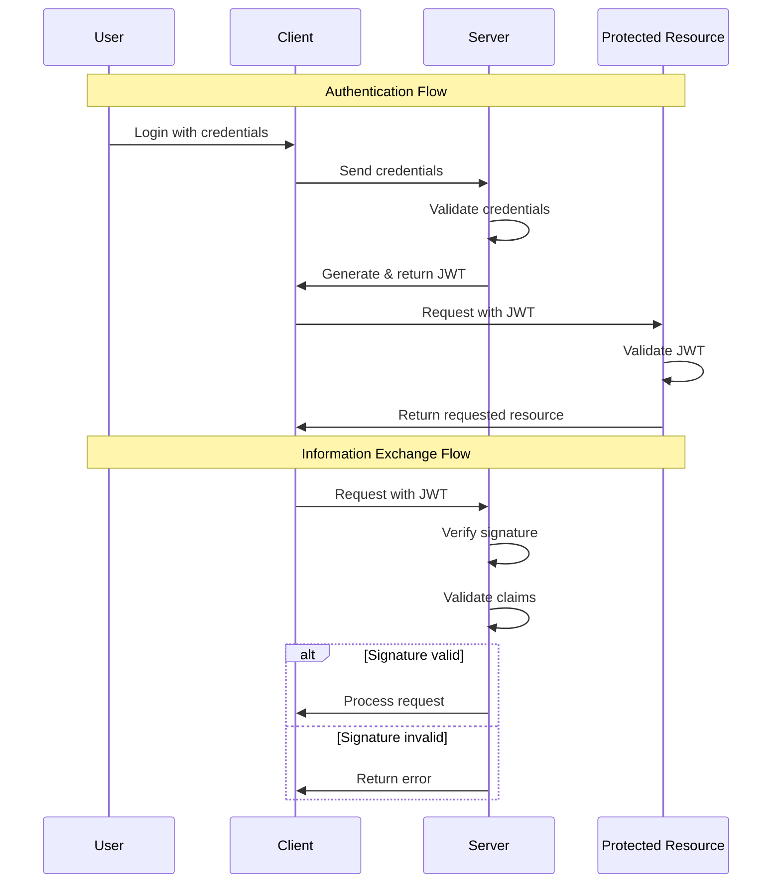

### 1. Web 1.0 vs Web 2.0 vs Web 3.0

The evolution of the Internet through Web 1.0, Web 2.0, and Web 3.0 represents distinct phases with unique characteristics and technologies. These stages reflect changes in how the Internet is used and its underlying technologies.

#### Web 1.0

- Web 1.0, prevalent in the 1990s, is the early stage of the Internet primarily designed for information retrieval. This phase of the web was more about users accessing and consuming data.
- Often referred to as the "read-only" web, Web 1.0 lacked the rich formatting, visuals, interactive elements, and user-generated content that characterize later web versions.

#### Web 2.0

- Emerging in the early 2000s, Web 2.0 represents the social phase of the Internet. It shifted the focus towards participation, collaboration, and content creation by users.
- Known as the "participative social web," Web 2.0 is characterized by the growth of social networks, blogs, and user-generated content, transforming users from passive consumers to active participants.

#### Web 3.0

- Web 3.0, still evolving and not yet fully defined, is the latest phase of the Internet. It builds upon decentralized networks and blockchain technology.
- The foundations of Web 3.0 are decentralization, openness, and

---

### 2. Git

**Git** is a distributed version control system widely used for source code management in software development. This system allows multiple developers to work on a project simultaneously without interfering with each other. Git tracks file changes and coordinates collaboration between multiple contributors. It integrates functions such as branch creation, merging, and reverting to help manage various versions of a project efficiently and maintain a systematic change history.

#### Main Functions

- **Distributed Architecture**:

  - Each developer has a complete copy of the entire repository and its history, supporting offline work and redundancy.

- **Branches and Merges**:

  - Facilitates easy creation and merging of branches for experimenting with new features or fixing bugs.

- **Staging Area**:

  - A unique concept where changes are first staged before being committed to the repository history.

- **Efficiency**:

  - Git is optimized for performance and adept at handling large projects.

- **Data Integrity**:
  - All changes are trackable and searchable through checksums.

#### Git Basic Terminology

- **Working Directory**:

  - The directory where the currently worked-on files are located.

- **Staging Area**:

  - An area where changes are temporarily gathered before being committed.

- **Repository**:

  - The place where all versions and history of the project are stored.

- **Commit**:

  - A process where changes in the staging area are permanently recorded in the repository.

- **Branch**:

  - A means for separating and managing tasks.

- **Merge**:
  - The process of combining two or more branches into one.

#### Differences Between Git and GitHub

- **Git**:

  - A version control system for managing the change history of source code.

- **GitHub**:
  - A web service that hosts projects using Git, providing additional features like collaboration, issue tracking, and code review.

#### Git Commands

```bash
# Initialize a new Git repository
git init

# Check the status of the repository
git status

# Add files to the staging area
git add <filename>
git add .  # Add all changes

# Commit changes with a message
git commit -m "commit message"

# Push changes to the remote repository
git push

# View commit history
git log

# Compare staged changes with the last commit
git diff --staged

# Create a new tag
git tag <tag-name>

# Delete a tag locally
git tag --delete <tag-name>

# Delete a tag from the remote repository
git push origin --delete <tag-name>

# Push tags to the remote repository
git push --tags

# List all tags
git tag

# Clone a repository
git clone <repository-url>

# Fetch changes from the remote repository
git fetch

# Merge changes from a remote branch
git merge <branch-name>

# Pull changes from the remote repository (fetch + merge)
git pull

# Check the status of branches (local and remote)
git branch -a

# Create a new branch
git branch <new-branch-name>

# Switch to a different branch
git checkout <branch-name>

# Create and switch to a new branch
git checkout -b <new-branch-name>

# Stash changes in the working directory
git stash

# Apply stashed changes
git stash pop

# Show remote repositories
git remote -v

# Add a new remote repository
git remote add <remote-name> <repository-url>

# Remove a remote repository
git remote remove <remote-name>

# Show changes not yet staged
git diff
```

#### Git Branch Creation and Merging Process

This demonstrates the workflow in which a feature branch is created from the master branch. Changes are applied and committed to the feature branch and then merged back into the master branch to implement new features or updates.


---

### 3. Appliance

The term "**Appliance**" generally refers to a specialized hardware or software package that is pre-configured and optimized to perform a specific purpose or function. In the IT field, appliances are typically used to refer to devices or software designed to efficiently perform specific tasks, such as network appliances, storage appliances, and virtual appliances.

#### Network Appliance

A network appliance is a hardware device specially manufactured to provide functions such as network management, security, and communication. This includes firewalls, routers, switches, VPN devices, and load balancers. These devices play an essential role in optimizing network performance and protecting the network from security threats.

#### Storage Appliance

A storage appliance is a hardware device aimed at data storage and management. Devices like **NAS (Network Attached Storage)** or **SAN (Storage Area Network)** equipment are designed to effectively store, share, and backup vast amounts of data.

#### Virtual Appliance

A virtual appliance is a form of software appliance that consists of a pre-configured virtual machine image designed to run specific software or services. This allows users to deploy and run software easily without complex installation processes. Examples include backup solutions, security systems, and network management tools in virtualized environments.

#### Advantages of Appliances

- **Ease of Use**: Appliances are optimized for specific tasks, making installation and configuration simple and user-friendly.
- **Performance**: Being optimized to perform specific functions, appliances offer high performance in handling related tasks.
- **Ease of Management**: Typically, they come with an integrated management interface, making management straightforward.
- **Security**: Many appliances have built-in security features, enhancing data protection and network security.

---

### 4. Agile Framework

The **Agile Framework** is a methodology designed for project management and software development that enables rapid and flexible response to change.

Unlike the traditional waterfall model, Agile involves iterative and incremental processes of planning, development, and deployment, aiming for continuous customer feedback and product improvement. This approach facilitates proactive adaptation to changes in customer requirements and market conditions, and the delivery of better products.

#### Core Values of Agile (Agile Manifesto)

Agile methodology is based on four core values:

- Individuals and interactions over processes and tools
- Working software over comprehensive documentation
- Customer collaboration over contract negotiation
- Responding to change over following a plan

#### Major Agile Frameworks

Several frameworks exist within Agile methodology, each offering different approaches and techniques.

- **Scrum**: One of the most widely used Agile frameworks, Scrum is structured around fixed periods (sprints) during which teams collaborate to achieve their goals.
- **Kanban**: A methodology that visualizes the flow of work to limit the amount of work in progress, thereby enhancing efficiency.
- **Extreme Programming (XP)**: Focuses on maximizing customer satisfaction through rapid feedback, continuous improvement, technical excellence, and good design.
- **Lean Software Development**: Based on principles of minimizing waste and focusing on value creation.

---

### 5. Scrum

**Scrum** is an **Agile Framework** widely used for managing complex software development projects. It divides the development process into short cycles (usually between 2 to 4 weeks, known as sprints), facilitating continuous improvement and flexible response to requirements. Scrum helps teams focus on clear objectives and quickly adapt to change.

#### Key Components of Scrum

- **Scrum Team**: Comprises the Product Owner, Scrum Master, and Development Team.
  - **Product Owner**: Manages the product backlog and maximizes the value of the product.
  - **Scrum Master**: Supports the Scrum Team in following the Scrum process smoothly.
  - **Development Team**: Performs the actual work on the product. They are autonomous and cross-functional.
- **Sprint**: The core time-box of Scrum, during which the team focuses on delivering new product increments.
- **Daily Scrum**: A short daily meeting where team members discuss their work for the day and share obstacles.
- **Sprint Planning Meeting**: Conducted at the start of a sprint, where the team decides on the items to work on during the next sprint.
- **Sprint Review**: Held at the end of a sprint to review the product increment. This meeting gathers feedback and helps adjust plans for the next sprint.
- **Sprint Retrospective**: Conducted after the Sprint Review, where the team reflects on the process and identifies improvements.

---

### 6. API (Application Programming Interface)

The **API (Application Programming Interface)** is an agreement or interface that enables interaction between various software applications, systems, and libraries.

APIs allow one program to access the functionalities or data of another program, enabling developers to utilize complex functions without having to implement them from scratch. They are a crucial tool in software development, making it easier and more efficient to use complex functions and services.

#### Main Functions and Purposes of APIs

- **Reusability**: APIs allow developers to reuse existing functionalities, which can save development time and costs.
- **Modularity**: Using APIs enables software to be designed in a modular way, making maintenance and updates easier.
- **Integration and Interoperability**: They facilitate the integration between different applications, systems, and services, enhancing interoperability among systems that use diverse technologies.
- **Security**: APIs enable control over data and function access, and allow the application of security rules and policies.

#### Types of APIs

- **Web APIs**: These are APIs that use the HTTP protocol to interact with web services, including REST (Representational State Transfer), SOAP (Simple Object Access Protocol), and GraphQL.
- **Library-based APIs**: These are APIs specialized for a particular programming language or platform, used by developers to implement specific functionalities.
- **Hardware APIs**: These are APIs for interacting with hardware, allowing access to hardware functionalities at the operating system or driver level.

#### Examples of API Usage

- **Social Media Integration**: Using social media services' APIs, websites or applications can provide functionalities like user authentication and content sharing.
- **Mapping Services**: With the Google Maps API, websites or mobile apps can display maps and offer location-based services.
- **Payment Systems**: Online payment functionalities can be easily integrated using APIs from services like PayPal or Stripe.

---

### 7. What is SSO (Single Sign-On)?

SSO, or Single Sign-On, is an authentication process that allows users to access multiple systems or applications through one authentication. Users can log in to multiple services with a single ID and password, which improves user experience and reduces the complexity of authentication management. SSO also contributes to efficient resource management and enhanced security. For example, when employees use various services such as company email, document tools, and internal portals, they can access all services with a single login without having to remember different login information for each.

SSO implementation can be accomplished in several ways, typically using standard protocols such as OAuth, SAML (Security Assertion Markup Language), and OpenID Connect. These protocols ensure the secure exchange of authentication information and mediate communication between service providers and trusted authentication providers.

#### SSO Key Benefits

- **Increased user convenience**: User convenience is increased as multiple services can be accessed with a single login.
- **Enhanced security**: Users do not have to remember complex and different passwords for various services, making it easier to enforce strong password policies.
- **Efficient resource management**: Since the authentication process is centrally managed, IT administrators can manage user accounts more effectively.

#### OAuth (Open Authorization)

- **Purpose**: OAuth is an open standard for access delegation, commonly used as a way for Internet users to give websites or applications access to information on other websites without having to provide a password. It focuses on authenticating third-party applications to access user data without exposing user credentials.
- **How it works**: OAuth works by receiving permission from the resource owner (user) and issuing a token to a third-party application from an authorization server. This token grants access to a specific set of resources for a defined period of time. The latest version, OAuth 2.0, is used for API authentication and supports multiple flows (or grants) for different client types and scenarios.
  

#### SAML (Security Assertion Markup Language)

- **Purpose**: SAML is an XML-based framework for authentication and authorization between service providers and identity providers. It is widely used in enterprise environments for single sign-on (SSO), allowing users to log in once and access multiple systems without re-authentication.
- **How it works**: In SAML, the identity provider (IdP) verifies the user's credentials and then sends a SAML assertion to the service provider (SP). This assertion contains authentication statements and properties related to the user identity. The service provider then grants access based on this assertion. SAML 2.0 is the currently commonly used version.
  

#### OIDC (OpenID Connect)

- **Purpose**: OpenID Connect is a simple identity layer on top of the OAuth 2.0 protocol, allowing clients to verify the identity of end users and obtain basic profile information in an interoperable REST-like manner. Widely used in web, mobile, and JavaScript clients.
- **How it works**: OpenID Connect extends OAuth 2.0 with ID tokens, which are JWTs (JSON Web Tokens) containing information about the user. After authenticating the user, the identity provider issues an ID token and an access token (if approved). The client can then use the ID token to obtain user information and access tokens to access authorized resources.
  

#### OAuth vs SAML vs OIDC

- **OAuth** is primarily concerned with authorization, not authentication. Used to grant an application permission to act on behalf of the user.
- **SAML** primarily focuses on authentication and authorization through SSO in enterprise scenarios where users access multiple services during a session.
- **OIDC** builds on OAuth 2.0 to add authentication, making it a more comprehensive solution for modern web and mobile applications that require both identity verification and data access permissions.

---

### 8. What is JWT Token?

**JSON Web Tokens (JWT)** are a URL-safe, concise means of representing claims to be transferred between two parties. Claims within a JWT are encoded as JSON objects and digitally signed using JSON Web Signatures (JWS). Optionally, you can also encrypt it using JSON Web Encryption (JWE).

#### Structure

JWT generally consists of three parts: Header, Payload, and Signature, separated by a dot (`.`). The structure is `header.payload.signature`.

- **Header**: The header usually consists of two parts: the type of token, which is JWT, and the signature algorithm used (e.g., HMAC SHA256 or RSA).

```json
{
  "alg": "HS256",
  "typ": "JWT"
}
```

- **Payload**: The payload contains claims. Claims are statements about an entity (usually the user) and additional data. There are three types of claims: registered claims, public claims, and private claims.
  - **Registered Claims**: These are not mandatory but are a predefined set of claims to provide a set of useful, interoperable claims. Some of these are iss (issuer), exp (expiration time), sub (subject), aud (audience), etc.
  - **Public Claims**: Those using JWTs can define these as desired. However, to avoid conflicts, they should be defined in the IANA JSON Web Token Registry or as a URI that contains a collision-resistant namespace.
  - **Private Claims**: These are custom claims created to share information between parties that agree on using them and are neither registered nor public claims.

```json
{
  "sub": "1234567890",
  "name": "John Doe",
  "admin": true,
  "iat": 1516239022
}
```

- **Signature**: To generate the signature part, you must sign it using the encoded header, the encoded payload, a secret, and the algorithm specified in the header. For example, when using the HMAC SHA256 algorithm, the signature is generated in the following way:

```plaintext
HMACSHA256(
  base64UrlEncode(header) + "." +
  base64UrlEncode(payload),
  secret)
```

#### How JWT Works

- **Authentication**: After a user logs in, each subsequent request includes the JWT, allowing access to the routes, services, and resources permitted by that token.
- **Information Exchange**: Since JWTs can be signed—for example, with public/private key pairs—you can be sure the sender is who they claim to be. Additionally, since the signature is calculated using the header and the payload, it can also be verified that the content has not been tampered with.


---

### 9. What is Infrastructure as Code (IaC)?

**Infrastructure as Code (IaC)** is the managing and provisioning of infrastructure through code instead of through manual processes. With IaC, infrastructure is managed using configuration files rather than hardware. This approach enables developers and IT operations teams to automatically manage, monitor, and provision resources, rather than manually setting up hardware or configurations.

#### Key Principles

- **Automation**: IaC automates the deployment of infrastructure, allowing for fast and consistent setups.
- **Idempotency**: An IaC system's operations can be executed one or multiple times with the same outcome, ensuring reliability and consistency.
- **Version Control**: Infrastructure configurations are stored in version control systems, enabling change tracking, history, and rollback.

#### Benefits

- **Speed and Efficiency**: Rapid provisioning of infrastructure, enabling quicker development and deployment cycles.
- **Consistency and Reliability**: Minimizes human error by automating the provisioning process, ensuring that environments are provisioned consistently every time.
- **Scalability**: Easily scale infrastructure up or down with changes to configuration files, without the need for manual intervention.
- **Cost Savings**: Reduces the need for physical hardware and manual labor, leading to cost savings over time.

#### Tools

Several tools facilitate IaC, each with its own syntax and ecosystem:

- **Terraform**: An open-source tool by HashiCorp, allowing for the management of both cloud and on-premises resources.
- **AWS CloudFormation**: A service by Amazon Web Services that allows you to manage AWS resources by defining them in templates.
- **Ansible**: An open-source tool that provides simple automation for cloud provisioning, configuration management, and application deployment.
- **Chef**: A configuration management tool that uses Ruby-based recipes to automate infrastructure provisioning.
- **Puppet**: Another configuration management tool that allows you to define the state of your IT infrastructure, then automatically enforces the correct state.

---

### 10. What is CI/CD?

#### CI (Continuous Integration)

**Continuous integration** refers to periodically merging code worked by developers into a shared repository. This process includes automated builds and testing to ensure that code changes do not cause problems. The main purpose of continuous integration is to early discover and resolve errors that may occur during the software development process.

#### CD (Continuous Deployment)

**Continuous deployment** refers to automatically distributing developed software to an environment where customers can use it. This involves delivering software to customers after going through a continuous integration process, without any additional manual steps. Continuous deployment allows new versions of software to be delivered to customers quickly.

#### Advantages of CI/CD

- **Increased efficiency**: Automated processes speed up the development and deployment process and reduce the likelihood of errors.
- **Quality improvement**: The quality of software is improved through continuous testing and integration.
- **Improved customer satisfaction**: Through rapid deployment, user feedback can be quickly reflected and software improvements can be provided quickly.

#### CI/CD tools

There are several tools available to build and manage CI/CD pipelines. Some of the most popular tools include:

- **Jenkins**: An open source automation server that supports various CI/CD scenarios. Jenkins is highly customizable with a vast plugin ecosystem.
- **Travis CI**: A continuous integration service for GitHub projects. It has the advantage of being easy to integrate with GitHub repositories and simple to use.
- **GitLab CI/CD**: Provides a solution that integrates source code management and CI/CD into one platform. Provides powerful pipeline configuration.
- **CircleCI**: A cloud-based CI/CD service that supports quick build and deployment. It provides excellent integration with GitHub and Bitbucket.
- **GitHub Actions**: Enables workflow automation within GitHub repositories. GitHub Actions makes it easy to automate all software workflows, from CI/CD to issue triage.
- **ArgoCD**: A declarative GitOps continuous delivery tool for Kubernetes. ArgoCD allows you to maintain and manage your Kubernetes resources using your source code repository as your source of truth.
- **Bamboo**: A continuous integration and deployment tool that combines automated build, test, and release into one workflow. It integrates well with other Atlassian products.
- **TeamCity**: A build management and continuous integration server provided by JetBrains. It supports a variety of programming languages ​​and technologies and has a comprehensive feature set.

---

### 11. What is APM(Application Performance Monitoring)?

**Application Performance Monitoring (APM)** refers to the process of using software tools and telemetry data to monitor the performance of business-critical applications. APM helps IT professionals detect and diagnose complex application performance issues to ensure applications meet expected service levels.

#### APM main components

APM typically includes several key components:

- **Performance Metrics**: APM tools collect data on various performance indicators, including response time, transaction volume, error rate, and system resource usage.
- **Real-time monitoring**: APM provides real-time monitoring of applications to quickly detect performance abnormalities and interruptions.
- **End User Monitoring**: Track how end users interact with your application and how application performance impacts the user experience. This may include analyzing browser and mobile app performance.
- **Distributed tracing and transaction profiling**: APM tools can trace and visualize transactions across various services and components within a distributed architecture. This helps pinpoint where delays or failures occur in the transaction chain.
- **Analysis and Reporting**: APM solutions provide analytics tools to process collected data, identify patterns, predict potential problems, and provide actionable insights.
- **Application topology discovery**: Modern APM tools can automatically discover and map the various components and dependencies of an application, providing a comprehensive view of the application architecture.

#### APM tools

- **Dynatrace**: Known for its deep monitoring capabilities and extensive automation to detect and diagnose performance issues.
- **New Relic**: Provides comprehensive application and infrastructure monitoring with powerful analytics capabilities.
- **Datadog**: Focuses on cloud environments and provides monitoring of servers, databases, tools, and services.
- **AppDynamics**: Focuses on detailed application performance insights and business performance monitoring.

---
