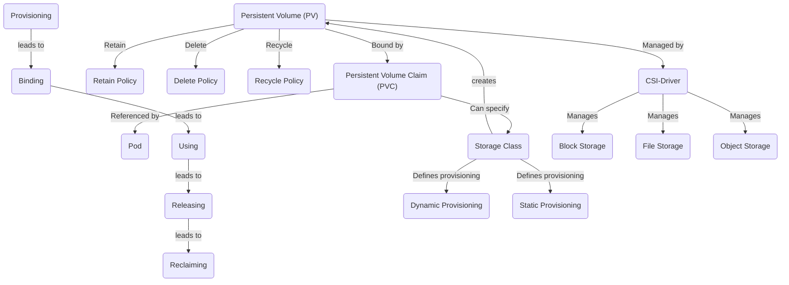
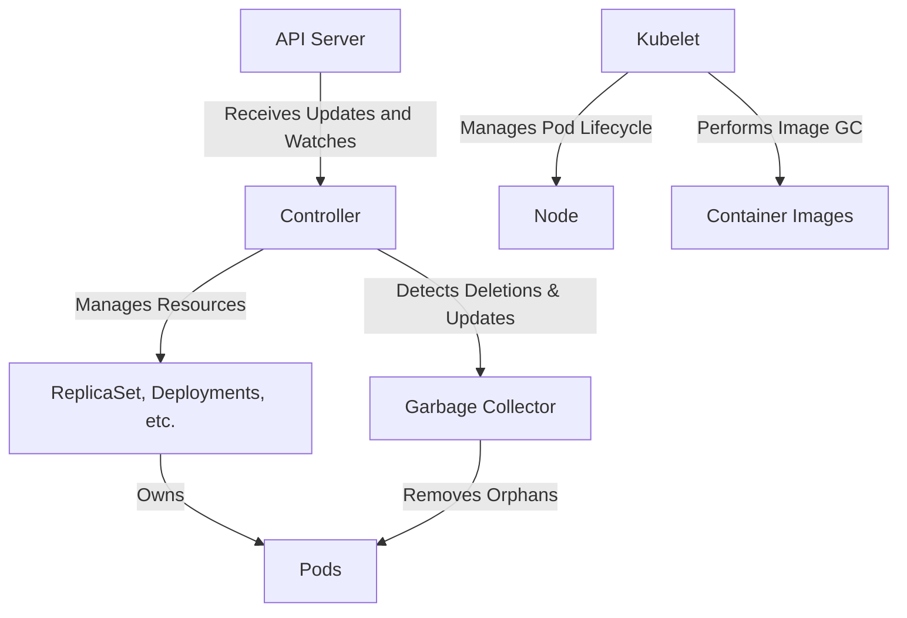
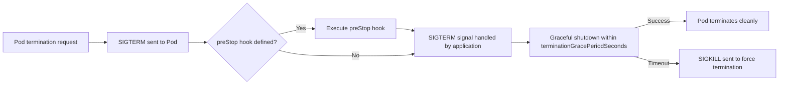

Certainly! Here's the provided information about Kubernetes and container orchestration, translated into English and formatted in a code block:

markdown
Copy code

### Why Use Kubernetes?

Kubernetes is an open-source container orchestration platform designed to automate the deployment, scaling, and operation of application containers. Developed by Google and now maintained by the Cloud Native Computing Foundation, Kubernetes offers several key advantages:

- **Container Orchestration**:
  - Efficiently manages the lifecycle of containers, handling deployment, scaling, and termination across machine clusters. This simplifies running applications in containers that are isolated and bundle their own dependencies.
- **Scalability**:
  - Enables automatic scaling of applications up and down using simple commands, UI, or automatically based on CPU usage.
- **Load Balancing**:
  - Distributes network traffic to ensure stable deployment, preventing single points of failure in your application.
- **High Availability**:
  - Ensures application availability through features like automatic bin packing, self-healing, replication, and horizontal scaling.
- **Automated Rollouts and Rollbacks**:
  - Allows you to define a desired state for deployed containers and change the actual state to the desired state at a controlled rate, including creating new containers, removing existing ones, and replacing all resources.
- **Service Discovery and Load Balancing**:
  - Exposes containers using DNS names or their IP addresses. If traffic to containers is high, Kubernetes can load balance and distribute network traffic.
- **Storage Orchestration**:
  - Automatically mounts any storage system, including local storages and public cloud providers.
- **Secret and Configuration Management**:
  - Manages sensitive information like passwords, OAuth tokens, and SSH keys, allowing you to deploy and update secrets and application configurations without rebuilding container images or exposing secrets in stack configurations.

#### What is Container Orchestration?

Container orchestration is the automatic management of the container lifecycle, encompassing a variety of activities such as deployment, scaling, networking, and lifecycle management of containers.
In other words, container orchestration refers to the process of constructing tasks of individual components and application layers.

##### Importance of Container Orchestration

- **Efficiency**: Manages and scales a large number of containers efficiently.
- **Load Balancing**: Automatically distributes load and traffic among containers.
- **High Availability**: Prevents downtime by managing container replicas and replacements.

##### Key Components in Container Orchestration

- **Container**: A lightweight, standalone executable package that includes everything needed to run software.
- **Pod**: The smallest deployable unit in Kubernetes that can host one or more containers.
- **Node**: A worker machine in Kubernetes, which could be either a VM or a physical machine, depending on the cluster.
- **Cluster**: A set of nodes running containerized applications managed by Kubernetes.

##### Other Container Orchestration Tools

In addition to Kubernetes, there are tools like Docker Swarm and Apache Mesos that also provide orchestration capabilities.

---

### 2. What are Kubernetes components?

Kubernetes is a system for managing containerized applications across clusters of machines.
It uses a variety of resources and components to handle various aspects of application deployment and management.
Within Kubernetes, the `kube-system` namespace contains several important system Pods that play important roles in a Kubernetes cluster.

#### Control Plane Components

##### kube-apiserver

- Responsible for central control of the entire Kubernetes cluster.
- It provides Kubernetes APIs for use by internal system components as well as external users.
- When a Pod is created, `kube-apiserver` processes requests and stores Pod information in the etcd database.

##### etcd

- A consistent, highly available key-value store that serves as Kubernetes' backing store for all cluster data.
- When a Pod is created, its configuration and state are stored in `etcd`, so the cluster state is maintained and can be recovered in the event of a failure.

##### kube-scheduler

- It watches for newly created Pods that do not have assigned nodes and selects which nodes to run based on various scheduling criteria, including resource requirements, affinity specifications, data locality, and workload-to-workload.
- After a Pod is created, `kube-scheduler` assigns it to the appropriate node.

##### kube-controller-manager

- Runs a controller process with background threads that handle routine tasks in the cluster.
- When creating a Pod, the relevant controller in `kube-controller-manager` checks whether the actual state of the Pod matches the desired state specified by the user.

#### Node component

##### kubelet

- The kubelet running on each node in the cluster is responsible for ensuring that containers are running in Pods.
- When a Pod is scheduled on a node, the kubelet on that node receives a request from `kube-apiserver` and starts the container specified in the Pod.

##### kube-proxy

- It runs on each node and is a network proxy, maintaining network rules that allow network communication to Pods from network sessions inside or outside the cluster.
- When a Pod is created, `kube-proxy` updates the node's network rules to allow IP forwarding to the Pod's IP address.

##### DNS service (ex: CoreDNS)

- Provides a DNS service for your Kubernetes cluster, translating service and pod names into IP addresses.
- When a Pod is created, it gets an IP address and DNS name. `CoreDNS` updates records to make Pods accessible via their DNS names within the cluster.

##### Container Runtime

- Container runtime is software responsible for running containers.
- Supports container runtimes such as Containerd and CRI.

##### Addon

- `Addon` implements cluster functions using Kubernetes resources (daemonset, deployment, etc.).
- Because it provides cluster-level functionality, the namespace resource for the add-on belongs to the kube-system namespace.

---

### 3. Kubernetes Pod creation method

1. **kubectl (Execute)**:

   - User executes `kubectl apply -f k8s-deployment.yml`.
   - Converts YAML to JSON and sends to kube-apiserver.

2. **kube-apiserver (Processing)**:

   - Receives deployment request.
   - Stores deployment details in Kubernetes database.

3. **etcd (Data Storage)**:

   - Stores configuration and state information.
   - Notifies kube-controller-manager when deployment resources are updated.

4. **kube-controller-manager (Resource Creation)**:

   - Creates Pod resources based on deployment's replica count.

5. **kube-scheduler (Scheduling)**:

   - Monitors unscheduled pods; assesses node health.
   - Selects optimal node and updates `nodeName` in Pod spec.

6. **kubelet (Node-Level Execution)**:

   - Running on each worker node.
   - Checks for and runs containers in assigned pods.
   - Executes tasks per control plane instructions.

7. **Container Runtime Interface (CRI) Daemon (Container Creation)**:

   - Invoked by kubelet to create containers in the pod.

8. **kubelet (Status Update)**:
   - Performs readiness and liveness probes.
   - Updates pod status to `running` if checks pass.

---

### 4. Kubernetes API Group & RBAC (Role Based Access Control)

#### API Group

The Kubernetes API Group is a way to organize Kubernetes API resources. API groups categorize related resources and allow for efficient version management.

Kubernetes API is broadly divided into Core Group and Named Group.


- Image Reference : https://cloud.redhat.com/blog/kubernetes-deep-dive-api-server-part-1

##### 1. Core Group

The Core Group contains basic Kubernetes resources and is identified with an empty string ("") as the API group name. This group includes essential Kubernetes resources like Pods, Services, ReplicationControllers, Nodes, and Namespaces.

For example, to set permissions for the `pods` resource in the Core Group, use:

```yaml
apiGroups: [""]
resources: ["pods"]
```

##### 2. Named Group

The Named Group consists of API groups with specific names other than the Core Group. This group includes resources related to applications, security, configuration, and various extensions. Examples of Named Groups are extensions, apps, networking.k8s.io, rbac.authorization.k8s.io, etc.

For instance, to set permissions for the deployments resource in the apps API group, use:

```yaml
apiGroups: ["apps"]
resources: ["deployments"]
```

<br/>

#### RBAC (Role Based Access Control)

Kubernetes RBAC (Role-Based Access Control) is a security mechanism(Authorization) that provides access to resources in a Kubernetes cluster to users or groups. RBAC ensures secure protection of cluster resources by assigning minimal necessary permissions to specific users.

In Kubernetes, RBAC is implemented using four elements: `Role, ClusterRole, RoleBinding, and ClusterRoleBinding.`

##### 1. Role

A Role defines access rights to resources within a specific namespace in Kubernetes. It specifies the types of resources to set permissions for and the operations (e.g., get, list, create, update, etc.) included in those permissions.

Example Role definition:

```yaml
apiVersion: rbac.authorization.k8s.io/v1
kind: Role
metadata:
  name: gitlab-runner-role
rules:
  - apiGroups: ["extensions", "apps"]
    resources: ["deployments"]
    verbs: ["get", "list", "watch", "create", "update", "patch", "delete"]
  - apiGroups: [""]
    resources: ["pods", "services", "secrets", "pods/exec", "serviceaccounts"]
    verbs: ["get", "list", "watch", "create", "update", "patch", "delete"]
```

Permissions for the deployments resource in the extensions and apps API groups include operations like get, list, watch, create, update, patch, and delete.
For resources in the core API group, similar operations are granted, including pods/exec for executing commands in containers within a pod.

##### 2. RoleBinding

RoleBinding links the permissions defined in a Role to a user, group, or service account. It essentially assigns the permissions of a Role to specific users or groups. RoleBinding is namespace-specific.

```yaml
apiVersion: rbac.authorization.k8s.io/v1
kind: RoleBinding
metadata:
  name: gitlab-runner-role-binding
subjects:
  - kind: ServiceAccount
    name: default
roleRef:
  kind: Role
  name: gitlab-runner-role
  apiGroup: rbac.authorization.k8s.io
```

---

### 5. Kubernetes Secret

Kubernetes secrets are utilized to securely store sensitive data like passwords, API keys, tokens, or certificates within a Kubernetes cluster. They aid in isolating sensitive information from application code and configuration files. Secrets can be mounted as files or environment variables for use by pods and containers in your cluster.

The resources that can be stored as Kubernetes Secrets include:

- Opaque Secrets
- Service account token Secrets
- Docker config Secrets
- Basic authentication Secret
- SSH authentication secrets
- TLS secrets
- External Secrets

---

### 6. Kubernetes Service Type & ExternalTrafficPolicy

#### Kubernetes Service Type

In Kubernetes, a Service is an abstraction that defines a logical set of Pods and a policy by which to access them. The Service Type specifies how the Service is exposed to the network.

The main Service Types include:

- **ClusterIP**: This default service type provides a service only accessible within the cluster.
- **NodePort**: Exposes the service on each Node's IP at a static port. You can contact the NodePort service from outside the cluster by requesting `<NodeIP>:<NodePort>`.
- **LoadBalancer**: Creates an external load balancer in the current cloud (if supported) and assigns a fixed, external IP to the service.
- **ExternalName**: Maps the service to the contents of the `externalName` field (e.g., `foo.bar.example.com`), by returning a CNAME record with its value.

#### ExternalTrafficPolicy

`externalTrafficPolicy` is an option of a Service of type `LoadBalancer` or `NodePort` that controls how the incoming traffic is routed. It can have two values: `Cluster` or `Local`.

- **Cluster**: The traffic is routed to any node, and if that node doesn't have a pod for the service, the traffic is forwarded to a node that does. This can cause an extra hop and might obscure the source IP address.
- **Local**: The traffic is only routed to the nodes that have the pod for the service. If the traffic hits a node without a pod, it's dropped, not forwarded. This preserves the original source IP address but can lead to uneven distribution of traffic across the pods.

---

### 7. Kubernetes Persistent Volumes (PV) and Persistent Volume Claims (PVC), StorageClass, and CSI (Container Storage Interface)



#### Persistent Volumes (PV)

- Persistent Volumes (PV) are storage resources within a cluster, provisioned by an administrator or dynamically using a storage class.
- PVs exist as cluster resources, similar to nodes, and can be claimed by users.

- Key Features:
  - **Life Cycle Independent of Pod**: PVs are independent of the life cycle of individual pods that use them.
  - **Storage Abstraction**: Abstracts the specifics of storage provisioning and usage.
  - **Supports Various Access Modes**: Includes modes like `ReadWriteOnce, ReadOnlyMany, and ReadWriteMany`.
    - `ReadWriteOnce`: Mountable as read-write by a single node.
    - `ReadOnlyMany`: Mountable as read-only by multiple nodes.
    - `ReadWriteMany`: Mountable as read-write by multiple nodes.

#### Persistent Volume Claims (PVC)

- PVCs are requests for storage made by users, similar to how pods use node resources.
- Key Features:

  - **Storage Request**: Users request specific sizes and access modes.
  - **Binding**: Automatically binds to an appropriate PV in the cluster.
  - **Usage in Pods**: Used as a volume within a pod, referenced by name.

- **persistentVolumeReclaimPolicy**:
  - This field in the PV specifies the action on the volume post-release from the claim.
  - Policies:
    - **Retain**: Default policy to keep the volume and preserve data after release.
    - **Delete**: For dynamically provisioned PVs, deletes the volume from the underlying storage upon PVC deletion.
    - **Recycle**: Not recommended for dynamic provisioning. Used to clear the volume data for new claims.

##### PV and PVC Lifecycle

- **Provisioning**: PVs can be dynamically provisioned through storage classes or pre-provisioned manually.
- **Binding**: Users create PVCs requesting specific sizes and access modes, which then bind to available PVs.
- **Using**: Once bound, the PVC is used by pods, referencing and mounting the PV as a volume.
- **Releasing**: Users can delete the PVC after use. Depending on the reclaim policy, the PV either becomes available again or is deleted.
- **Reclaiming**: With `Retain` policy, PV remains in the cluster post-PVC deletion. With `Delete`, both PV and related external storage assets are deleted.

#### StorageClass

StorageClass allows administrators to define different "classes" of storage.

- Key Aspects:
  - **Provisioning**: Can be dynamic or static, defining how storage is allocated.
  - **Parameters**: Various parameters depending on the storage provider.
  - **Binding**: PVCs can specify a StorageClass. Only PVs of the same class can bind to a PVC.

##### Container Storage Interface (CSI)

CSI standardizes the exposure of block and file storage systems to workloads in COS like Kubernetes.

- Key Goal: Provide a consistent API for storage solutions, facilitating integration in cloud-native ecosystems.

##### Volume Types in CSI

CSI supports various volume types:

- **Block Storage**: Basic block-level storage, used mainly in performance-critical applications.
- **File Storage**: Shared or dedicated file access, often in shared storage systems.
- **Object Storage**: Stores each object separately, used mainly for unstructured data.

##### Volume Types Available in Pods

In addition to CSI volume types, pods can use other volume types:

- **hostPath**: Mounts a file/directory from the host node’s filesystem into the pod.
- **emptyDir**: A temporary directory shared with the pod's lifespan.

---

### 8. Kubernetes Autoscaling

Kubernetes Auto Scaling refers to the ability of a Kubernetes cluster to automatically adjust capacity according to workload. It helps ensure that pods have enough resources to run efficiently while optimizing resource usage to prevent waste.

#### Kubernetes Autoscaler

In general, it is appropriate for stateless servers to use HPA. This is because VPA inevitably requires restarting the pod during the process of changing resources, and there is a limit to the resources (CPU, memory) that one node can have.

- **HPA (Horizontal Pod Autoscaler)**: Automatically adjusts the number of pods in `Replication Controller, Deployment, Replication set, Statefulset` based on CPU utilization or metrics. Check the metrics periodically and adjust the number of replicas if the observed metric values ​​deviate from the set target. It is an autoscaler that scales out.
- **VPA (Vertical Pod Autoscaler)**: Automatically adjusts the CPU and memory reservation of Pods to ensure resource efficiency. Updates the container's values ​​based on request resource usage history to ensure that each pod has only enough resources to run effectively. You can recommend changes or configure them to automatically apply these changes. It is an autoscaler that scales up.
- **CA (Cluster Autoscaler)**: Automatically adjusts the size of the Kubernetes cluster itself. If you have pods in your cluster that fail to run due to insufficient resources, you can add more nodes. If node utilization is low and its pods can be scheduled on other nodes, these nodes can be removed.

#### Scale up vs Scale out

Scale up (vertical scaling) and Scale out (horizontal scaling) are strategies used in computing to increase system capacity to handle greater load or demand. Scale up involves increasing the capacity of existing hardware or software, typically by adding more resources like CPU or memory to an existing server. In contrast, Scale out involves adding more nodes or instances to a system, effectively distributing the load across multiple servers or instances. While scale up focuses on making individual components more powerful, scale out emphasizes distributing workloads across a larger infrastructure. These concepts are particularly relevant in cloud computing and data center management.


- Image Reference : https://tecoble.techcourse.co.kr/post/2021-10-12-scale-up-scale-out/

---

### 9. Kubernetes Probe

Kubernetes probes are a critical component for managing and ensuring the health of Pods within a Kubernetes cluster. This allows Kubernetes to perform regular checks on running containers to determine their health and take appropriate action based on the state of the application.

There are three main probe types that Kubernetes uses:

- **Liveness Probes**: Liveness Probes check whether the container is running properly. If a Liveness Probe fails, Kubernetes terminates the container and starts a new container according to the pod's restart policy. It is used to catch and handle situations where an application is running but cannot proceed (e.g., a deadlock).
- **Readiness Probes**: Readiness Probes check whether the container is ready to start receiving traffic. Containers that fail Readiness Probes do not receive traffic from the Kubernetes Service. This is important to ensure that traffic is only sent to pods that are actually ready to handle traffic, which is especially useful during startup or after a version upgrade.
- **Startup Probes**: Startup Probes are used to determine when a container application has been started. If your pods take a long time to start (e.g. due to a long initialization process), you can use startup probes to prevent the pods from being terminated by the active probe during the startup phase. After the Startup Probe is successful for the first time, it disables itself and the Liveness Probe takes over for subsequent probes.

#### Configuring Probes

Probes can be configured from Ford specifications.

Each probe type supports several ways to perform inspection.

- **HTTP GET**: Kubernetes performs an HTTP GET request to the container. A response code in the range 200 to 399 indicates success. If the connection fails with any other response code or within the time limit, it is treated as a failure.
- **TCP Socket**: Kubernetes attempts to open a TCP socket to the container. Success is indicated by the ability to establish a connection, failure is indicated by the inability to open the socket within the timeout period.
- **exec**: Kubernetes executes commands inside the container. Success is indicated by a return code of 0, and any other return code indicates failure.

#### Probe Sequence

Kubernetes probes are configured in a Pod's specification, typically under the .spec.containers[] field. Let's take a look at how each probe type can be configured within a Pod's YAML file and discuss the sequence in which these probes operate.

Here's how the probes might be set up in a Kubernetes deployment manifest:

```yaml
apiVersion: v1
kind: Pod
metadata:
  name: my-application
spec:
  containers:
    - name: my-container
      image: my-image
      ports:
        - containerPort: 8080
      livenessProbe:
        httpGet:
          path: /healthz
          port: 8080
        initialDelaySeconds: 15
        timeoutSeconds: 2
        periodSeconds: 5
        failureThreshold: 3
      readinessProbe:
        httpGet:
          path: /ready
          port: 8080
        initialDelaySeconds: 5
        timeoutSeconds: 1
        periodSeconds: 5
        failureThreshold: 1
      startupProbe:
        exec:
          command:
            - cat
            - /app/initialized
        initialDelaySeconds: 5
        periodSeconds: 5
        failureThreshold: 30
```

- **1. Startup Probe**: When a Pod starts, the Startup Probe begins to check the defined conditions. Until the Startup Probe succeeds, the Liveness and Readiness Probes are disabled. If the Startup Probe does not succeed within the configured timeout and failure thresholds, the container will be killed and rescheduled according to the Pod's restart policy.
- **2. Readiness Probe**: Once the Startup Probe succeeds, the Readiness Probe starts. The Readiness Probe determines if the container is ready to receive requests. If it fails, the container is removed from the service's load balancer until it passes the readiness check.
- **3. Liveness Probe**: Alongside the Readiness Probe, the Liveness Probe is checking if the container is still running as expected. If the Liveness Probe fails (after the initial delay and within the failure threshold), the container will be restarted.

---

### 10. Kubernetes Affinity and Scheduling

Kubernetes allows you to control where pods are deployed within your cluster through several mechanisms:

- NodeSelector
- Affinity
- Taints & Toleration
- Cordon
- Drain

#### 1. **NodeSelector**:

- This is the simplest scheduling constraint in Kubernetes.
- Select nodes using key-value pairs.
- Example:
  ```yaml
  apiVersion: v1
  kind: Pod
  metadata:
    name: nginx
  spec:
    containers:
      - name: nginx
        image: nginx
    nodeSelector:
      disktype: ssd
  ```

#### 2. **Affinity**:

- More advanced than NodeSelector, Affinity sets rules for the placement of specific pods.
- Main types: Node Affinity and Pod Affinity.
- Node Affinity:

  - Can be set as `requiredDuringSchedulingIgnoredDuringExecution` or `preferredDuringSchedulingIgnoredDuringExecution`.
  - Example:
    ```yaml
    apiVersion: v1
    kind: Pod
    metadata:
      name: nginx
    spec:
      affinity:
        nodeAffinity:
          requiredDuringSchedulingIgnoredDuringExecution:
            nodeSelectorTerms:
              - matchExpressions:
                  - key: disktype
                    operator: In
                    values:
                      - ssd
      containers:
        - name: nginx
          image: nginx
    ```
  - **requiredDuringSchedulingIgnoredDuringExecution**

    - Defines requirements that must be met for a pod to be scheduled on a node. A pod can only be scheduled on nodes that satisfy these rules.
    - Used when a pod must be placed on specific nodes. For example, if you want to place pods only on nodes with a certain label, you can use this rule.
    - If no node satisfies these rules, the pod will not be scheduled.

  - **preferredDuringSchedulingIgnoredDuringExecution**
    - Informs the scheduler about preferences (but not requirements) for pod scheduling. The scheduler tries to fulfill these preferences as much as possible, but the pod can be scheduled on other nodes if no node meets the criteria.
    - Used to provide more flexibility in pod placement. For example, if you prefer to place a pod on certain nodes, but those nodes are unavailable or not present, you can use this rule to allow the pod to be placed on other nodes as well.
    - If there are nodes that satisfy these preferences, the pod is more likely to be scheduled on those nodes, but it can still be scheduled on other nodes if no preferred nodes are available.
  - In summary, `requiredDuringSchedulingIgnoredDuringExecution` defines strict requirements that must be met for pod scheduling, whereas `preferredDuringSchedulingIgnoredDuringExecution` defines preferred conditions but allows for flexibility in pod scheduling even if these conditions are not met.

- Node Anti-Affinity:

  - Used to distance a pod from nodes with certain attributes or labels.
  - Operates similarly to node affinity but with the opposite goal.
  - Example: In this example, `requiredDuringSchedulingIgnoredDuringExecution` requires the pod to be placed on nodes where disktype is not hdd, meaning only nodes with SSD or other types of disks can host the pod. Additionally, `preferredDuringSchedulingIgnoredDuringExecution` indicates a preference for nodes where cpu is not high, though this is not mandatory. weight signifies the importance of this preference.
    ```yaml
    apiVersion: v1
    kind: Pod
    metadata:
      name: mypod
    spec:
      affinity:
        nodeAffinity:
          requiredDuringSchedulingIgnoredDuringExecution:
            nodeSelectorTerms:
              - matchExpressions:
                  - key: disktype
                    operator: NotIn
                    values:
                      - hdd
          preferredDuringSchedulingIgnoredDuringExecution:
            - weight: 1
              preference:
                matchExpressions:
                  - key: cpu
                    operator: NotIn
                    values:
                      - high
      containers:
        - name: mycontainer
          image: myimage
    ```

- Pod Affinity:

  - Sets rules based on the labels of other pods.
  - Allows for defining both hard affinity and soft affinity rules.
  - Used to place a pod close to other pods.
  - Example: In the `requiredDuringSchedulingIgnoredDuringExecution` example, `mypod` must be placed on the same host (kubernetes.io/hostname) as other pods labeled `app=database`.

  ```yaml
  apiVersion: v1
  kind: Pod
  metadata:
    name: mypod
  spec:
    affinity:
      podAffinity:
        requiredDuringSchedulingIgnoredDuringExecution:
          - labelSelector:
              matchExpressions:
                - key: app
                  operator: In
                  values:
                    - database
            topologyKey: "kubernetes.io/hostname"
      containers:
        - name: mycontainer
          image: myimage
  ```

- Pod Anti-Affinity:
  - Used to keep a pod away from other pods with specific labels.
  - Example: In the `requiredDuringSchedulingIgnoredDuringExecution` example, `mypod` must be placed on a different host (kubernetes.io/hostname) than other pods labeled `app=webserver`.
  ```yaml
  apiVersion: v1
  kind: Pod
  metadata:
    name: mypod
  spec:
    affinity:
      podAntiAffinity:
        requiredDuringSchedulingIgnoredDuringExecution:
          - labelSelector:
              matchExpressions:
                - key: app
                  operator: In
                  values:
                    - webserver
            topologyKey: "kubernetes.io/hostname"
      containers:
        - name: mycontainer
          image: myimage
  ```

3. **Taints & Toleration**:

   - Taints are applied to specific nodes and reject pods that do not have tolerations.
   - Toleration is set on the pod to allow it to be scheduled on the tainted node.
   - Example of applying a taint:
     ```
     kubectl taint nodes nodeName key=value:effect
     ```
   - Example of setting tolerations:
     ```yaml
     tolerations:
       - key: "key"
         operator: "Equal"
         value: "value"
         effect: "NoSchedule"
     ```

4. **Cordon**:

   - Used to mark a specific node as unschedulable, preventing new pods from being scheduled onto it.
   - Example command:
     ```
     kubectl cordon nodeName
     ```

5. **Drain**:
   - Used for maintenance or decommissioning of a node by removing all pods from it.
   - Respects PodDisruptionBudgets and does not remove DaemonSet-managed pods unless `--ignore-daemonsets=true` is used.
   - Example command:
     ```
     kubectl drain nodeName
     ```

---

### 11. Kubernetes Security

Kubernetes is an open-source platform for managing container-based applications and services.

#### Cluster Security

- **API Server Security**: The API server is the core of the Kubernetes cluster and must be protected through appropriate authentication, authorization, and authorization.
- **Node Security**: Nodes are part of a cluster, and access to them must be strictly controlled.
- **Network Policy**: Implementing a network policy is necessary to control communication between pods.

#### Container Security

- **Image Security**: Insecure container images may contain vulnerabilities; therefore, security must be maintained through image scanning and signing.
- **Container Isolation**: Each container must be isolated and use resource limitations to prevent affecting other containers and services.
- **Security Context**: Use the security context to control the permissions and capabilities of containers.

#### Access Control

Access control in Kubernetes is divided into authentication and authorization for API access.

##### Authentication

- **X.509 Client Certs**: Authentication using CA crt (Certificate Authority certificate), Client crt (client certificate), and Client key (client private key) in kubeconfig.
- **kubectl**: Manages multiple clusters (kubeconfig) - refers to clusters, users, and certificates/keys in contexts.
- **Service Account**: Default service account (default) - Secret (CA crt and token).

##### Authorization

- **Authorization Methods**: RBAC (Role, RoleBinding), ABAC, Webhook, Node Authorization.
- **RBAC**: Role-based permission management, separate declaration of users and roles, binding them together, assigning permissions to users, and managing through kubectl or API.
  - Namespace/Cluster - Role/ClusterRole, RoleBinding/ClusterRoleBinding, Service Account.
  - Role - (RoleBinding role binding) - Service Account: RoleBinding connects the role and service account.
  - Role (privileges of resources within the namespace) vs. ClusterRole (privileges of resources at the cluster level).

#### Auditing and Logging

- **Audit Log**: Important activities should be recorded in audit logs for investigation of security incidents.
- **Logging**: System and application logs provide essential information for security incident response and troubleshooting.

#### Example 1: Applying Network Policy

This example demonstrates how to apply a Network Policy:

```yaml
apiVersion: networking.k8s.io/v1
kind: NetworkPolicy
metadata:
  name: example-network-policy
  namespace: default
spec:
  podSelector:
    matchLabels:
      role: db
  policyTypes:
    - Ingress
  ingress:
    - from:
        - podSelector:
            matchLabels:
              role: frontend
      ports:
        - protocol: TCP
          port: 3306
```

- This policy limits incoming traffic to the database pod (role: db) so that only the frontend pod (role: frontend) can access it on TCP port 3306.

#### Example 2: Role-Based Access Control (RBAC)

This example shows how to create a role that grants read-only access to Pods in a specific namespace:

```yaml
apiVersion: rbac.authorization.k8s.io/v1
kind: Role
metadata:
  namespace: default
  name: pod-reader
rules:
  - apiGroups: [""]
    resources: ["pods"]
    verbs: ["get", "watch", "list"]
---
apiVersion: rbac.authorization.k8s.io/v1
kind: RoleBinding
metadata:
  name: read-pods
  namespace: default
subjects:
  - kind: User
    name: "example-user"
    apiGroup: rbac.authorization.k8s.io
roleRef:
  kind: Role
  name: pod-reader
  apiGroup: rbac.authorization.k8s.io
```

#### Example 3: Pod Security Policy

This example demonstrates a Pod Security Policy that enforces containers to not run as root:

```yaml
apiVersion: policy/v1beta1
kind: PodSecurityPolicy
metadata:
  name: non-root-psp
spec:
  privileged: false
  allowPrivilegeEscalation: false
  requiredDropCapabilities:
    - ALL
  runAsUser:
    rule: MustRunAsNonRoot
  seLinux:
    rule: RunAsAny
  supplementalGroups:
    rule: RunAsAny
  fsGroup:
    rule: RunAsAny
  volumes:
    - "*"
```

---

### 12. What is an Operator? (With Kubernetes)

In the Kubernetes ecosystem, an Operator is a method to package, deploy, and manage Kubernetes applications. Kubernetes applications are deployed on Kubernetes and managed using the Kubernetes API and the `kubectl` tooling. Operators adhere to the Kubernetes principle of controllers, which are loops that monitor the state of the cluster and then make or request changes when necessary. An Operator extends Kubernetes to automate the entire lifecycle management of specific applications.

#### Concept and How It Works

Operators are essentially custom controllers with domain-specific knowledge built-in. They know how to deploy, upgrade, configure, recover, and scale specific applications. The Operator pattern aims to encapsulate operational knowledge about how to manage applications in software, automate common tasks, and provide a Kubernetes-native method of application management.

Operators are implemented as a set of custom resources and custom controllers for those resources. A custom resource acts as a configuration schema for the application, and the controller works to ensure that the application's state matches the desired state described by the custom resource.

- **Custom Resource**: Extends the Kubernetes API to allow the creation of new resource types. Custom resources define the desired state of the application.
- **Custom Controllers**: Watch custom resources and, if they detect that the actual state of the application differs from the desired state defined in the custom resource, they take action to reconcile the differences.

#### Lifecycle Management

Operators use Kubernetes' `control loop` concept to manage applications. They continuously monitor the application's state and take application-specific actions to correct any discrepancies with the desired state.

- Automatically deploy applications and potentially backing services.
- Seamlessly handle upgrades and downgrades, including complex stateful applications.
- Manage application configurations and secrets.
- Automatically scale based on load or other metrics.
- Recover from errors, automatically replacing or reconfiguring unhealthy instances.
- Perform backups and restorations.

#### Developing an Operator

There are frameworks and tools available to help develop Operators, such as the Operator Framework, which includes:

- **Operator SDK**: Helps you develop, test, and package Operators.
- **Operator Lifecycle Manager (OLM)**: Manages the Operators on a Kubernetes cluster, taking care of installing, updating, and management of the Operator lifecycle.
- **Operator Metering**: For reporting on the resources an Operator uses.

---

### 13. What is Kubernetes Service Account?

First, let's briefly explain User Account and Service Account. User accounts are for people. Service accounts are for processes running in pods.

A Kubernetes Service Account is a credential used to authorize pods running within a Kubernetes cluster to interact with the API server. A service account belongs to a specific namespace and can be created automatically or by the user. And when creating a namespace, a default service account is created.

> **Caution**
>
> - Prior to Kubernetes version 1.24, a service account token was automatically created when a service account was first created.
> - After Kubernetes version 1.24, to enhance security, a service account token is not created even when a service account is created.

#### Service Account Key Elements

- **ServiceAccount admission controller**: The ServiceAccount admission controller is responsible for assigning the default Service account to an unspecified Pod. Included in `api-server`.
- **ServiceAccount Token Controller**: The Token controller is responsible for creating and managing tokens for each ServiceAccount in the cluster. Included in `controller-manager`.
- **ServiceAccount Controller**: The ServiceAccount controller manages the creation and deletion of ServiceAccount and related Secrets. Included in `controller-manager`.

#### Service Account Secret Key Elements

- **Token**: A token is a JSON web token (JWT) that can be used to authenticate requests to the Kubernetes API server on behalf of a service account. This token is signed with the private key of the Kubernetes API server and can be verified using the corresponding public key (in ca.crt). The token contains information about the service account, such as its name and the namespace it belongs to.
- **ca.crt**: The ca.crt file contains the certificate authority (CA) certificate for the Kubernetes cluster. It is used to establish trust between the client and the API server when making a request. The client can use this CA certificate to verify that the API server's certificate is valid and signed by the same CA. This ensures that the client is communicating with an authenticated API server and not a malicious actor.
- **Namespace**: Namespace is a key component of Kubernetes' multi-tenant architecture. Namespaces are used to logically separate resources within a cluster, allowing multiple teams or projects to share the same cluster without interfering with each other.

---

### 14. What is Kubernetes Custom Resource Definitions (CRDs)

Kubernetes Custom Resource Definitions (CRDs) are a powerful feature that allows you to extend Kubernetes capabilities with custom resources. CRDs enable you to create your own specific resources within a Kubernetes cluster in a manner similar to how standard Kubernetes resources like Pods, Deployments, or Services are handled. This can be incredibly useful for developing custom applications or integrations on top of the Kubernetes platform.

#### What is a Custom Resource?

A custom resource is an extension of the Kubernetes API that is not necessarily available in a default Kubernetes installation. It is a way for you to customize Kubernetes to meet your needs by adding new resources beyond what is provided by default.

#### Why Use CRDs?

CRDs are used for several reasons:

- **Extensibility**: They allow you to extend Kubernetes with your own APIs that can be used with kubectl and other Kubernetes API clients.
- **Flexibility**: You can define new resources that behave like native Kubernetes resources.
- **Integration**: CRDs are useful for building operators which are custom controllers that manage applications and their components based on the custom resource.

#### How Do CRDs Work?

To implement a CRD, you define it using YAML, similar to other Kubernetes resources. This definition specifies a new kind of resource, its name, and its schema. The schema is used to validate the configuration of instances of the CRD (known as custom resources).

Here's a basic structure of a CRD definition:

```yaml
apiVersion: apiextensions.k8s.io/v1
kind: CustomResourceDefinition
metadata:
  # Name of the CRD
  name: crdtype.mycompany.com
spec:
  # Group name to which the CRD belongs
  group: mycompany.com
  # List of versions
  versions:
    - name: v1
      served: true
      storage: true
      schema:
        openAPIV3Schema:
          type: object
          properties:
            spec:
              type: object
              properties:
                myField:
                  type: string
  # Scope of the CRD (Namespaced or Cluster)
  scope: Namespaced
  names:
    # Plural name used in the URL
    plural: crdtypes
    # Singular name used as an alias
    singular: crdtype
    # Kind is the serialized kind of the resource
    kind: CrdType
    # ShortNames allow shorter string to match your resource on kubectl
    shortNames:
      - ct
```

#### Lifecycle and Controllers

After you've defined and applied a CRD in your cluster, you can create and manage its instances like any other resource in Kubernetes. Here’s a basic example of a custom resource:

```yaml
apiVersion: mycompany.com/v1
kind: CrdType
metadata:
  name: example-crdtype
spec:
  myField: "Hello, world!"
```

- Typically, a CRD is part of an operator which consists of the CRD itself and a custom controller.
- The controller watches for events related to its custom resources and reacts by creating, updating, deleting, or adjusting the resources accordingly.

#### Best Practices and Considerations

- **Versioning**: It's crucial to version your CRDs carefully and handle upgrades and deprecations thoughtfully to avoid disrupting existing resources.
- **Validation**: Use the OpenAPI schema specifications in your CRD definitions to validate custom resources and ensure they meet your expectations before they are stored in the Kubernetes API.
- **Performance**: Keep an eye on the performance impact of your custom controllers, especially in large-scale clusters.

---

### 15. What is Kubernetes Garbage Collection (GC)?

The Kubernetes Garbage Collection (GC) is a system that automatically manages resource cleanups, primarily with an emphasis on removing unused objects, such as pods, containers, images, and other Kubernetes resources. There are three main types of Garbage Collection in Kubernetes.

- Garbage Collection of Pods and Controllers
- Container Image Garbage Collection
- Resource Finalizers

#### Kubernetes Garbage Collection Workflow



---

### 16. Kubernetes Graceful Shutdown

In Kubernetes, configuring Graceful Shutdown and handling SIGTERM and SIGKILL signals play an important role in managing resources and preventing data loss when containers are terminated. Each concept is explained as follows:

#### terminationGracePeriodSeconds

When a Pod is terminated, Kubernetes sends a SIGTERM signal to the Pod and waits before forcefully terminating the Pod with SIGKILL.

- **terminationGracePeriodSeconds** is an option to set the _Grace Period_, which gives the container that received SIGTERM time to terminate gracefully.
- **The default value is 30 seconds**, and if the container is not terminated within this time, Kubernetes forcefully sends a SIGKILL to terminate the container.
- This setting allows services to safely perform cleanup operations (e.g., closing connections, saving state) without interrupting requests.

```yaml
spec:
  terminationGracePeriodSeconds: 60 # Give the Pod a grace period of 60 seconds before receiving a SIGKILL.
```

#### preStop Hook

`preStop` is a Kubernetes Lifecycle Hook that specifies a command or script to be executed when a Pod is terminated. When a Pod receives a SIGTERM signal, this `preStop` hook is executed first, and after the configured actions are completed, the container starts its termination process.

- You can use this hook to perform tasks such as notifying external services or cleaning up logs before termination.
- The `preStop` hook runs before the SIGTERM signal is processed, allowing some preparation before the container starts its Graceful Shutdown.

```yaml
lifecycle:
  preStop:
    exec:
      command: ["/bin/sh", "-c", "sleep 10"] # Wait 10 seconds before terminating the container.
```

- By using the preStop hook to delay for 10 seconds, the container waits before it begins handling SIGTERM. After this time, it can still use the remainder of `terminationGracePeriodSeconds` to finish cleanup tasks.

#### SIGTERM (Terminate Signal)

- SIGTERM is a signal that sends a graceful shutdown request to a container or process.
- Applications that support Graceful Shutdown need to capture and handle this signal, which can trigger tasks such as closing open connections or completing the current work.
- In Kubernetes, SIGTERM is sent first when a Pod is terminated. Upon receiving this signal, the application can proceed with cleanup operations for a graceful termination.

#### SIGKILL (Kill Signal)

- SIGKILL is a force kill signal that immediately terminates a process or container.
- This signal stops the process without allowing for cleanup operations, which can result in data loss or broken connections.
- In Kubernetes, if a container is not terminated within `terminationGracePeriodSeconds`, SIGKILL is sent to force the container to terminate.

#### Graceful Shutdown Flow Summary

1. When a Pod termination request occurs, Kubernetes first sends a SIGTERM signal to the corresponding Pod.
2. If a `preStop` hook is defined, it is executed, preparing the application for the SIGTERM signal.
3. The application processes the SIGTERM signal within `terminationGracePeriodSeconds`, performing any necessary cleanup tasks.
4. If the container is not terminated within `terminationGracePeriodSeconds`, Kubernetes sends a SIGKILL to force the container to terminate.



---

### 17. Kubernetes imagePullPolicy

In Kubernetes, `imagePullPolicy` is a setting that controls how and when container images are pulled from the container registry. This is configured for each container in the Pod specification and determines whether Kubernetes should pull the image from the registry or use a locally cached version. There are three main `imagePullPolicy` values:

- Always
- IfNotPresent
- Never

#### Always

- Kubernetes always pulls the image from the registry whenever a Pod is created, even if the image already exists on the node.
- This is useful if you frequently update images in your container registry without changing the image tag (e.g., using the 'latest' tag or a fixed tag for continuous deployment).

#### IfNotPresent

- Kubernetes pulls the image from the registry only if the image is not yet on the node. If the image exists locally, it uses the cached version.
- This is the default policy if a specific image tag (other than 'latest') is used. It helps reduce the time and bandwidth required to pull the image if the same image is already available on the node.

#### Never

- Kubernetes does not pull the image from the registry and expects the image to already exist on the node.
- This is useful in environments where you manually preload container images on nodes or want to avoid pulling images from external sources.

#### Preferences

- **Use the latest tag**: When you use the `latest` tag, Kubernetes defaults to setting the image pull policy to `Always`.
- **Use other tags**: If you specify a tag that is not the `latest` tag, Kubernetes defaults to `IfNotPresent`.

---

### 18. Kubernetes Deployment Strategy

In Kubernetes, **deployment strategies** define how to update a Pod (or set of Pods) when deploying a new application version or container image. There are two main deployment strategies:

- **RollingUpdate** (default strategy)
- **Recreate**

#### RollingUpdate (default)

- **RollingUpdate** is the default and most widely used strategy in Kubernetes. It gradually updates Pods within a deployment.
- During a rolling update, Kubernetes creates new versions of Pods while simultaneously terminating older Pods in small batches. Downtime is minimal as some Pods continue to run during the process.
- This strategy is ideal if you need to maintain **high availability**.

Key configuration options:

- `maxUnavailable`: Specifies the maximum number (or percentage) of Pods that can be unavailable during the update. For example, `maxUnavailable: 25%` means that up to 25% of Pods may go down during an update.
- `maxSurge`: Specifies the maximum number (or percentage) of additional Pods that can be temporarily created beyond the desired number of replicas. For example, `maxSurge: 1` means that one additional Pod can be created temporarily during an update.

- **Advantage**: Updates and deploys new Pods incrementally, so there is no service downtime.
- **Use case**: Ideal for production environments that require continuous availability during updates.

```yaml
spec:
  strategy:
    type: RollingUpdate
    rollingUpdate:
      maxUnavailable: 1
      maxSurge: 1
```

#### Recreate

- In the **Recreate** strategy, Kubernetes deletes all existing Pods before creating new ones.
- This strategy ensures that old applications are fully stopped when a new version is deployed.

- **Advantages**: Simple; terminates all existing instances before cleanly deploying the new version.
- **Disadvantages**: All Pods are terminated until new Pods are created, resulting in downtime.
- **Use case**: Suitable for applications where short downtime is acceptable or where the previous version must be fully stopped before deployment.

```yaml
spec:
  strategy:
    type: Recreate
```

---
