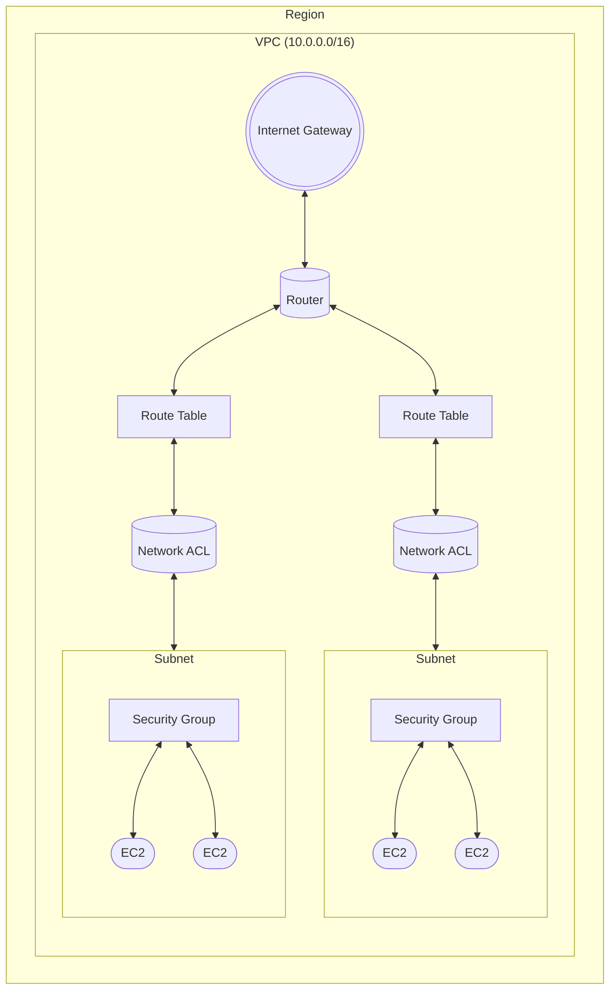

### 1. Assume Role

AWS 역할 가정을 사용하면 임시 보안 자격 증명(액세스 키, 보안 액세스 키 및 세션 토큰)을 획득하여 다른 계정의 AWS 리소스에 액세스하거나 동일한 계정 내에서 다른 권한을 사용할 수 있다.

- `sts:AssumeRole` 작업을 사용하면 다른 AWS 계정이나 자신의 계정 내에 존재하는 역할을 맡을 수 있다. 역할을 맡으면 해당 역할과 관련된 권한을 일시적으로 획득하게 된다.
  - **교차 계정 액세스**: 다른 AWS 계정의 역할을 맡아 해당 계정의 리소스에 액세스할 수 있다.
  - **동일 계정 내**: 현재 명령을 실행하는 사용자 또는 서비스와 다른 권한을 가진 역할을 맡는다.

- 다음은 Assume Role 을 사용하여 계정 B의 EKS 리소스에 대한 계정 A 액세스 권한을 부여하는 방법이다.

#### Step1: 계정 B에서 IAM 역할 생성

계정 B에서 계정 A가 이 역할을 맡도록 허용하는 신뢰 정책을 사용하여 IAM 역할을 생성한다. 이 역할은 계정 B에서 EKS 리소스를 관리할 수 있는 권한을 부여한다.

- 계정 B에 AssumeRole 역할 생성 예시:
이 정책은 계정 A의 사용자 또는 역할이 다음 역할을 맡도록 허용한다.

```json
{
  "Version": "2012-10-17",
  "Statement": [
    {
      "Effect": "Allow",
      "Principal": {
        "AWS": "arn:aws:iam::123456789012:root" // Account A ID
      },
      "Action": "sts:AssumeRole"
    }
  ]
}
```

또는 계정 A에서 특정 역할을 지정할 수 있다.

```json
{
  "Version": "2012-10-17",
  "Statement": [
    {
      "Effect": "Allow",
      "Principal": {
        "AWS": "arn:aws:iam::123456789012:role/AccountARole"  // Replace with specific role in Account A
      },
      "Action": "sts:AssumeRole"
    }
  ]
}
```
- 계정 B의 역할에 EKS 권한을 연결한다. 
  - EKS 리소스를 관리하기 위해 `AmazonEKSClusterPolicy` 또는 사용자 지정 권한과 같은 필수 EKS 정책을 역할에 연결한다.

#### Step2: 계정 A에서 IAM 정책 생성

계정 A의 사용자 또는 서비스가 계정 B의 역할을 맡도록 허용하려면 계정 A에서 IAM 정책을 생성한다.

계정 A 정책 예시:

```json
{
  "Version": "2012-10-17",
  "Statement": [
    {
      "Effect": "Allow",
      "Action": "sts:AssumeRole",
      "Resource": "arn:aws:iam::111122223333:role/EKSAdminRole" // Role ARN in Account B
    }
  ]
}
```
- 이 정책을 계정 A의 필요한 사용자, 그룹 또는 역할에 연결한다.

#### Step3: 계정 A에서 역할 위임

역할을 맡을 권한이 있는 계정 A의 사용자 또는 서비스는 AWS CLI, SDK 또는 AWS 콘솔을 사용하여 이를 수행할 수 있다.

AWS CLI 예시:

```bash
aws sts assume-role \
  --role-arn arn:aws:iam::111122223333:role/EKSAdminRole \
  --role-session-name eks-session
```

- 이 명령은 계정 B에서 EKS 클러스터에 액세스하고 관리하는 데 사용할 수 있는 임시 자격 증명(액세스 키, 비밀 키 및 세션 토큰)을 제공한다.

#### Step4: 액세스를 위해 임시 자격 증명 사용

- 임시 자격 증명을 사용하면 계정 A에 권한이 있는 것처럼 계정 B의 리소스를 관리할 수 있다.

계정 B에서 EKS 클러스터를 관리하도록 kubeconfig를 업데이트 예시:

```bash
aws eks --region us-west-2 update-kubeconfig --name eks-cluster \
  --role-arn arn:aws:iam::111122223333:role/EKSAdminRole
```

- 이를 계정 A의 kubectl을 사용하여 계정 B에서 EKS 클러스터를 관리할 수 있다.

#### `sts:AssumeRoleWithWebIdentity`
Google, GitHub Actions, AWS Cognito 또는 OIDC 호환 ID 공급자와 같은 외부 공급자(OIDC 또는 SAML)로부터 연합된 ID를 기반으로 역할을 임시로 획득하기 위해 사용된다.

##### 인증 방식
AWS IAM 자격 증명 대신 OIDC 토큰 또는 SAML 어설션이 필요하다.

##### 주요 사용 사례
- **OIDC 통합 액세스**: GitHub Actions, Kubernetes 서비스 계정, AWS Cognito 또는 외부 ID 공급자와 같은 CI/CD 시스템.
- 장기 IAM 자격 증명 없이 AWS 리소스에 안전하고 단기적으로 접근할 수 있다.
- OIDC 공급자가 사용자나 서비스에 OIDC 토큰을 발급하고, 해당 토큰을 `AssumeRoleWithWebIdentity` API 호출에 포함하여 AWS로 전송한다.
- AWS는 구성된 OIDC 공급자를 기준으로 토큰을 검증하고, 토큰 및 조건이 유효한 경우 역할에 대한 임시 자격 증명을 발급한다.

##### `sts:AssumeRole` vs `sts:AssumeRoleWithWebIdentity`

| 특징                          | `sts:AssumeRole`                              | `sts:AssumeRoleWithWebIdentity`                   |
|-------------------------------|-----------------------------------------------|---------------------------------------------------|
| **인증 방식**                 | AWS IAM 자격 증명 (액세스 키와 비밀 키)       | OIDC 토큰 또는 SAML 어설션                        |
| **사용 사례**                 | AWS 내 계정 간 접근                          | 외부 공급자로부터 통합 접근                       |
| **지원 ID 유형**              | AWS IAM 엔터티(사용자, 그룹, 역할)           | 연합 ID(예: Google, GitHub, Cognito)              |
| **CI/CD 통합**                | 드물게 사용됨                               | GitHub Actions, Kubernetes 등에서 자주 사용됨     |

---

### 2. Ingress Group

- AWS에서 ingress group은 여러 개의 ingress 리소스를 하나의 로드 밸런서(ALB)로 통합하여 관리할 수 있게 해주는 기능이다.
- 이를 통해 여러 Kubernetes 네임스페이스나 서로 다른 팀의 애플리케이션들이 같은 ALB를 공유하면서도 각기 다른 Ingress 규칙을 설정할 수 있다.
- ingress group을 사용하면 네트워크 리소스를 절약하고 관리 효율성을 높일 수 있다.
- 기본적으로 ingress는 ingress group에 속하지 않으며, ingress는 "implicit IngressGroup" 이며 즉, 독립적인 엔터티로 존재한다.

#### Ingress Group 이름 설정

- `alb.ingress.kubernetes.io/group.name` 어노테이션을 사용하여 그룹 이름을 정의한다.
- 동일한 그룹 이름을 가진 ingress 리소스는 하나의 ALB를 공유하게 된다.
- ingress group에 할당된 ALB는 `ingress.k8s.aws/stack` 이이는 AWS 태그를 검색하여 찾는다.(리스너 규칙의 태그로 되어있음) 이 태그의 값으로 IngressGroup의 이름을 가지게 된다.
- ingress group을 사용하지 않은 리소스들은 태그 값은 `namespace/ingressname` 형식으로 설정한다.
- ingress 리소스에 할당된 groupName을 변경하면, Ingress는 기존 그룹에서 새로운 IngressGroup으로 이동하게 되며, 새로운 IngressGroup의 ALB에서 관리된다.
- 만약 새로운 IngressGroup에 ALB가 없다면, 새로운 ALB가 자동으로 생성된다.
- ingress group의 ALB는 ingress group의 이름을 값으로 하는 AWS 태그 `ingress.k8s.aws/` 스택 태그를 검색하여 찾을 수 있다.
- example: `alb.ingress.kubernetes.io/group.name: my-team.awesome-group`

#### Ingress Group 순위 설정

- `alb.ingress.kubernetes.io/group.order` 어노테이션을 사용해 순서를 지정할 수 있다.
- 낮은 숫자의 order 값을 가진ㅑingress 규칙이 우선 적용되며, 동일한 path나 host에 대해 특정 우선순위를 지정할 수 있다.
- example: `alb.ingress.kubernetes.io/group.order: 10`

#### Ingress Group 예시

아래 예시에서 두 개의 ingress 리소스가 `my-shared-group` 이라는 그룹을 공유하게 되어 하나의 ALB에서 요청을 처리한다.

```yaml
# Ingress for Service A
apiVersion: networking.k8s.io/v1
kind: Ingress
metadata:
  name: service-a-ingress
  annotations:
    alb.ingress.kubernetes.io/group.name: "my-shared-group"
    alb.ingress.kubernetes.io/group.order: "10"
spec:
  rules:
    - host: "service-a.example.com"
      http:
        paths:
          - path: /
            pathType: Prefix
            backend:
              service:
                name: service-a
                port:
                  number: 80

# Ingress for Service B
apiVersion: networking.k8s.io/v1
kind: Ingress
metadata:
  name: service-b-ingress
  annotations:
    alb.ingress.kubernetes.io/group.name: "my-shared-group"
    alb.ingress.kubernetes.io/group.order: "20"
spec:
  rules:
    - host: "service-b.example.com"
      http:
        paths:
          - path: /
            pathType: Prefix
            backend:
              service:
                name: service-b
                port:
                  number: 80
```

- `service-a` 와 `service-b` 가 각각 ingress 그룹 `my-shared-group` 에 속하게 되며, `service-a` 가 `order` 10으로 우선 적용된다.

#### Reference

- [Ingress annotations](https://github.com/kubernetes-sigs/aws-load-balancer-controller/blob/main/docs/guide/ingress/annotations.md)

---

### 3. Ingress Traffic Listening

#### listen-ports

- ALB가 수신하는 포트를 지정헌다.
- Example: `alb.ingress.kubernetes.io/listen-ports: '[{"HTTP": 80}, {"HTTPS": 443}, {"HTTP": 8080}, {"HTTPS": 8443}]'`
- IngressGroup 내의 모든 Ingress에 적용되므로 각 Ingress는 고유한 포트를 정의할 수 있으며 규칙은 각 Ingress에 지정된 포트에만 적용된다.
- 동일한 수신 포트가 IngressGroup 내의 여러 Ingress에 의해 정의된 경우 IngressGroup의 순서에 따라 적용된다.
- 기본값: `listen-ports` 가 지정되지 않은 경우 인증서가 사용되지 않으면 기본값은 `{"HTTP": 80}` 이고 인증서가 제공되면 `{"HTTPS": 443}`이이다.
- 경고: 동일한 그룹 내에서는 중복된 로드 밸런서 포트를 가질 수 없다. (예외 : `alb.ingress.kubernetes.io/group.order: 10` 지정
- ALB가 그룹의 모든 Ingress에 대해 이러한 설정을 통합하므로 IngressGroup 내 하나의 Ingress에서 `listen-ports` 를 정의하는 것으로 충분하다.

#### ssl-redirect

- HTTP 트래픽이 리디렉션되는 포트(일반적으로 HTTPS 포트 443)를 지정하여 SSL 리디렉션을 활성화한다.
- Example: `alb.ingress.kubernetes.io/ssl-redirect: '443'`
- SSL 리디렉션(ssl-redirect)는 IngressGroup에 정의된 경우 그룹 내의 모든 Ingress에 영향을 준다.
- SSL 리디렉션이 활성화되면 모든 HTTP listener는 기본적으로 다른 HTTP 규칙을 무시하고 HTTPS로 리디렉션하도록 구성된다.

#### etc

- `alb.ingress.kubernetes.io/ip-address-type`
  - ALB가 IPv4 및 IPv6 트래픽 지원을 위해 `ipv4` 또는 `dualstack` 을 사용해야 하는지 여부를 지정할 수 있다.
  - Example: `alb.ingress.kubernetes.io/ip-address-type: ipv4 or dualstack`
  - ipv4: IPv4 주소만 사용하도록 ALB를 구성합니다. 즉, IPv4 트래픽을 독점적으로 처리한다.
  - dualstack: ALB가 IPv4 및 IPv6 트래픽을 모두 지원할 수 있다. `dualstack` 으로 설정된 경우 ALB는 IPv4 및 IPv6 주소를 갖게 되어 두 주소 유형 모두에서 트래픽을 라우팅할 수 있다.
- `alb.ingress.kubernetes.io/customer-owned-ipv4-pool`
  - Outpost 환경을 사용할 때 ALB에 대한 고객 소유 IPv4 주소 풀을 지정한다.
  - 경고: 이 주석은 변경할 수 없다다 이를 변경하거나 제한하려면 Ingress를 다시 생성해야 한다.
  - Example: `alb.ingress.kubernetes.io/customer-owned-ipv4-pool: ipv4pool-coip-xxxxxxx`

#### Reference

- [Ingress annotations](https://github.com/kubernetes-sigs/aws-load-balancer-controller/blob/main/docs/guide/ingress/annotations.md)

---

### 4. Ingress Traffic Routing
- `alb.ingress.kubernetes.io/load-balancer-name`
  - IngressGroup 내의 모든 Ingress는 동일한 load balancer 이름을 사용해야 한다.
  - 이름은 32자를 초과할 수 없으며, 초과 시 오류가 발생한다.
- `alb.ingress.kubernetes.io/target-type`
  - `instance` 모드는 서비스를 위해 열린 NodePort의 클러스터 내 모든 ec2 인스턴스로 트래픽을 라우팅한다.
  - `instance` 모드 사용시에는 서비스는 반드시 `NodePort` or `Loadbalacner` type을 사용해야 한다.
  - `ip` 모드는 모든 트래픽을 pod로 라우팅한다.
  - 네트워크 플러그인은 pod IP가 `ip` 모드를 사용하려면 ENI의 보조 IP 주소를 사용해야 한다.
  - [amazon-vpc-cni-k8s](https://github.com/aws/amazon-vpc-cni-k8s)
  - sticky session이 애플리케이션 로드 밸런서와 함께 작동하려면 `ip` 모드가 필하하다. ip 모드를 사용할 때 서비스 유형은 중요하지 않다.
- `alb.ingress.kubernetes.io/target-node-labels`
  - 인스턴스 대상 유형의 target group 등록에 포함할 노드를 지정한다.
  - Example: `alb.ingress.kubernetes.io/target-node-labels: label1=value1, label2=value2`
- `alb.ingress.kubernetes.io/backend-protocol`
  - 트래픽을 파드드 라우팅할 때 사용하는 프로토콜을 지정한다.
- `alb.ingress.kubernetes.io/backend-protocol-version`
  - 트래픽을 포드로 라우팅하는 데 사용되는 애플리케이션 프로토콜을 지정한다. HTTP 또는 HTTPS가 백엔드 프로토콜로 사용될 때만 유효하다.
  - Example: 
    - `alb.ingress.kubernetes.io/backend-protocol-version: HTTP2`
    - `alb.ingress.kubernetes.io/backend-protocol-version: GRPC`
- `alb.ingress.kubernetes.io/actions.${action-name}`
  - redirecton 작업과 같이 loadbalancer listener 규칙을 구성하는 방법을 제공한다.
  - annotation의 serviceName은 ingress rule의 serviceName과 일칙해야 하며, servicePort는 무조건 `use-annotation` 을 줘야 한다.
- `alb.ingress.kubernetes.io/conditions.${conditions-name}`
  - ingress의 호스트/경로 조건 외에 라우팅 조건을 지정하는 방법을 제공한다.
  - annotation의 serviceName은 ingress rule의 serviceName과 일칙해야 하며, servicePort는 무조건 `use-annotation` 을 줘야 한다.
```yaml
  apiVersion: networking.k8s.io/v1
  kind: Ingress
  metadata:
    namespace: default
    name: ingress
    annotations:
      alb.ingress.kubernetes.io/scheme: internet-facing
      alb.ingress.kubernetes.io/actions.rule-path1: >
        {"type":"fixed-response","fixedResponseConfig":{"contentType":"text/plain","statusCode":"200","messageBody":"Host is www.example.com OR anno.example.com"}}
      alb.ingress.kubernetes.io/conditions.rule-path1: >
        [{"field":"host-header","hostHeaderConfig":{"values":["anno.example.com"]}}]
      alb.ingress.kubernetes.io/actions.rule-path2: >
        {"type":"fixed-response","fixedResponseConfig":{"contentType":"text/plain","statusCode":"200","messageBody":"Path is /path2 OR /anno/path2"}}
      alb.ingress.kubernetes.io/conditions.rule-path2: >
        [{"field":"path-pattern","pathPatternConfig":{"values":["/anno/path2"]}}]
      alb.ingress.kubernetes.io/actions.rule-path3: >
        {"type":"fixed-response","fixedResponseConfig":{"contentType":"text/plain","statusCode":"200","messageBody":"Http header HeaderName is HeaderValue1 OR HeaderValue2"}}
      alb.ingress.kubernetes.io/conditions.rule-path3: >
        [{"field":"http-header","httpHeaderConfig":{"httpHeaderName": "HeaderName", "values":["HeaderValue1", "HeaderValue2"]}}]
      alb.ingress.kubernetes.io/actions.rule-path4: >
        {"type":"fixed-response","fixedResponseConfig":{"contentType":"text/plain","statusCode":"200","messageBody":"Http request method is GET OR HEAD"}}
      alb.ingress.kubernetes.io/conditions.rule-path4: >
        [{"field":"http-request-method","httpRequestMethodConfig":{"Values":["GET", "HEAD"]}}]
      alb.ingress.kubernetes.io/actions.rule-path5: >
        {"type":"fixed-response","fixedResponseConfig":{"contentType":"text/plain","statusCode":"200","messageBody":"Query string is paramA:valueA1 OR paramA:valueA2"}}
      alb.ingress.kubernetes.io/conditions.rule-path5: >
        [{"field":"query-string","queryStringConfig":{"values":[{"key":"paramA","value":"valueA1"},{"key":"paramA","value":"valueA2"}]}}]
      alb.ingress.kubernetes.io/actions.rule-path6: >
        {"type":"fixed-response","fixedResponseConfig":{"contentType":"text/plain","statusCode":"200","messageBody":"Source IP is 192.168.0.0/16 OR 172.16.0.0/16"}}
      alb.ingress.kubernetes.io/conditions.rule-path6: >
        [{"field":"source-ip","sourceIpConfig":{"values":["192.168.0.0/16", "172.16.0.0/16"]}}]
      alb.ingress.kubernetes.io/actions.rule-path7: >
        {"type":"fixed-response","fixedResponseConfig":{"contentType":"text/plain","statusCode":"200","messageBody":"multiple conditions applies"}}
      alb.ingress.kubernetes.io/conditions.rule-path7: >
        [{"field":"http-header","httpHeaderConfig":{"httpHeaderName": "HeaderName", "values":["HeaderValue"]}},{"field":"query-string","queryStringConfig":{"values":[{"key":"paramA","value":"valueA"}]}},{"field":"query-string","queryStringConfig":{"values":[{"key":"paramB","value":"valueB"}]}}]
  spec:
    ingressClassName: alb
    rules:
      - host: www.example.com
        http:
          paths:
            - path: /path1
              pathType: Exact
              backend:
                service:
                  name: rule-path1
                  port:
                    name: use-annotation
            - path: /path2
              pathType: Exact
              backend:
                service:
                  name: rule-path2
                  port:
                    name: use-annotation
            - path: /path3
              pathType: Exact
              backend:
                service:
                  name: rule-path3
                  port:
                    name: use-annotation
            - path: /path4
              pathType: Exact
              backend:
                service:
                  name: rule-path4
                  port:
                    name: use-annotation
            - path: /path5
              pathType: Exact
              backend:
                service:
                  name: rule-path5
                  port:
                    name: use-annotation
            - path: /path6
              pathType: Exact
              backend:
                service:
                  name: rule-path6
                  port:
                    name: use-annotation
            - path: /path7
              pathType: Exact
              backend:
                service:
                  name: rule-path7
                  port:
                    name: use-annotation
  ```

#### Reference

- [Ingress annotations](https://github.com/kubernetes-sigs/aws-load-balancer-controller/blob/main/docs/guide/ingress/annotations.md)

---

### 5. Ingress Access Control
- `alb.ingress.kubernetes.io/scheme`
  - AWS Application Load Balancer(ALB)와 함께 Kubernetes Ingress 구성에서 로드 밸런서 Access 유형을 정의하는 데 사용용다. 이 주석은 ALB가 인터넷 연결(퍼블릭)인지 내부(프라이빗)인지 여부를 AWS에 알려준다.
  - `internet-facing`: 인터넷을 통해 ALB에 공개적으로 액세스할 수 있도록 한다.
  - `internal`: ALB가 VPC 또는 연결된 네트워크 내에서만 액세스 가능하도록 제한하여 비공개로 만든다.
- `alb.ingress.kubernetes.io/inbound-cidrs`
  - 지정된 IP 범위(CIDR)만 연결하도록 허용하여 ALB에 대한 액세스를 제한한다.
  - ALB에 액세스할 수 있는 IP 범위를 제한하여 개인 애플리케이션 또는 내부 리소스에 대한 액세스를 제어하는 ​​데 특히 유용하다.
  - Ingress가 IngressGroup의 일부인 경우 `inbound-cidrs` 주석은 그룹의 모든 Ingress 리소스에 적용된다.
  - 그러나 `inbound-cidrs` 은 해당 Ingress에 정의된 포트에만 적용된다.
  - 따라서 여러 인그레스가 동일한 수신 포트를 공유하는 경우 충돌을 방지하려면 해당 인그레스 중 하나에만 `inbound-cidrs` 을 정의해야 한다.
  - Ingress에서 `alb.ingress.kubernetes.io/security-groups`을 지정하면 inbound-cidrs 주석이 무시된다.
  - If you do not specify the `inbound-cidrs` annotation:
    - 0.0.0.0/0 (all IPv4 addresses) will be allowed if the ALB’s **IPAddressType** is set to ipv4.
    - 0.0.0.0/0 and ::/0 (all IPv4 and IPv6 addresses) will be allowed if the ALB’s **IPAddressType** is set to dualstack.
- `alb.ingress.kubernetes.io/security-groups` 
  - 로드밸런서에 연결할 보안 그룹을 지정한다.
  - 해당 annotation이 없으면 컨트롤러가 자동으로 하나의 보안 그룹을 생성하고 보안 그룹이 로드밸런서에 연결되며 `inbound-cidrs` 과 `security-group-prefix-lists` 에 `listen-ports` 액세스를 허용한다. 또한 Node/Pod 보안 그룹은 이 보안 그룹에서 인바운드 트래픽을 허용하도록 수정한다. 즉, 내가 생성한 보안그룹을 Pod와 Node에 적용하고 싶으면 사용하면 된다.
  - Example: `alb.ingress.kubernetes.io/security-groups: sg-xxxx, nameOfSg1, nameOfSg2`
- `alb.ingress.kubernetes.io/manage-backend-security-group-rules`
  - 보안안그룹을 지정할 때 트래픽 액세스를 위해 컨트롤러가 Node/Pod에 보안 그룹 규칙을 구성할지 여부를 지정한다.
  - `alb.ingress.kubernetes.io/security-groups` 을 통해 보안 그룹을 지정한 경우에만 적용된다.
  - Example: `alb.ingress.kubernetes.io/manage-backend-security-group-rules: "true"`

#### Reference

- [Ingress annotations](https://github.com/kubernetes-sigs/aws-load-balancer-controller/blob/main/docs/guide/ingress/annotations.md)

---

### 6. AWS Network ACL vs Security Group

| Security Group(Stateful)                   | AWS Network ACL(Stateless)                    |
|--------------------------------------------|-----------------------------------------------|
| 인스턴스 기준 적용(1차 보안 계층)                | 서브넷 기준 적용(2차 보안 계층)               |
| 룰에 대한 허용 규칙만 지원                     | 룰에 대한 허용 및 거부 규칙 지원               |
| 아웃바운드 요청에 대한 응답 자동 허용            | 아웃바운드 요청에 대한 응답 규칙 정의 필요    |
| 등록된 모든 규칙을 평가하여 트래픽 허용           | 등록된 규칙의 번호순으로 트래픽 허용 및 거부   |
| 특정 그룹을 지정시에만 Instance에 적용됨        | 설정된 서브넷 하단의 모든 Instance에 자동 적용됨 |



#### 제한 사항

- Network ACL
  - 1개의 VPC에 Network ACL은 최대 200개 까지 생성 가능
  - 1개의 Network ACL에 등록 가능한 규칙은 기본 거부 규칙을 포함하여 인바운드 최대 20개, 아웃바운드 최대 20개 등록 가능. 한도는 최대 40개까지 늘릴 수 있으나 추가 규칙을 처리하기 위해 워크로드가 증가되어 네트워크 성능에 영향을 줄 수 있음

- Security Group
  - 1개의 VPC에 Security Group은 최대 2500개 까지 생성 가능
  - Security Group별 인바운드 규칙은 최대 60개, 아웃바운드 규칙은 최대 60개 등록 가능
  - 1개의 Instance Network Interface에 설정할 수 있는 SG는 최대 5개 설정 가능

---