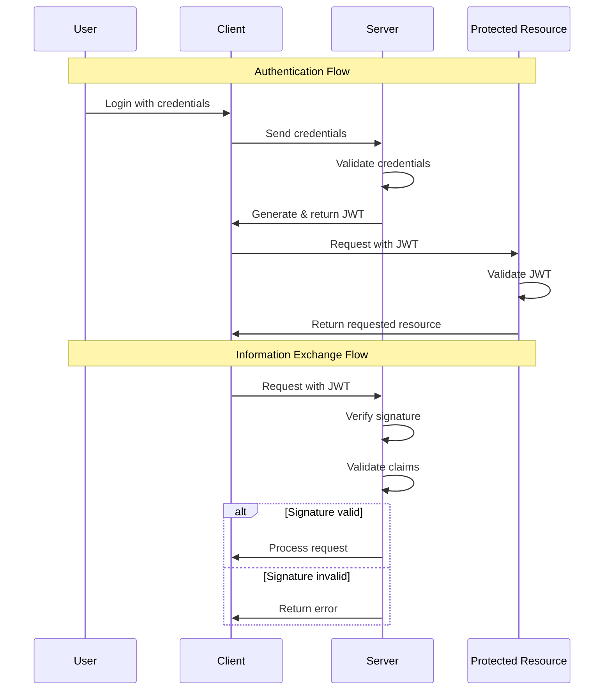

### 1. Web 1.0 vs Web 2.0 vs Web 3.0

인터넷의 발전을 통해 등장한 웹1(Web1.0), 웹2(Web2.0), 웹3(Web3.0)은 각기 다른 특성과 기술을 대표한다. 이들의 발전 과정은 인터넷의 사용 방식과 인터넷 기술의 변화를 반영 한다.

#### Web 1.0

Web 1.0은 인터넷의 초기 형태로, 주로 1990년대에 해당한다. 웹 1.0은 사람들이 정보를 더 잘 찾을 수 있도록 설계되었다. 이 웹 버전은 데이터를 검색하는 사용자를 위한 것 이었다.


오늘날 인터넷에서 즐기는 필수 형식, 시각적 요소, 컨트롤 및 상호 작용 기능이 부족하기 때문에 읽기 전용 웹(the read-only Web)이라고도 한다.

#### Web 2.0

Web 2.0은 인터넷의 사회적 단계로, 2000년대 초반부터 대중화되기 시작했다.

점점 늘어나는 청중을 위해 훨씬 더 많은 콘텐츠를 만드는 많은 사람들로 구성된다.  참여와 기여에 초점을 맞췄다.

오늘날 참여형 소셜 웹(participative social Web)이라고도 한다.

### Web 3.0

웹3는 인터넷의 최신 단계로, 아직 완전히 정의되지 않았지만, 분산형 네트워크와 블록체인 기술에 기반을 두고 있다. 그리고 탈중앙화, 개방성, 보다 뛰어난 사용자 유틸리티라는 핵심 아이디어를 바탕으로 구축되었다.

Web 1.0은 읽기 전용 웹(the read-only Web)이고, Web 2.0은 참여형 소셜 웹(participative social Web)이며, Web 3.0은 읽고, 쓰고, 실행하는 웹(read, write, execute Web) 이다.


처음에 Web 3.0을 Semantic Web이라고 불렀으며 인공 지능과 기계 학습을 사용하여 글로벌 두뇌(global brain) 역할을 하고 콘텐츠를 개념적, 맥락적으로 처리하는 지능적이고 자율적이며 개방적인 인터넷을 구상했다.

---

### 2. Git

**Git**은 소프트웨어 개발에서 소스 코드 관리를 위해 널리 사용되는 분산 버전 관리 시스템이다. 이 시스템을 통해 여러 개발자가 서로 방해 받지 않고 동시에 하나의 프로젝트에서 작업할 수 있다. Git은 파일 변경사항을 추적하고 여러 기여자들 간의 협업을 조율한다. 브랜치 생성, 병합, 되돌리기 등의 기능을 통합하여 프로젝트의 다양한 버전을 효율적으로 관리하고 변경 이력을 체계적으로 유지하는 데 도움을 준다.

#### 주요 기능:

- **분산 아키텍처**:

  - 모든 개발자가 전체 저장소와 그 이력의 완전한 복사본을 갖고 있어, 오프라인 작업 및 중복성을 지원한다.

- **브랜치 및 병합**:

  - 새로운 기능을 실험하거나 버그를 수정하기 위해 브랜치를 쉽게 생성하고 병합할 수 있다.

- **스테이징 영역(Staging Area)**:

  - 변경사항을 저장소 이력에 커밋하기 전에 먼저 스테이징하는 독특한 개념이다.

- **효율성**:

  - Git은 성능에 최적화되어 있으며 큰 프로젝트도 능숙하게 처리한다.

- **데이터 무결성**:
  - 모든 변경사항은 체크섬(checksum)을 통해 추적 및 검색이 가능하다.

#### Git 기본 용어:

- **워킹 디렉토리(Working Directory)**:

  - 현재 작업 중인 파일들이 있는 디렉토리이다.

- **스테이징 영역(Staging Area)**:

  - 커밋하기 전에 변경사항을 임시로 모아두는 영역이다.

- **리포지토리(Repository)**:

  - 프로젝트의 모든 버전과 이력이 저장되는 곳이다.

- **커밋(Commit)**:

  - 스테이징 영역의 변경사항을 리포지토리에 영구적으로 기록하는 것이다.

- **브랜치(Branch)**:

  - 작업을 분리하여 관리하기 위한 수단이다.

- **병합(Merge)**:
  - 두 개 이상의 브랜치를 하나로 통합하는 과정이다.

#### Git과 GitHub의 차이점:

- **Git**:
  - 버전 관리 시스템으로, 소스 코드의 변경 이력을 관리한다.
- **GitHub**:
  - Git을 사용하는 프로젝트를 호스팅하는 웹 서비스이다.
  - 협업, 이슈 추적, 코드 리뷰 등 추가적인 기능을 제공한다.

#### Git 명령어

```bash
# 새 Git 저장소 초기화
git init

# 저장소 상태 확인
git status

# 파일을 스테이징 영역에 추가
git add <파일명>
git add .  # 모든 변경사항 추가

# 커밋 메시지와 함께 변경사항 커밋
git commit -m "커밋 메시지"

# 원격 저장소에 변경사항 푸시
git push

# 커밋 이력 확인
git log

# 스테이징된 변경사항과 마지막 커밋 비교
git diff --staged

# 새 태그 생성
git tag <태그명>

# 로컬에서 태그 삭제
git tag --delete <태그명>

# 원격 저장소에서 태그 삭제
git push origin --delete <태그명>

# 원격 저장소에 태그 푸시
git push --tags

# 모든 태그 목록 조회
git tag

# 저장소 복제
git clone <저장소-URL>

# 원격 저장소에서 변경사항 가져오기
git fetch

# 원격 브랜치의 변경사항 병합
git merge <브랜치명>

# 원격 저장소에서 변경사항 가져오고 병합 (fetch + merge)
git pull

# 로컬 및 원격 브랜치 상태 확인
git branch -a

# 새 브랜치 생성
git branch <새-브랜치명>

# 다른 브랜치로 전환
git checkout <브랜치명>

# 위의 두 명령어를 결합: 새 브랜치 생성 및 전환
git checkout -b <새-브랜치명>

# 작업 디렉토리의 변경사항 임시 저장
git stash

# 임시 저장된 변경사항을 작업 디렉토리에 적용
git stash pop

# 원격 저장소 목록 표시
git remote -v

# 새 원격 저장소 설정
git remote add <원격-이름> <저장소-URL>

# 원격 저장소 삭제
git remote remove <원격-이름>

# 스테이징 되지 않은 변경사항 보기
git diff
```

##### Git 브랜치 생성 및 병합 프로세스

master 브랜치에서 feture 브랜치가 생성되는 워크플로를 보여준다. feature 브랜치에서 변경 사항이 적용되고 커밋된 다음 master 브랜치로 다시 병합되어 새로운 기능이나 변경 사항이 적용된다.


---

### 3. 어플라이언스(Appliance)

"**어플라이언스(Appliance)**"라는 용어는 일반적으로 특정 목적이나 기능을 수행하기 위해 사전에 구성되고 최적화된 특수 하드웨어 또는 소프트웨어 패키지를 의미한다. IT 분야에서 어플라이언스는 주로 네트워크 어플라이언스, 스토리지 어플라이언스, 가상 어플라이언스 등과 같이 특정 작업을 효율적으로 수행하도록 설계된 장치나 소프트웨어를 지칭하는 데 사용된다.

#### 네트워크 어플라이언스

네트워크 어플라이언스는 네트워크 관리, 보안, 통신 등의 기능을 제공하기 위해 특별히 제작된 하드웨어 장치이다. 방화벽, 라우터, 스위치, VPN 장비, 로드 밸런서 등이 여기에 해당합니다. 이러한 장치들은 네트워크 성능을 최적화하고, 보안 위협으로부터 네트워크를 보호하는 데 필수적인 역할을 한다.

#### 스토리지 어플라이언스

스토리지 어플라이언스는 데이터 저장 및 관리를 목적으로 하는 하드웨어 장치이다. **NAS(Network Attached Storage)** 또는 **SAN(Storage Area Network)** 장비와 같이 대량의 데이터를 효과적으로 저장하고, 공유하며, 백업할 수 있도록 설계되었다.

#### 가상 어플라이언스

가상 어플라이언스는 소프트웨어 어플라이언스의 한 형태로, 특정 소프트웨어 또는 서비스를 실행하기 위해 사전에 구성된 가상 머신 이미지이다. 이를 통해 사용자는 복잡한 설치 과정 없이 소프트웨어를 쉽게 배포하고 실행할 수 있다. 예를 들어, 가상화 환경에서의 백업 솔루션, 보안 시스템, 네트워크 관리 도구 등이 있다.

#### 어플라이언스의 장점

- **사용 편의성**: 어플라이언스는 특정 작업을 위해 최적화되어 있기 때문에, 설치와 구성이 간단하고 사용하기 쉽다.
- **성능**: 어플라이언스는 특정 기능을 수행하기 위해 최적화되어 있어, 관련 작업을 처리하는 데 있어 높은 성능을 발휘한다.
- **관리 용이성**: 일반적으로 통합된 관리 인터페이스를 제공하여, 관리가 용이하다.
- **보안**: 많은 어플라이언스는 보안 기능을 내장하고 있어, 데이터 보호와 네트워크 보안을 강화한다.

---

### 4. 애자일 프레임워크(Agile Framework)

**애자일 프레임워크(Agile Framework)** 는 프로젝트 관리와 소프트웨어 개발에서 변화에 빠르고 유연하게 대응하기 위해 고안된 방법론이다.

애자일은 전통적인 워터폴 모델과 달리, 계획과 개발, 배포 과정이 반복적이고 점진적으로 진행되어, 지속적인 고객 피드백과 제품의 개선을 추구한다. 이는 고객의 요구사항 변화에 능동적으로 대응하고, 시장의 변화에 빠르게 적응하며, 더 나은 제품을 제공하기 위한 목적으로 사용된다.

#### 애자일의 핵심 가치 (Agile Manifesto)

애자일 방법론은 다음 네 가지 핵심 가치에 기반을 둔다.

- 프로세스와 도구보다 개인과 상호작용을 우선시한다
- 포괄적인 문서보다 작동하는 소프트웨어를 우선시한다
- 계약 협상보다 고객과의 협력을 우선시한다
- 계획을 따르기보다 변화에 대응하는 것을 우선시한다

#### 주요 애자일 프레임워크

애자일 방법론에는 여러 프레임워크가 존재하며, 각기 다른 접근 방식과 기법을 제공한다.

- **스크럼 (Scrum)**: 가장 널리 사용되는 애자일 프레임워크 중 하나로, 정해진 기간(스프린트) 동안 팀이 목표를 달성하기 위해 협력하는 구조를 갖추고 있다.
- **칸반 (Kanban)**: 작업의 흐름을 시각화하여 현재 진행 중인 작업의 양을 제한함으로써 효율성을 높이는 방법론이다.
- **익스트림 프로그래밍 (XP)**: 고객 만족을 최대화하기 위해 빠른 피드백, 연속적인 개선, 기술적 우수성, 좋은 설계에 초점을 맞춘 소프트웨어 개발 방법론이다.
- **린 소프트웨어 개발 (Lean Software Development)**: 낭비를 최소화하고, 가치 창출에 집중하는 원칙에 기반한 방법론이다.

---

### 5. 스크럼(Scrum)

**스크럼(Scrum)** 은 **애자일(Agile) 프레임워크** 중 하나로, 특히 복잡한 소프트웨어 개발 프로젝트를 관리하기 위해 널리 사용된다. 스크럼은 개발 프로세스를 짧은 사이클(일반적으로 2주에서 4주 사이의 스프린트)로 나누어, 지속적인 개선과 유연한 요구사항 대응을 가능하게 한다. 스크럼은 팀이 명확한 목표를 가지고 집중할 수 있도록 돕고, 변화에 신속하게 대응할 수 있도록 한다.

### 스크럼의 주요 구성 요소

- **스크럼 팀(Scrum Team)**: 제품 소유자(Product Owner), 스크럼 마스터(Scrum Master), 개발 팀(Development Team)으로 구성된다.
  - **제품 소유자(Product Owner)**: 제품 백로그를 관리하며, 제품의 가치를 최대화한다.
  - **스크럼 마스터(Scrum Master)**: 스크럼 팀이 스크럼 프로세스를 원활하게 따를 수 있도록 지원한다.
  - **개발 팀(Development Team)**: 제품의 실제 작업을 수행합니다. 자율적이며, 크로스펑셔널한 팀이다.
- **스프린트(Sprint)**: 스크럼의 핵심이 되는 시간 박스로, 팀이 새로운 제품 증분을 제공하기 위해 집중하는 기간이다.
- **일일 스크럼(Daily Scrum)**: 매일 진행되는 짧은 회의로, 팀 구성원이 그날의 작업에 대해 논의하고, 장애물을 공유한다.
- **스프린트 계획 회의(Sprint Planning Meeting)**: 스프린트가 시작될 때 진행되며, 팀이 다음 스프린트 동안 작업할 항목을 결정한다.
- **스프린트 검토(Sprint Review)**: 스프린트가 끝날 때 제품의 증분을 검토하는 회의입니다. 이는 피드백을 수집하고 다음 스프린트에 대한 계획을 조정하는 데 도움이 된다.
- **스프린트 회고(Sprint Retrospective)**: 스프린트 검토 후에 진행되며, 팀이 과정을 반성하고 개선점을 도출하는 회의이다.

---

### 6. API(Application Programming Interface, 애플리케이션 프로그래밍 인터페이스)

**API(Application Programming Interface, 애플리케이션 프로그래밍 인터페이스)** 는 다양한 소프트웨어 애플리케이션, 시스템, 라이브러리 간에 상호작용을 가능하게 하는 규약 또는 인터페이스이다.

API는 한 프로그램이 다른 프로그램의 기능이나 데이터에 접근할 수 있도록 해주며, 이를 통해 개발자는 복잡한 기능을 직접 구현하지 않고도 해당 기능을 사용할 수 있다. 소프트웨어 개발의 핵심 요소로, 복잡한 기능과 서비스를 쉽고 효율적으로 사용할 수 있게 해주는 중요한 도구이다.

#### API의 주요 기능과 목적

- **재사용성**: API를 통해 개발자는 기존에 개발된 기능을 재사용할 수 있으며, 이는 개발 시간과 비용을 절약하는 데 도움이 된다.
- **모듈성**: API를 사용하면 소프트웨어를 모듈식으로 설계할 수 있으며, 이는 유지보수와 업데이트를 보다 쉽게 만든다.
- **통합과 상호운용성**: 다양한 애플리케이션, 시스템, 서비스 간의 통합을 용이하게 하여, 서로 다른 기술을 사용하는 시스템들 사이의 상호운용성을 향상시킨다.
- **보안**: API를 사용하면 데이터와 기능에 대한 접근을 제어하고, 보안 규칙과 정책을 적용할 수 있다.

#### API의 종류

- **웹 API**: HTTP 프로토콜을 사용하여 웹 서비스와 상호작용하기 위한 API로, REST(Representational State Transfer), SOAP(Simple Object Access Protocol), GraphQL 등이 있다.
- **라이브러리 기반 API**: 특정 프로그래밍 언어 또는 플랫폼에 특화된 API로, 개발자가 특정 기능을 구현할 때 사용한다.
- **하드웨어 API**: 하드웨어와 상호작용하기 위한 API로, 운영 체제나 드라이버 수준에서 하드웨어의 기능에 접근할 수 있게 한다.

#### API 사용 예시

- **소셜 미디어 통합**: 소셜 미디어 서비스의 API를 사용하여 웹사이트나 애플리케이션에서 사용자 인증, 콘텐츠 공유 등의 기능을 제공할 수 있다.
- **지도 서비스**: Google Maps API를 사용하여 웹사이트나 모바일 앱에 지도를 표시하고, 위치 기반 서비스를 제공할 수 있다.
- **결제 시스템**: PayPal, Stripe 등의 결제 서비스 API를 통해 온라인 결제 기능을 손쉽게 통합할 수 있다.

---

### 7. SSO (Single Sign-On)이란?

SSO, 즉 Single Sign-On은 사용자가 하나의 인증을 통해 여러 시스템이나 애플리케이션에 접근할 수 있게 해주는 인증 과정이다. 사용자는 하나의 ID와 비밀번호로 다양한 서비스에 로그인할 수 있으며, 이는 사용자 경험을 향상시키고 인증 관리의 복잡성을 줄여준다. SSO는 효율적인 자원 관리와 보안 강화에도 기여한다. 예를 들어, 직원이 회사의 이메일, 문서 도구, 내부 포털 등 다양한 서비스를 사용할 때 각각 다른 로그인 정보를 기억할 필요 없이 한 번의 로그인으로 모든 서비스에 접근할 수 있다.

SSO 구현은 여러 방식으로 이루어질 수 있으며, 일반적으로 OAuth, SAML(Security Assertion Markup Language), OpenID Connect와 같은 표준 프로토콜을 사용한다. 이러한 프로토콜은 안전한 인증 정보의 교환을 보장하며, 서비스 제공자와 신뢰할 수 있는 인증 제공자 간의 통신을 중재한다.

#### SSO 주요이점

- **사용자 편의성 증대**: 한 번의 로그인으로 여러 서비스에 접근할 수 있어 사용자의 편의성이 증대된다.
- **보안 강화**: 사용자가 다양한 서비스에 대해 복잡하고 다른 비밀번호를 기억할 필요가 없어, 강력한 비밀번호 정책을 더 쉽게 시행할 수 있다.
- **효율적인 자원 관리**: 인증 절차가 중앙에서 관리되므로 IT 관리자는 사용자 계정을 더욱 효과적으로 관리할 수 있다.

#### OAuth (Open Authorization)

- **목적**: OAuth는 액세스 위임을 위한 개방형 표준으로, 일반적으로 인터넷 사용자가 비밀번호를 제공하지 않고도 웹사이트나 애플리케이션에 다른 웹사이트의 정보에 대한 액세스 권한을 부여하는 방법으로 사용된다. 사용자 자격 증명을 노출하지 않고 사용자 데이터에 액세스할 수 있도록 타사 애플리케이션을 인증하는 데 중점을 둔다.
- **작동 방식**: OAuth는 리소스 소유자(사용자)의 승인을 받아 승인 서버에서 타사 애플리케이션에 토큰을 발급하는 방식으로 작동한다. 이 토큰은 정의된 기간 동안 특정 리소스 세트에 대한 액세스 권한을 부여한다. 최신 버전인 OAuth 2.0은 API 인증에 사용되며 다양한 클라이언트 유형 및 시나리오에 대한 여러 흐름(또는 부여)을 지원한다.
  

#### SAML (Security Assertion Markup Language)

- **목적**: SAML은 서비스 제공자와 ID 제공자 간의 인증 및 권한 부여를 위한 XML 기반 프레임워크이다. SSO(Single Sign-On)를 위해 엔터프라이즈 환경에서 널리 사용되며 사용자가 한 번 로그인하면 재인증 없이 여러 시스템에 액세스할 수 있다.
- **작동 방식**: SAML에서 ID 공급자(IdP)는 사용자의 자격 증명을 확인한 다음 서비스 공급자(SP)에게 SAML 어설션을 보낸다. 이 어설션에는 사용자 ID와 관련된 인증 문 및 속성이 포함되어 있습니다. 그런 다음 서비스 공급자는 이 어설션을 기반으로 액세스 권한을 부여한다. SAML 2.0은 현재 일반적으로 사용되는 버전이다.
  

#### OIDC (OpenID Connect)

- **목적**: OpenID Connect는 OAuth 2.0 프로토콜 위에 있는 간단한 ID 계층으로, 클라이언트가 최종 사용자의 ID를 확인하고 상호 운용 가능한 REST와 유사한 방식으로 기본 프로필 정보를 얻을 수 있도록 한다. 웹, 모바일 및 JavaScript 클라이언트에 널리 사용된다.
- **작동 방식**: OpenID Connect는 사용자에 대한 정보가 포함된 JWT(JSON 웹 토큰)인 ID 토큰으로 OAuth 2.0을 확장한다. 사용자를 인증한 후 ID 공급자는 ID 토큰과 액세스 토큰(승인된 경우)을 발급한다. 그런 다음 클라이언트는 ID 토큰을 사용하여 사용자 정보를 얻고 액세스 토큰을 사용하여 승인된 리소스에 액세스할 수 있다.
  

#### OAuth vs SAML vs OIDC

- **OAuth**는 주로 인증이 아닌 승인과 관련이 있다. 사용자를 대신하여 작업할 수 있는 권한을 애플리케이션에 부여하는 데 사용된다.
- **SAML**은 사용자가 세션 중에 여러 서비스에 액세스하는 엔터프라이즈 시나리오에서 주로 SSO를 통한 인증 및 권한 부여에 중점을 둔다.
- **OIDC**는 인증을 추가하기 위해 OAuth 2.0을 기반으로 구축되어 신원 확인과 데이터 액세스 권한이 모두 필요한 최신 웹 및 모바일 애플리케이션을 위한 보다 포괄적인 솔루션이다.

---

### 8. JWT 토큰(JWT Token)이란?

**JSON 웹 토큰(JWT)** 은 두 당사자 간에 전송될 클레임을 나타내는 URL 안전 방식의 간결한 수단이다. JWT 내의 클레임은 JSON 객체로 인코딩되며, JSON 웹 서명(JWS)을 사용하여 디지털 서명된다. 선택적으로, JSON 웹 암호화(JWE)를 사용하여 암호화할 수도 있다.

#### 구조

JWT는 일반적으로 헤더(Header), 페이로드(Payload), 서명(Signature)의 세 부분으로 구성되며, 점(`.`)으로 구분됩니다. 그 구조는 `header.payload.signature`이다.

- **헤더(Header)**: 헤더는 보통 토큰의 유형(JWT)과 사용되는 서명 알고리즘(예: HMAC SHA256 또는 RSA)의 두 부분으로 구성된다.

```json
{
  "alg": "HS256",
  "typ": "JWT"
}
```

- **페이로드(Payload)**: 페이로드에는 클레임이 포함됩니다. 클레임은 엔티티(보통 사용자)에 대한 진술과 추가 데이터입니다. 등록된 클레임, 공개 클레임, 개인 클레임의 세 가지 유형이 있다.
  - **등록된 클레임(Registered Claims)**: 이들은 필수는 아니지만 유용한 상호 운용 클레임 세트를 제공하기 위해 미리 정의된 클레임 세트이다. 일부는 iss(발급자), exp(만료 시간), sub(주제), aud(대상자) 등이다.
  - **공개 클레임(Public Claims)**: JWT를 사용하는 이들이 원하는 대로 정의할 수 있다. 그러나 충돌을 피하기 위해 IANA JSON 웹 토큰 레지스트리에 정의되거나 충돌 방지 네임스페이스를 포함하는 URI로 정의되어야 한다.
  - **개인 클레임(Private Claims)**: 동의하는 당사자 간에 정보를 공유하기 위해 생성된 사용자 정의 클레임으로, 등록되지 않았거나 공개 클레임이 아니다.

```json
{
  "sub": "1234567890",
  "name": "John Doe",
  "admin": true,
  "iat": 1516239022
}
```

- **서명(Signature)**: 서명 부분을 생성하려면, 인코딩된 헤더와 인코딩된 페이로드, 비밀키, 헤더에 명시된 알고리즘을 사용하여 서명해야 한다. 예를 들어, HMAC SHA256 알고리즘을 사용하는 경우, 서명은 다음과 같은 방식으로 생성된다.

```plaintext
HMACSHA256(
  base64UrlEncode(header) + "." +
  base64UrlEncode(payload),
  secret)
```

#### JWT의 작동 방식

- **인증(Authentication)**: 사용자가 로그인한 후, 각 후속 요청에는 JWT가 포함되어, 해당 토큰으로 허용된 경로, 서비스 및 리소스에 접근할 수 있다.
- **정보 교환(Information Exchange)**: JWT는 예를 들어 공개/개인 키 쌍을 사용하여 서명할 수 있기 때문에, 발신자가 그들이 주장하는 사람인지 확신할 수 있다. 또한, 서명은 헤더와 페이로드를 사용하여 계산되므로, 내용이 변경되지 않았는지도 검증할 수 있다.


---

### 9. Infrastructure as Code (IaC)란?

**Infrastructure as Code (IaC)** 는 수동 프로세스가 아닌 코드를 통해 인프라를 관리하고 프로비저닝하는 방식이다. IaC를 사용하면, 하드웨어가 아닌 구성 파일을 사용하여 인프라가 관리된다. 이 접근 방식은 개발자와 IT 운영 팀이 하드웨어 설정이나 구성을 수동으로 설정하는 대신 자동으로 리소스를 관리, 모니터링 및 프로비저닝할 수 있게 해준다.

#### 핵심 원칙

- **자동화(Automation)**: IaC는 인프라 배포를 자동화하여 빠르고 일관된 설정을 가능하게 한다.
- **멱등성(Idempotency)**: IaC 시스템의 작업은 한 번이나 여러 번 실행될 수 있으며 동일한 결과를 보장하여 신뢰성과 일관성을 보장한다.
- **버전 관리(Version Control)**: 인프라 구성은 버전 관리 시스템에 저장되어 변경 추적, 기록, 및 롤백을 가능하게 한다.

#### 이점

- **속도 및 효율성(Speed and Efficiency)**: 인프라의 신속한 프로비저닝을 통해 개발 및 배포 주기를 빠르게 할 수 있다.
- **일관성 및 신뢰성(Consistency and Reliability)**: 프로비저닝 프로세스를 자동화하여 인간의 오류를 최소화하고 환경을 매번 일관되게 프로비저닝을 보장한다.
- **확장성(Scalability)**: 수동 개입 없이 구성 파일의 변경으로 인프라를 쉽게 확장하거나 축소할 수 있다.
- **비용 절감(Cost Savings)**: 물리적 하드웨어와 수동 노동의 필요성을 줄여 시간이 지남에 따라 비용을 절감한다.

#### 도구

IaC를 용이하게 하는 여러 도구들이 있으며, 각각 자체적인 문법과 생태계를 가지고 있다:

- **Terraform**: HashiCorp에 의해 개발된 오픈소스 도구로, 클라우드 및 온프레미스 리소스 모두를 관리할 수 있다.
- **AWS CloudFormation**: Amazon Web Services에서 제공하는 서비스로, 템플릿에 정의된 AWS 리소스를 관리할 수 있다.
- **Ansible**: 클라우드 프로비저닝, 구성 관리 및 애플리케이션 배포를 위한 간단한 자동화를 제공하는 오픈소스 도구이다.
- **Chef**: Ruby 기반 레시피를 사용하여 인프라 프로비저닝을 자동화하는 구성 관리 도구이다.
- **Puppet**: IT 인프라의 상태를 정의할 수 있게 하고 올바른 상태를 자동으로 집행하는 또 다른 구성 관리 도구이다.

---

### 10. CI/CD란?

#### CI (Continuous Integration, 지속적 통합)

**지속적 통합**은 개발자들이 작업한 코드를 주기적으로 공유 레포지토리에 합치는 것을 말한다. 이 과정은 자동화된 빌드와 테스트를 포함하여, 코드 변경 사항이 문제를 일으키지 않는지 확인한다. 지속적 통합의 주요 목적은 소프트웨어 개발 과정에서 발생할 수 있는 오류를 조기에 발견하고 해결하는 것이다.

#### CD (Continuous Deployment, 지속적 배포)

**지속적 배포**는 개발된 소프트웨어를 고객이 사용할 수 있는 환경까지 자동으로 배포하는 것을 말한다. 이는 지속적 통합 과정을 거친 후, 추가적인 수동 과정 없이 고객에게 소프트웨어를 제공하는 것을 포함한다. 지속적 배포를 통해 소프트웨어의 새로운 버전을 빠르게 고객에게 전달할 수 있다.

#### CI/CD의 장점

- **효율성 증대**: 자동화된 프로세스를 통해 개발 및 배포 과정의 속도가 빨라지고, 오류 발생 가능성이 줄어든다.
- **품질 향상**: 지속적인 테스트와 통합을 통해 소프트웨어의 품질이 개선된다.
- **고객 만족도 향상**: 빠른 배포를 통해 사용자의 피드백을 신속하게 반영하고, 소프트웨어의 개선 사항을 빠르게 제공할 수 있다.

#### CI/CD 도구

CI/CD 파이프라인을 구축하고 관리하는 데 사용할 수 있는 여러 도구가 있다. 가장 인기 있는 도구 중 일부는 다음과 같다:

- **Jenkins**: 다양한 CI/CD 시나리오를 지원하는 오픈 소스 자동화 서버이다. Jenkins는 방대한 플러그인 생태계로 매우 맞춤화할 수 있다.
- **Travis CI**: GitHub 프로젝트를 위한 지속적 통합 서비스이다. GitHub 저장소와의 통합이 용이하고 사용이 간편하다는 장점이 있다.
- **GitLab CI/CD**: 소스 코드 관리와 CI/CD를 하나의 플랫폼으로 통합한 솔루션을 제공한다. 강력한 파이프라인 구성을 제공한다.
- **CircleCI**: 빠른 빌드와 배포를 지원하는 클라우드 기반 CI/CD 서비스이다. GitHub과 Bitbucket과의 우수한 통합 기능을 제공한다.
- **GitHub Actions**: GitHub 저장소 내에서 워크플로우 자동화를 가능하게 한다. GitHub Actions는 CI/CD에서 이슈 분류까지 모든 소프트웨어 워크플로우를 자동화하는 것을 쉽게 만들어 준다.
- **ArgoCD**: Kubernetes를 위한 선언적 GitOps 지속적 배포 도구이다. ArgoCD를 사용하면 소스 코드 저장소를 진리의 근원으로 사용하여 Kubernetes 리소스를 유지 관리하고 관리할 수 있다.
- **Bamboo**: 자동화된 빌드, 테스트, 릴리즈를 하나의 워크플로우로 결합하는 지속적 통합 및 배포 도구이다. 다른 Atlassian 제품들과 잘 통합된다.
- **TeamCity**: JetBrains에서 제공하는 빌드 관리 및 지속적 통합 서버이다. 다양한 프로그래밍 언어와 기술을 지원하며 포괄적인 기능 세트를 가지고 있다.

---

### 11. APM(Application Performance Monitoring)이란?

**APM(애플리케이션 성능 모니터링)** 은 소프트웨어 도구와 원격 측정 데이터를 사용하여 비즈니스 크리티컬 애플리케이션의 성능을 모니터링하는 프로세스를 말한다. APM은 IT 전문가가 복잡한 애플리케이션 성능 문제를 감지하고 진단하여 애플리케이션이 예상 서비스 수준을 충족하는지 확인하는 데 도움을 준다.

#### APM 주요 구성 요소

APM에는 일반적으로 다음과 같은 몇 가지 주요 구성 요소가 포함된다.

- **성능 지표**: APM 도구는 응답 시간, 트랜잭션 볼륨, 오류율, 시스템 리소스 사용량 등 다양한 성능 지표에 대한 데이터를 수집한다.
- **실시간 모니터링**: APM은 애플리케이션에 대한 실시간 모니터링을 제공하여 성능 이상 및 중단을 신속하게 감지한다.
- **최종 사용자 모니터링**: 최종 사용자가 애플리케이션과 상호 작용하는 방식과 애플리케이션 성능이 사용자 경험에 미치는 영향을 추적한다. 여기에는 브라우저 및 모바일 앱 성능 분석이 포함될 수 있다.
- **분산 추적 및 트랜잭션 프로파일링**: APM 도구는 분산 아키텍처 내의 다양한 서비스와 구성 요소에서 트랜잭션을 추적하고 시각화할 수 있다. 이는 트랜잭션 체인에서 지연이나 실패가 발생하는 위치를 정확히 찾아내는 데 도움이 된다.
- **분석 및 보고**: APM 솔루션은 수집된 데이터를 처리하고, 패턴을 식별하고, 잠재적인 문제를 예측하고, 실행 가능한 통찰력을 제공하는 분석 도구를 제공한다.
- **애플리케이션 토폴로지 검색**: 최신 APM 도구는 애플리케이션의 다양한 구성 요소와 종속성을 자동으로 검색하고 매핑하여 애플리케이션 아키텍처에 대한 포괄적인 보기를 제공할 수 있다.

#### APM 도구

- **Dynatrace**: 성능 문제를 감지하고 진단하는 심층 모니터링 기능과 광범위한 자동화로 잘 알려져 있다.
- **New Relic**: 강력한 분석 기능을 통해 포괄적인 애플리케이션 및 인프라 모니터링을 제공한다.
- **Datadog**: 클라우드 환경에 중점을 두고 서버, 데이터베이스, 도구 및 서비스 전반에 대한 모니터링을 제공한다.
- **AppDynamics**: 상세한 애플리케이션 성능 통찰력 및 비즈니스 성과 모니터링에 중점을 둔다.

---
