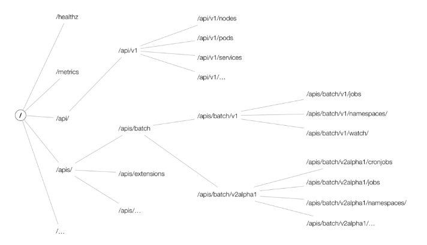
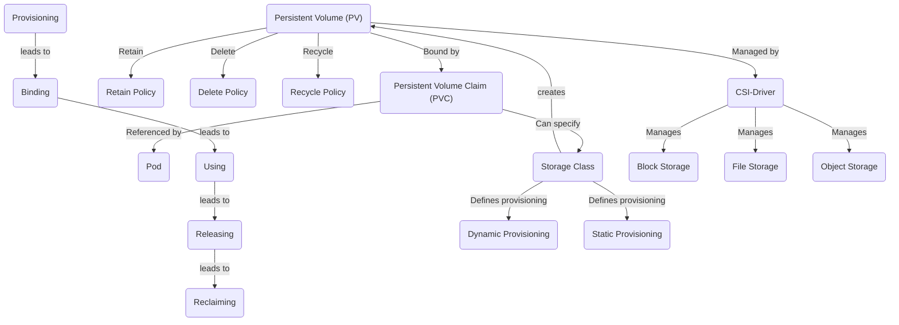
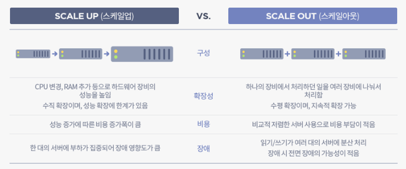
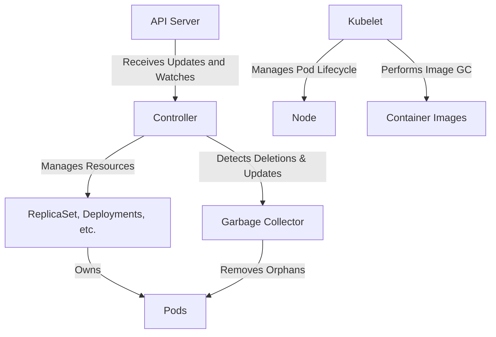
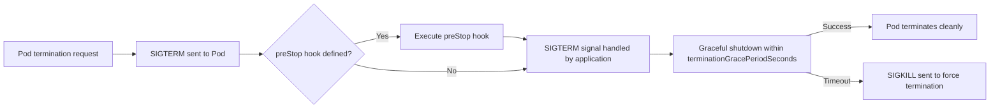

### 1. 왜 쿠버네티스를 사용해야 할까?

Kubernetes를 사용하면서도 **“왜 Kubernetes를 사용해야 할까?”** 에 대한 의문점에 대해서 크게 생각해본 적이 없었다.

그렇다면 Kubernetes를 사용해야만 하는 이유에 대해서 알아보자.

Kubernetes는 애플리케이션 컨테이너 배포, 확장 및 운영을 자동화하도록 설계된 오픈 소스 컨테이너 오케스트레이션 플랫폼이다. Google에서 개발했으며 현재 Cloud Native Computing Foundation에서 유지관리 하고 있다.

주요 이점은 아래와 같다.

- **Container Orchestration(컨테이너 오케스트레이션)**
  - Kubernetes는 컨테이너의 수명주기를 효율적으로 관리하여 머신 클러스터 전반에 걸쳐 배포, 확장, 종료를 처리한다. 이는 격리되고 자체 종속성이 번들로 포함된 컨테이너에서 애플리케이션을 실행하는 프로세스를 단순화한다.
- **Scalability(확장성)**
  - Kubernetes를 사용하면 간단한 명령이나 UI를 사용하거나 CPU 사용량에 따라 자동으로 애플리케이션을 자동으로 확장 및 축소할 수 있다.
- **Load Balancing(로드 밸런싱)**
  - Kubernetes는 배포가 안정적이도록 네트워크 트래픽을 분산할 수 있다. 즉, 애플리케이션의 단일 실패 지점에 대해 걱정할 필요가 없다.
- **High Availability(고가용성)**
  - Kubernetes는 자동 빈패킹, 자가 복구(응답하지 않는 컨테이너 자동으로 다시 시작), 복제, 수평 확장(필요에 따라 자동으로 애플리케이션 크기 조정)과 같은 기능을 제공하여 애플리케이션의 가용성을 보장한다.
- **Automated Rollouts and Rollbacks(자동 롤아웃 롤백)**
  - Kubernetes를 사용하여 배포된 컨테이너에 대해 원하는 상태를 설명할 수 있으며 제어된 속도로 실제 상태를 원하는 상태로 변경할 수 있다. 예를 들어 Kubernetes를 자동화하여 배포를 위한 새 컨테이너를 생성하고, 기존 컨테이너를 제거하고, 모든 리소스를 새 컨테이너로 변경시켜 줄 수 있다.
- **Service Discovery and Load Balancing(서비스 검색 및 로드 밸런싱)**
  - Kubernetes는 DNS 이름이나 자체 IP 주소를 사용하여 컨테이너를 노출할 수 있다. 컨테이너에 대한 트래픽이 높으면 Kubernetes는 배포가 안정적이도록 네트워크 트래픽의 부하를 분산하고 분산할 수 있다.
- **Storage Orchestration(스토리지 오케스트레이션)**
  - Kubernetes를 사용하면 로컬 스토리지, 퍼블릭 클라우드 공급자 등 원하는 스토리지 시스템을 자동으로 마운트할 수 있다.
- **Secret and Configuration Management(Secret 및 Configmap 관리)**
  - Kubernetes는 비밀번호, OAuth 토큰, SSH 키와 같은 민감한 정보를 관리할 수 있다. 컨테이너 이미지를 다시 빌드하거나 스택 구성에 Secret을 노출하지 않고도 비밀과 애플리케이션 구성을 배포하고 업데이트할 수 있다.

#### 컨테이너 오케스트레이션(Container Orchestration)이란?

컨테이너 오케스트레이션은 컨테이너 수명주기를 자동으로 관리하는 것이다. 여기에는 컨테이너의 배포, 확장, 네트워킹, 수명주기 관리 등 다양한 활동이 포함된다.

즉, 컨테이너 오케스트레이션은 개별 구성 요소와 애플리케이션 계층의 작업을 구성하는 프로세스를 의미한다.

##### 컨테이너 오케스트레이션이 중요한 이유

- **Efficiency(효율성)**: 많은 수의 컨테이너를 효율적으로 관리하고 확장한다.
- **Load Balancing(로드 밸런싱)**: 컨테이너 간에 로드와 트래픽을 자동으로 분산한다.
- **High Availability(고가용성)**: 컨테이너 복제본 및 교체를 관리하여 가동 중지 시간을 방지한다.

##### 컨테이너 오케스트레이션의 주요 구성 요소

- **Container(컨테이너)**: 코드, 런타임, 시스템 도구, 라이브러리 및 설정을 포함하여 소프트웨어를 실행하는 데 필요한 모든 것이 포함된 경량의 독립형 실행 가능 패키지이다.
- **Pod(파드)**: 하나 이상의 컨테이너를 호스팅할 수 있는 Kubernetes에서 배포 가능한 가장 작은 단위이다.
- **Node(노드)**: Kubernetes의 작업자 머신으로, 클러스터에 따라 가상 머신일 수도 있고 물리적 머신일 수도 있다.
- **Cluster(클러스터)**: Kubernetes에서 관리하는 컨테이너화된 애플리케이션을 실행하는 노드 집합이다.

##### 기타 컨테이너 오케스트레이션 도구

Kubernetes 외에도 오케스트레이션 기능을 제공하는 Docker Swarm 및 Apache Mesos와 같은 다른 도구가 있다.

#### Reference

- [Kubernetes 구성요소와 Pod 생성 방식](https://somaz.tistory.com/263)

---

### 2. Kubernetes 구성요소란?

Kubernetes는 머신 클러스터 전체에서 컨테이너화된 애플리케이션을 관리하기 위한 시스템이다.

다양한 리소스와 구성 요소를 사용하여 애플리케이션 배포 및 관리의 다양한 측면을 처리한다.

Kubernetes 내에서 `kube-system` 네임스페이스에는 Kubernetes 클러스터에서 중요한 역할을 하는 여러 중요한 시스템 Pod가 포함되어 있다.

#### Control Plane 컴포넌트

##### kube-apiserver

- 전체 Kubernetes 클러스터의 중앙 제어를 담당한다.
- 내부 시스템 구성 요소는 물론 외부 사용자가 사용하는 Kubernetes API를 제공한다.
- Pod가 생성되면 `kube-apiserver`는 요청을 처리하고  Pod 정보를 etcd 데이터베이스에 저장한다.


##### etcd

- 모든 클러스터 데이터에 대한 Kubernetes의 백업 저장소로 사용되는 일관되고 가용성이 높은 키 값 저장소이다.
- Pod가 생성되면 해당 구성과 상태가 `etcd`에 저장되므로 클러스터 상태가 유지되고 장애 발생 시 복구될 수 있다.


##### kube-scheduler

- 할당된 노드가 없는 새로 생성된 Pod를 감시하고 리소스 요구 사항, 선호도 사양, 데이터 지역성, 워크로드 간 등 다양한 일정 기준에 따라 실행할 노드를 선택한다.
- Pod가 생성된 후 `kube-scheduler`는 이를 적합한 노드에 할당한다.


##### kube-controller-manager

- 클러스터에서 일상적인 작업을 처리하는 background threads 컨트롤러 프로세스를 실행한다.
- Pod 생성 시 `kube-controller-manager`의 관련 컨트롤러는 Pod의 실제 상태가 사용자가 지정한 원하는 상태와 일치하는지 확인한다.

#### Node 컴포넌트

##### kubelet

- 클러스터의 각 노드에서 실행되는 kubelet은 컨테이너가 Pod에서 실행되는지 확인하는 역할을 한다.
- Pod가 노드에 예약되면 해당 노드의 kubelet은 `kube-apiserver`의 요청을 받아 Pod에 지정된 컨테이너를 시작한다.


##### kube-proxy

- 각 노드에서 실행되며 네트워크 프록시로, 클러스터 내부 또는 외부의 네트워크 세션에서 Pod로의 네트워크 통신을 허용하는 네트워크 규칙을 유지한다.
- Pod가 생성되면 `kube-proxy`는 포드의 IP 주소로 IP 전달을 허용하도록 노드의 네트워크 규칙을 업데이트 한다.


##### DNS 서비스(ex: CoreDNS)

- Kubernetes 클러스터에 DNS 서비스를 제공하여 서비스 및 Pod 이름을 IP 주소로 변환한다.
- Pod가 생성되면 IP 주소와 DNS 이름을 얻는다. `CoreDNS`는 레코드를 업데이트하여 클러스터 내의 DNS 이름을 통해 Pod에 액세스할 수 있도록 한다.


##### Container Runtime

- 컨테이너 런타임은 컨테이너 실행을 담당하는 소프트웨어이다.
- Containerd, CRI와 같은 컨테이너 런타임을 지원한다.


##### Addon

- `Addon`은 쿠버네티스 리소스(데몬셋, 디폴로이먼트 등)을 이용하여 클러스터 기능을 구현한다.
- 클러스터 단위의 기능을 제공하기 때문에 애드온에 대한 네임스페이스 리소스는 kube-system 네임스페이스에 속한다.

#### Reference

- [Kubernetes 구성요소와 Pod 생성 방식](https://somaz.tistory.com/263)

---

### 3. Kubernetes Pod 생성 방식

1. **kubectl (Execute)**:

   - 사용자가 `kubectl apply -f k8s-deployment.yml`을 실행한다.
   - YAML을 JSON으로 변환하여 kube-apiserver로 전송한다.

2. **kube-apiserver (Processing)**:

   - API 서버가 배포 요청을 받는다.
   - 쿠버네티스 데이터베이스에 배포 세부 정보(객체 정의)를 유지한다.

3. **etcd (Data Storage)**:

   - etcd는 쿠버네티스에서 구성 및 상태 정보를 포함한 데이터를 지속적으로 저장하는데 사용되는 고가용성 키-값 저장소이다.
   - 배포 리소스가 etcd에 저장되면 컨트롤러 매니저에게 알림이 전송된다.

4. **kube-controller-manager (Resource Creation)**:

   - 컨트롤러 매니저는 배포 시 지정된 replica 수에 따라 pod 리소스를 생성한다.

5. **kube-scheduler (Scheduling)**:

   - 스케줄러는 큐 상태를 모니터링하고 인프라스트럭처의 health를 평가한다.
   - 최적의 노드를 선정하기 위해 노드 필터링 및 순위 매기기(ranking)를 수행한다.
   - 스케줄러는 `nodeName` 필드로 선택된 노드를 나타내며, etcd에서 pod의 상태를 `scheduled`으로 업데이트한다.

6. **kubelet (Node-Level Execution)**:

   - 각 워커 노드는 마스터 노드/컨트롤 플레인과 통신하는 `kubelet`을 실행한다.
   - `kubelet`은 pod에 지정된 컨테이너가 실행 중인지 확인한다.
   - 컨트롤 플레인의 지시에 따라 노드에서 작업을 실행한다.

7. **Container Runtime Interface (CRI) Daemon (Container Creation)**:

   - 배포가 여러 복제본을 지정하는 경우, 각 작업은 etcd에서 `scheduled`으로 표시된다.
   - `kubelet`은 pod 템플릿을 검색하고 컨테이너 런타임 인터페이스(CRI) 데몬에게 컨테이너 생성을 지시한다.
   - `kubelet`에 의해 호출되어 Pod 내의 컨테이너를 생성 한다.

8. **kubelet (Status Update)**:
   - CRI 데몬 작업이 완료되면 `kubelet`은 `readiness` 및 `liveness` 프로브 검사를 수행한다.
   - 이 검사를 통과하면 pod의 상태가 `running`으로 업데이트된다.

#### Reference

- [Kubernetes 구성요소와 Pod 생성 방식](https://somaz.tistory.com/263)

---

### 4. Kubernetes API Group & RBAC(Role Based Access Control)

#### API Group

쿠버네티스 API 그룹(API Group)은 쿠버네티스 API 리소스들을 관리하기 위해 그룹화한 것이다. API 그룹을 통해 관련된 리소스를 분류하고, 버전 관리를 효율적으로 수행할 수 있다.

쿠버네티스 API는 크게 Core Group과 Named Group으로 나뉜다.


- Image Reference : https://cloud.redhat.com/blog/kubernetes-deep-dive-api-server-part-1

##### 1. Core Group

Core Group은 기본적인 쿠버네티스 리소스를 포함하는 그룹으로, API 그룹 이름이 공백 문자열("")로 지정된다.

이 그룹에는 파드(Pods), 서비스(Services), 레플리케이션컨트롤러(ReplicationControllers), 노드(Nodes), 네임스페이스(Namespaces) 등 쿠버네티스의 핵심 기능을 제공하는 리소스가 포함된다.


예를들어 Core Group의 `pods` 리소스에 대한 권한을 설정할 때 다음과 같이 작성한다.

```yaml
apiGroups: [""]
resources: ["pods"]
```

##### 2. Named Group

Named Group은 Core Group 외의 특정한 이름을 가진 API 그룹이다.

이 그룹에는 애플리케이션 관련 리소스, 보안 관련 리소스, 구성 관련 리소스, 그 외 다양한 확장 리소스 등이 포함될 수 있다. 대표적인 Named Group으로는 `extensions, apps, networking.k8s.io, rbac.authorization.k8s.io` 등이 있다.


예를 들어, apps API 그룹의 deployments 리소스에 대한 권한을 설정할 때 다음과 같이 작성한다.

```yaml
apiGroups: ["apps"]
resources: ["deployments"]
```

<br/>

#### RBAC(Role Based Access Control)

쿠버네티스의 RBAC (Role-Based Access Control)은 쿠버네티스 클러스터 내에서 리소스에 대한 접근 권한을 사용자나 그룹에게 부여하는 보안 메커니즘(Authorization)이다. RBAC을 통해 특정 사용자에게 필요한 최소한의 권한만 부여함으로써 클러스터의 리소스와 정보를 안전하게 보호할 수 있다.

쿠버네티스에서는 `Role, ClusterRole, RoleBinding, ClusterRoleBinding` 이렇게 네 가지 요소를 사용하여 RBAC을 구현한다.

##### 1. Role

Role은 쿠버네티스의 특정 네임스페이스(namespace) 내에서 리소스에 대한 접근 권한을 정의하는 객체이다.

Role은 어떤 종류의 리소스에 대한 권한을 설정할지, 그리고 그 권한이 어떤 동작(예: get, list, create, update 등)을 포함하는지 명시한다.

```yaml
apiVersion: rbac.authorization.k8s.io/v1
kind: Role
metadata:
  name: gitlab-runner-role
  # kubectl apply 할 때 적용할 namespace 지정
  #namespace:
rules:
  - apiGroups: ["extensions", "apps"]
    resources: ["deployments"]
    verbs: ["get", "list", "watch", "create", "update", "patch", "delete"]
  - apiGroups: [""]
    resources: ["pods", "services", "secrets", "pods/exec", "serviceaccounts"]
    verbs: ["get", "list", "watch", "create", "update", "patch", "delete"]
출처: https://somaz.tistory.com/199 [Somaz의 IT 공부 일지:티스토리]
```

extensions 및 apps API 그룹에 속하는 deployments 리소스에 대한 권한

- get: 리소스 조회
- list: 리소스 목록 조회
- watch: 리소스 변경 사항 감시
- create: 리소스 생성
- update: 리소스 수정
- patch: 리소스 일부 수정
- delete: 리소스 삭제

core API 그룹 (apiGroups 필드에 빈 문자열 ""이 사용)에 속하는 리소스에 대한

- pods, services, secrets, serviceaccounts: 위와 동일한 동작 권한
- pods/exec: 파드 내에서 실행 중인 컨테이너의 명령을 실행할 수 있는 권한

##### 2. RoleBinding

RoleBinding은 Role에 정의된 권한을 사용자, 그룹, 또는 다른 서비스 계정에 연결하는 객체이다.

즉, RoleBinding을 통해 특정 사용자가 Role에 명시된 권한을 가지게 된다. RoleBinding은 특정 네임스페이스에만 국한되어 작동한다.

```yaml
apiVersion: rbac.authorization.k8s.io/v1
kind: RoleBinding
metadata:
  # kubectl apply 할 때 적용할 namespace 지정
  #namespace:
  name: gitlab-runner-role-binding
subjects:
  - kind: ServiceAccount
    name: default
    # kubectl apply 할 때 적용할 namespace 지정
    #namespace:
roleRef:
  kind: Role
  name: gitlab-runner-role
  apiGroup: rbac.authorization.k8s.io
```

#### Reference

- [Kubernetes API Server, Group / RBAC란?](https://somaz.tistory.com/199)

---

### 5. Kubernetes Secret

Kubernetes 시크릿은 비밀번호, API 키, 토큰 또는 인증서와 같은 민감한 정보를 Kubernetes 클러스터 내에 안전하게 저장하는 데 사용된다. 민감한 데이터를 애플리케이션 코드 및 구성 파일과 분리하는 데 도움이 된다. 시크릿은 클러스터의 포드 및 컨테이너에서 사용할 파일 또는 환경 변수로 마운트할 수 있다.

Kubernetes Secrets으로 저장할 수 있는 리소는 아래와 같다.

- Opaque Secrets
- Service account token Secrets
- Docker config Secrets
- Basic authentication Secret
- SSH authentication secrets
- TLS secrets
- External Secrets

#### Reference

- [Kubernetes Secret이란?](https://somaz.tistory.com/220)

---

### 6. Kubernetes Service Type & ExternalTrafficPoilcy

#### Kubernetes Service Type

Kubernetes에서 서비스는 논리적 Pod 세트와 이에 액세스하는 정책을 정의한다. 서비스 유형은 서비스가 네트워크에 노출되는 방식을 지정한다.

주요 서비스 유형은 다음과 같다.

- **ClusterIP**: 클러스터 내에서만 접속 가능한 서비스를 제공하는 기본 서비스 유형이다.
- **NodePort**: 정적 포트에서 각 노드의 IP에 대한 서비스를 노출한다. `<NodeIP>:<NodePort>`를 요청하여 클러스터 외부에서 NodePort 서비스에 연결할 수 있다.
- **LoadBalancer**: 현재 클라우드에 외부 로드 밸런서를 생성하고(지원되는 경우) 고정 외부 IP를 서비스에 할당한다.
- **ExternalName**: 해당 값과 함께 CNAME 레코드를 반환하여 `externalName` 필드(예: `foo.bar.example.com`)의 콘텐츠에 서비스를 매핑한다.

#### ExternalTrafficPolicy

`externalTrafficPolicy`는 수신 트래픽이 라우팅되는 방식을 제어하는 `​​LoadBalancer` 또는 `NodePort` 유형의 서비스 옵션이다. `Cluster` 또는 `Local`이라는 두 가지 값을 가질 수 있다.

- **Cluster**: 트래픽은 임의의 노드로 라우팅되며, 해당 노드에 서비스용 Pod가 없으면 트래픽은 있는 노드로 전달된다. 이로 인해 추가 홉이 발생하고 소스 IP 주소가 모호해질 수 있다.
- **Local**: 트래픽은 서비스용 Pod가 있는 노드로만 라우팅된다. 트래픽이 포드 없이 노드에 도달하면 전달되지 않고 삭제된다. 이렇게 하면 원래 소스 IP 주소가 유지되지만 포드 전체에 트래픽이 고르지 않게 분산될 수 있다.

---

### 7. Kubernetes Persistent Volumes (PV) and Persistent Volume Claims (PVC) and StorageClass and CSI(Constainer Storage Interface)



#### Persistent Volumes(PV)

- Persistent Volumes(PV)은 관리자에 의해 프로비저닝되거나 스토리지 클래스를 사용하여 동적으로 프로비저닝된 클러스터 내의 저장소이다.
- PV는 노드처럼 클러스터의 리소스로 존재하며 사용자에 의해 클레임될 수 있다.

- 주요 특징:
  - **파드와 독립적인 생명주기**: PV는 사용하는 개별 파드의 생명주기와 독립적이다.
  - **저장소 추상화**: 저장소 프로비저닝 및 사용에 대한 세부 사항을 추상화한다.
  - **다양한 접근 모드 지원**: `ReadWriteOnce, ReadOnlyMany, ReadWriteMany` 등의 모드를 지원한다.
    - `ReadWriteOnce`: 볼륨이 단일 노드에 의해 읽기-쓰기로 마운트될 수 있다.
    - `ReadOnlyMany`: 볼륨이 여러 노드에 의해 읽기 전용으로 마운트될 수 있다.
    - `ReadWriteMany`: 볼륨이 여러 노드에 의해 읽기-쓰기로 마운트될 수 있다.

#### Persistent Volume Claims(PVC)

- Persistent Volume Claims(PVC)은 사용자의 저장소 요청이다.
- 파드가 노드 리소스를 사용하는 것과 마찬가지로, PVC는 PV 리소스를 사용한다.

- 주요 특징:

  - **저장소 요청**: 사용자는 특정 크기와 접근 모드를 요청한다.
  - **바인딩**: PVC는 클러스터 내의 적합한 PV에 자동으로 바인딩된다.
  - **파드에서의 사용**: PVC는 포드 내에서 볼륨으로 사용되며 이름으로 참조한다.

- persistentVolumeReclaimPolicy

  - PV에 설정된 이 필드는 클레임에서 해제된 후 볼륨에 대해 수행할 작업을 지정한다.

- 정책은 다음과 같다:
  - **Retain**: 기본 정책으로 해제 후 볼륨을 유지하며 데이터를 보존한다.
  - **Delete**: 동적으로 프로비저닝된 PV의 경우 PVC가 삭제될 때 기본 저장소에서 볼륨을 삭제한다.
  - **Recycle**: 동적 프로비저닝을 위해 권장되지 않는다. 이 정책은 볼륨의 데이터를 스크러빙하고 새 클레임에 사용할 수 있도록 하는 데 사용되었다.

##### PV and PVC Lifecycle

- **Provisioning(프로비저닝)**: 영구 볼륨(PV)은 스토리지 클래스를 통해 동적으로 프로비저닝되거나 관리자에 의해 수동으로 사전 프로비저닝될 수 있다.
- **Binding(바인딩)**: 사용자는 특정 크기 및 접근 모드를 요청하는 영구 볼륨 클레임(PVC)을 생성한다. PVC는 사용 가능한 PV에 바인딩된다.
- **Using(사용)**: 바인딩되면 PVC는 포드에 의해 사용될 수 있습니다. 포드는 PVC를 참조하고 기본 PV를 볼륨으로 마운트 한다.
- **Releasing(릴리스)**: 사용자가 볼륨을 완료하면 PVC를 삭제할 수 있습니다. 회수 정책에 따라 기본 PV가 다시 사용 가능해지거나 삭제된다.
- **Reclaiming(회수)**: Reclaim 정책이 `Retain`로 설정된 경우 PVC 삭제 후 PV는 클러스터에 유지되며, `Delete`인 경우 PV 및 외부 인프라의 관련 스토리지 자산이 삭제된다.

#### StorageClass

StorageClass는 관리자가 제공하는 스토리지의 "클래스"를 설명하는 방법을 제공한다.

기본 스토리지 플랫폼의 세부정보를 추상화하고 PV를 동적으로 프로비저닝하는 표준화된 방법을 제공한다.

주요 측면:

- **프로비저닝(Provisioning)**: 동적 또는 정적일 수 있으며 스토리지 할당 방법을 정의한다.
- **매개변수(Parameters)**: 기본 스토리지 제공자에 따라 다양한 StorageClass가 서로 다른 매개변수를 가질 수 있다.
- **바인딩(Binding)**: PVC는 StorageClass를 지정할 수 있습니다. 동일한 클래스의 PV만 PVC에 바인딩될 수 있다.

##### Container Storage Interface(CSI)

컨테이너 스토리지 인터페이스(CSI)는 쿠버네티스와 같은 컨테이너 오케스트레이션 시스템(COS)에서 다양한 블록 및 파일 스토리지 시스템을 컨테이너화된 워크로드에 노출시키기 위한 표준이다. CSI의 목표는 스토리지 솔루션을 위한 일관되고 표준화된 API를 제공하여 클라우드 네이티브 생태계에서 스토리지 제품을 쉽게 통합하고 사용할 수 있게 하는 것이다.

##### CSI에서의 볼륨 유형

CSI는 다음과 같은 다양한 유형의 볼륨을 지원한다.

- **블록 스토리지**: 기본 블록 수준의 스토리지를 제공하며, 성능이 중요한 애플리케이션에 주로 사용된다.
- **파일 스토리지**: 공유 또는 전용 파일 액세스를 제공하며, 공유 스토리지 시스템에 주로 사용된다.
- **오브젝트 스토리지**: 평면 데이터 구조를 사용하여 각 객체를 별도의 데이터로 저장하며, 비정형 데이터에 주로 사용된다.

##### 파드에서 사용할 수 있는 볼륨 유형

CSI 볼륨 유형 외에도 쿠버네티스 파드에서 사용할 수 있는 여러 유형의 볼륨이 있다.

- **hostPath**: 호스트 노드의 파일 시스템에서 파일 또는 디렉토리를 파드 내부로 마운트한다. 특정 노드에 종속적인 데이터 또는 테스트에 적합하다.
- **emptyDir**: 파드의 수명과 공유되는 임시 디렉토리이다. 임시 저장소 및 동일 파드 내의 컨테이너 간 파일 공유에 유용하다.

---

### 8. Kubernetes Autoscaling

Kubernetes Auto Scaling은 Kubernetes 클러스터가 워크로드에 따라 용량을 자동으로 조정하는 기능을 말한다.

파드(Pod)에 효율적으로 실행할 수 있는 충분한 리소스가 있는지 확인하는 동시에 낭비를 방지하기 위해 리소스 사용을 최적화하는 데 도움이 된다.

#### Kubernetes Autoscaler

일반적으로 stateless 서버는 HPA를 사용하는 것이 적합하다.
VPA는 리소스를 변경하는 과정에서 pod의 재시작이 불가피하고, 하나의 node가 가질 수 있는 리소스(CPU, 메모리)에는 한계가 있기 때문이다.

- **HPA(Horizontal Pod Autoscaler)**: CPU 사용률 또는 메트릭을 기반으로 `Replication Controller, Deployment, Replication set, Statefulset`의 Pod 수를 자동으로 조정한다. 메트릭을 주기적으로 확인하고 관찰된 메트릭 값이 설정된 목표에서 벗어나는 경우 Replica 수를 조정한다. Scale out 하는 오토스케일러 이다.
- **VPA(Vertical Pod Autoscaler)**: Pod의 CPU 및 메모리 예약을 자동으로 조정하여 리소스 효율성을 보장한다. request 리소스 사용 기록을 기반으로 컨테이너의 값을 업데이트하여 각 포드가 효과적으로 실행하기에 충분한 리소스만 갖도록 한다. 변경 사항을 권장하거나 이러한 변경 사항을 자동으로 적용하도록 구성할 수 있다. Scale up 하는 오토스케일러 이다.
- **CA(Cluster Autoscaler)**: Kubernetes 클러스터 자체의 크기를 자동으로 조정한다. 리소스가 부족하여 실행에 실패한 클러스터에 포드가 있는 경우 더 많은 노드를 추가할 수 있다. 노드 사용률이 낮고 해당 포드가 다른 노드에서 예약될 수 있는 경우 이러한 노드를 제거할 수 있다.

#### Scale up vs Scale out

스케일업(수직 스케일링)과 스케일아웃(수평 스케일링)은 더 큰 부하나 수요를 처리하기 위해 시스템 용량을 증가시키기 위한 컴퓨팅 전략이다.

스케일업은 기존 서버에 CPU나 메모리와 같은 리소스를 더 많이 추가함으로써 기존 하드웨어나 소프트웨어의 용량을 증가시키는 것을 포함한다. 반면 스케일아웃은 시스템에 더 많은 노드나 인스턴스를 추가하여 여러 서버나 인스턴스에 걸쳐 부하를 효과적으로 분산시키는 것을 포함한다.

스케일업은 개별 구성 요소를 더 강력하게 만드는 데 초점을 맞추지만 스케일아웃은 더 큰 인프라에 워크로드를 분산시키는 것을 강조한다. 클라우드 컴퓨팅과 데이터 센터 관리에서 특히 중요한 개념이다.


- Image Reference : https://tecoble.techcourse.co.kr/post/2021-10-12-scale-up-scale-out/

#### Reference

- [Kubernetes Autoscaling & Karpenter](https://somaz.tistory.com/235)

---

### 9. Kubernetes Probe

Kubernetes 프로브는 Kubernetes 클러스터 내의 Pod 상태를 관리하고 보장하는 데 중요한 구성 요소이다. 이를 통해 Kubernetes는 실행 중인 컨테이너에 대해 정기적인 검사를 수행하여 상태를 확인하고 애플리케이션의 상태에 따라 적절한 조치를 취할 수 있다.

Kubernetes가 사용하는 세 가지 주요 프로브 유형이 있다.

- **Liveness Probes**: Liveness Probe는 컨테이너가 제대로 실행되고 있는지 확인한다. Liveness Probes가 실패하면 Kubernetes는 포드의 다시 시작 정책에 따라 컨테이너를 종료하고 새 컨테이너를 시작한다. 애플리케이션이 실행 중이지만 진행할 수 없는 상황(e.g., a deadlock)을 포착하고 처리하는 데 사용된다.
- **Readiness Probes**: Readiness Probe는 컨테이너가 트래픽 수신을 시작할 준비가 되었는지 확인한다. Readiness Probes에 실패한 컨테이너는 Kubernetes Service로부터 트래픽을 수신하지 않는다. 이는 트래픽을 실제로 처리할 준비가 된 파드에만 트래픽이 전송되도록 하는 데 중요하며, 이는 시작 중이나 버전 업그레이드 후에 특히 유용하다.
- **Startup Probes**: Startup Probe는 컨테이너 애플리케이션이 시작된 시기를 확인하는 데 사용됩니다. 파드를 시작하는 데 오랜 시간이 걸리는 경우(예: 긴 초기화 프로세스로 인해) 시작 프로브를 사용하여 포드가 시작 단계에서 활성 프로브에 의해 종료되는 것을 방지할 수 있다. Startup Probe가 처음으로 성공하면 자체적으로 비활성화되고 Liveness Probe가 후속 검사를 대신한다.

#### Configuring Probes

Probe는 포드 사양에서 구성될 수 있다.

각 Probe 유형은 검사를 수행하는 여러 가지 방법을 지원한다.

- **HTTP GET**: Kubernetes는 컨테이너에 대해 HTTP GET 요청을 수행한다. 200~399 범위 내의 응답 코드는 성공을 나타낸다. 기타 응답 코드 또는 제한 시간 내에 연결에 실패하면 실패로 처리된다.
- **TCP Socket**: Kubernetes는 컨테이너에 대한 TCP 소켓을 열려고 시도한다. 성공은 연결 설정 기능으로 표시되고, 실패는 제한 시간 내에 소켓을 열 수 없는 것으로 표시된다.
- **exec**: Kubernetes는 컨테이너 내부에서 명령을 실행한다. 성공은 반환 코드 0으로 표시되고 다른 반환 코드는 실패를 나타낸다.

#### Prode 동작 순서

Kubernetes 프로브는 포드 사양(일반적으로 .spec.containers[] 필드 아래)에서 구성된다. Pod의 YAML 파일 내에서 각 프로브 유형을 구성하는 방법을 살펴보고 이러한 프로브가 작동하는 순서에 대해 알아본다.

```yaml
apiVersion: v1
kind: Pod
metadata:
  name: my-application
spec:
  containers:
    - name: my-container
      image: my-image
      ports:
        - containerPort: 8080
      livenessProbe:
        httpGet:
          path: /healthz
          port: 8080
        initialDelaySeconds: 15
        timeoutSeconds: 2
        periodSeconds: 5
        failureThreshold: 3
      readinessProbe:
        httpGet:
          path: /ready
          port: 8080
        initialDelaySeconds: 5
        timeoutSeconds: 1
        periodSeconds: 5
        failureThreshold: 1
      startupProbe:
        exec:
          command:
            - cat
            - /app/initialized
        initialDelaySeconds: 5
        periodSeconds: 5
        failureThreshold: 30
```

- **1. Startup Probe**: Pod가 시작되면 Startup Probe는 정의된 조건을 확인하기 시작한다. Startup Probe가 성공할 때까지 활성 및 준비 프로브는 비활성화된다. 구성된 제한 시간 및 실패 임계값 내에 Startup Probe가 성공하지 못하면 컨테이너가 종료되고 파드의 다시 시작 정책에 따라 다시 예약된다.
- **2. Readiness Probe**: Startup Probe가 성공하면 Readiness Probe가 시작된다. Readiness Probe는 컨테이너가 요청을 받을 준비가 되었는지 확인한다. 실패하면 Readiness 확인을 통과할 때까지 컨테이너가 서비스의 로드 밸런서에서 제거된다.
- **3. Liveness Probe**: Readiness Probe와 함께 Liveness Probe는 컨테이너가 예상대로 계속 실행되고 있는지 확인한다. Liveness Probe가 실패하면(초기 지연 이후 및 실패 임계값 내에서) 컨테이너가 다시 시작된다.

#### Reference

- [Kubernetes Probe (Liveness, Readiness, Startup)](https://somaz.tistory.com/110)

---

### 10. Kubernetes Affinity and Scheduling

쿠버네티스에서는 다음과 같은 여러 메커니즘을 통해 클러스터 내에서 파드가 배포되는 위치를 제어할 수 있다.

- 노드 셀렉터(NodeSelector)
- 어피니티(Affinity)
- 테인트 & 톨러레이션(Taints & Toleration)
- 커든(Cordon)
- 드레인(Drain)

#### 1. **노드 셀렉터(NodeSelector)**:

- 쿠버네티스에서 가장 간단한 스케줄링 제약 조건이다.
- 키-값 쌍을 사용하여 노드를 선택한다.
- 예제:
  ```yaml
  apiVersion: v1
  kind: Pod
  metadata:
    name: nginx
  spec:
    containers:
      - name: nginx
        image: nginx
    nodeSelector:
      disktype: ssd
  ```

#### 2. **어피니티(Affinity)**:

- 노드 셀렉터보다 고급이며, 특정 파드 배치에 대한 규칙을 설정한다.
- 주요 유형: 노드 어피니티(Node Affinity) 및 파드 어피니티(Pod Affinity).
- 노드 어피니티:

  - `requiredDuringSchedulingIgnoredDuringExecution` 또는 `preferredDuringSchedulingIgnoredDuringExecution`으로 설정할 수 있다.
  - 예제:
    ```yaml
    apiVersion: v1
    kind: Pod
    metadata:
      name: nginx
    spec:
      affinity:
        nodeAffinity:
          requiredDuringSchedulingIgnoredDuringExecution:
            nodeSelectorTerms:
              - matchExpressions:
                  - key: disktype
                    operator: In
                    values:
                      - ssd
      containers:
        - name: nginx
          image: nginx
    ```
  - **requiredDuringSchedulingIgnoredDuringExecution**
    - 파드가 스케줄링될 때 반드시 충족해야 하는 요구사항을 정의한다. 규칙을 만족하는 노드에만 파드가 스케줄될 수 있다.
    - 특정 노드에 파드를 배치해야 할 때 사용한다. 예를 들어, 특정 라벨이 있는 노드에만 파드를 배치하고 싶은 경우 이 규칙을 사용할 수 있다.
    - 만약 이 규칙을 만족하는 노드가 없다면, 파드는 스케줄되지 않는다.
  - **preferredDuringSchedulingIgnoredDuringExecution**
    - 스케줄러에게 파드가 스케줄링될 때 선호되는(하지만 필수는 아닌) 요구사항을 알린다. 스케줄러는 이 규칙을 가능한 한 충족시키려고 시도하지만, 규칙을 만족하는 노드가 없어도 파드는 다른 노드에 스케줄될 수 있다.
    - 파드의 배치에 더 유연성을 제공하고자 할 때 사용한다. 예를 들어, 특정 노드에 파드를 선호적으로 배치하고 싶지만, 그러한 노드가 없거나 사용할 수 없는 경우 다른 노드에도 배치될 수 있도록 하고 싶을 때 사용할 수 있다.
    - 이 규칙을 만족하는 노드가 있으면 그 노드에 파드가 우선적으로 스케줄되지만, 만족하는 노드가 없어도 파드는 스케줄될 수 있다.
  - 요약하자면, `requiredDuringSchedulingIgnoredDuringExecution`은 파드의 스케줄링에 있어서 반드시 충족해야 하는 엄격한 요구사항을 정의하는 반면, `preferredDuringSchedulingIgnoredDuringExecution`은 선호되는 조건을 정의하지만, 이 조건이 충족되지 않더라도 파드가 스케줄될 수 있도록 유연성을 제공한다.

- 노드 안티-어피니티:

  - 특정 노드의 속성이나 라벨을 기반으로 하여 파드를 해당 노드로부터 멀리 배치하고자 할 때 사용한다.
  - 노드 안티-어피니티는 노드 어피니티와 유사하게 작동하지만, 반대의 목적을 가지고 있다.
  - 예제 : 이 예제에서 `requiredDuringSchedulingIgnoredDuringExecution`은 disktype이 hdd가 아닌 노드에 파드를 배치하도록 요구한다. 즉, SSD 또는 다른 유형의 디스크를 사용하는 노드에만 파드가 배치될 수 있다. 또한, `preferredDuringSchedulingIgnoredDuringExecution` 설정은 cpu가 high가 아닌 노드를 선호하지만, 이는 필수 조건이 아다. weight는 이 선호도의 중요성을 나타낸다.

  ```yaml
  apiVersion: v1
  kind: Pod
  metadata:
    name: mypod
  spec:
    affinity:
      nodeAffinity:
        requiredDuringSchedulingIgnoredDuringExecution:
          nodeSelectorTerms:
            - matchExpressions:
                - key: disktype
                  operator: NotIn
                  values:
                    - hdd
        preferredDuringSchedulingIgnoredDuringExecution:
          - weight: 1
            preference:
              matchExpressions:
                - key: cpu
                  operator: NotIn
                  values:
                    - high
    containers:
      - name: mycontainer
        image: myimage
  ```

- 파드 어피니티:
  - 다른 파드의 레이블을 기준으로 규칙을 설정하는 데 사용된다.
  - 역시 하드 어피니티와 소프트 어피니티 규칙을 정의할 수 있다.
  - 다른 파드와 가깝게 배치되기를 원할 때 사용한다.
  - 예제 : `requiredDuringSchedulingIgnoredDuringExecution` 예제에서, mypod는 `app=database` 레이블을 가진 다른 파드와 같은 호스트(kubernetes.io/hostname)에 배치되어야 한다.
  ```yaml
  apiVersion: v1
  kind: Pod
  metadata:
    name: mypod
  spec:
    affinity:
      podAffinity:
        requiredDuringSchedulingIgnoredDuringExecution:
          - labelSelector:
              matchExpressions:
                - key: app
                  operator: In
                  values:
                    - database
            topologyKey: "kubernetes.io/hostname"
      containers:
        - name: mycontainer
          image: myimage
  ```
- 파드 안티-어피니티:
  - 파드를 특정 레이블을 가진 다른 파드로부터 멀리 배치하고자 할 때 사용한다.
  - 예제 : `requiredDuringSchedulingIgnoredDuringExecution` 예제에서, mypod는 `app=webserver` 레이블을 가진 다른 파드와는 다른 호스트(kubernetes.io/hostname)에 배치되어야 한다.
  ```yaml
  apiVersion: v1
  kind: Pod
  metadata:
    name: mypod
  spec:
    affinity:
      podAntiAffinity:
        requiredDuringSchedulingIgnoredDuringExecution:
          - labelSelector:
              matchExpressions:
                - key: app
                  operator: In
                  values:
                    - webserver
            topologyKey: "kubernetes.io/hostname"
      containers:
        - name: mycontainer
          image: myimage
  ```

3. **테인트 & 톨러레이션(Taints & Toleration)**:

   - 테인트는 특정 노드에 적용되어 톨러레이션을 갖지 않는 파드를 거부한다.
   - 톨러레이션은 테인트가 적용된 노드에 스케줄링될 수 있도록 파드에 설정한다.
   - 테인트 적용 예제:
     ```
     kubectl taint nodes 노드이름 키=값:효과
     ```
   - 톨러레이션 설정 예제:
     ```yaml
     tolerations:
       - key: "key"
         operator: "Equal"
         value: "value"
         effect: "NoSchedule"
     ```

4. **커든(Cordon)**:

   - 특정 노드를 스케줄 불가능 상태로 표시하여 새로운 파드가 해당 노드에 스케줄되지 않도록 하는 데 사용된다.
   - 예제 명령어:
     ```
     kubectl cordon 노드이름
     ```

5. **드레인(Drain)**:
   - 노드에서 모든 파드를 추방하여 유지보수 또는 노드 폐기를 위해 사용된다.
   - PodDisruptionBudgets를 존중하며 `--ignore-daemonsets=true` 옵션이 사용되지 않는 한 DaemonSet으로 관리되는 파드는 제거하지 않는다.
   - 예제 명령어:
     ```
     kubectl drain 노드이름
     ```

#### Reference

- [Kubernetes Affinity and Scheduling](https://somaz.tistory.com/84)

---

### 11. Kubernetes Security

쿠버네티스는 컨테이너 기반의 애플리케이션 및 서비스를 관리하기 위한 오픈 소스 플랫폼이다.

#### 클러스터 보안

- **API 서버 보안**: API 서버는 쿠버네티스 클러스터의 핵심이며, 적절한 인증, 승인 및 인가를 통해 보호되어야 한다.
- **노드 보안**: 노드는 클러스터의 일부이며, 이들에 대한 접근은 엄격하게 통제되어야 한다.
- **네트워크 정책**: 포드 간의 통신을 제어하기 위한 네트워크 정책을 구현해야 한다.

#### 컨테이너 보안

- **이미지 보안**: 안전하지 않은 컨테이너 이미지는 취약점을 포함할 수 있으므로, 이미지 스캐닝 및 서명을 통해 보안을 유지해야 한다.
- **컨테이너 격리**: 각 컨테이너는 격리되어야 하며, 리소스 제한을 통해 다른 컨테이너 및 서비스에 영향을 미치지 않도록 해야 힌다.
- **보안 컨텍스트**: 컨테이너의 권한과 능력을 제어하기 위해 보안 컨텍스트를 사용할 수 있다.

#### 접근 제어

접근제어는 K8S(API 접근) 인증/인가로 구분된다.

##### 인증(Authentication)

- **X.509 Client Certs**: kubeconfig 에 CA crt(발급 기관 인증서) , Client crt(클라이언트 인증서) , Client key(클라이언트 개인키) 를 통해 인증
- **kubectl**: 여러 클러스터(kubeconfig)를 관리 가능 - contexts 에 클러스터와 유저 및 인증서/키 참고
- **Service Account**: 기본 서비스 어카운트(default) - 시크릿(CA crt 와 token)

##### 인가(Authorization)

- **인가 방식** : RBAC(Role, RoleBinding), ABAC, Webhook, Node Authorization
- **RBAC** : 역할 기반의 권한 관리, 사용자와 역할을 별개로 선언 후 두가지를 조합(binding)해서 사용자에게 권한을 부여하여 kubectl or API로 관리 가능
  - Namespace/Cluster - Role/ClusterRole, RoleBinding/ClusterRoleBinding, Service Account
  - Role(롤) - (RoleBinding 롤 바인딩) - Service Account(서비스 어카운트) : 롤 바인딩은 롤과 서비스 어카운트를 연결
  - Role(네임스페이스내 자원의 권한) vs ClusterRole(클러스터 수준의 자원의 권한)

#### 감사 및 로깅

- **감사 로그**: 보안 사고 조사를 위해 중요한 활동을 감사 로그에 기록해야 한다.
- **로깅**: 시스템 및 애플리케이션 로그는 보안 사고 대응 및 문제 해결에 필수적인 정보를 제공한다.

#### 예시1: Network Policy 적용

이 예에서는 Network Policy 적용하는 방법을 보여준다.

```yaml
apiVersion: networking.k8s.io/v1
kind: NetworkPolicy
metadata:
  name: example-network-policy
  namespace: default
spec:
  podSelector:
    matchLabels:
      role: db
  policyTypes:
    - Ingress
  ingress:
    - from:
        - podSelector:
            matchLabels:
              role: frontend
      ports:
        - protocol: TCP
          port: 3306
```

- 해당 정책은 프런트엔드 파드(role: frontend)만 TCP 포트 3306에서 액세스할 수 있도록 데이터베이스 포드(role: db)로 들어오는 트래픽을 제한한다.

#### 예시 2: 역할 기반 액세스 제어(RBAC)

이 예에서는 특정 네임스페이스의 Pod에 읽기 전용 액세스 권한을 부여하는 역할을 생성하는 방법을 보여준다.

```yaml
apiVersion: rbac.authorization.k8s.io/v1
kind: Role
metadata:
  namespace: default
  name: pod-reader
rules:
  - apiGroups: [""]
    resources: ["pods"]
    verbs: ["get", "watch", "list"]
---
apiVersion: rbac.authorization.k8s.io/v1
kind: RoleBinding
metadata:
  name: read-pods
  namespace: default
subjects:
  - kind: User
    name: "example-user"
    apiGroup: rbac.authorization.k8s.io
roleRef:
  kind: Role
  name: pod-reader
  apiGroup: rbac.authorization.k8s.io
```

#### 예시 3: 파드 보안 정책

이 예에서는 컨테이너가 루트로 실행되지 않도록 강제하는 파드 보안 정책을 보여준다.

```yaml
apiVersion: policy/v1beta1
kind: PodSecurityPolicy
metadata:
  name: non-root-psp
spec:
  privileged: false
  allowPrivilegeEscalation: false
  requiredDropCapabilities:
    - ALL
  runAsUser:
    rule: MustRunAsNonRoot
  seLinux:
    rule: RunAsAny
  supplementalGroups:
    rule: RunAsAny
  fsGroup:
    rule: RunAsAny
  volumes:
    - "*"
```

#### Reference

- [EKS Security](https://somaz.tistory.com/239)

---

### 12. Operator란? (With Kubernetes)

Kubernetes 생태계에서 Operator는 Kubernetes 애플리케이션을 패키징, 배포, 관리하는 방법이다. Kubernetes 애플리케이션은 Kubernetes에 배포되고 Kubernetes API 및 `kubectl` 도구를 사용하여 관리된다. Operator는 클러스터 상태를 감시한 다음 필요한 경우 변경을 수행하거나 요청하는 루프인 컨트롤러의 Kubernetes 원칙을 따른다. Operator는 Kubernetes를 확장하여 특정 애플리케이션의 전체 수명주기 관리를 자동화한다.

#### 개념 및 작동 방식

Operator는 본질적으로 도메인별 지식이 내장된 맞춤형 컨트롤러이다. 특정 애플리케이션을 배포, 업그레이드, 구성, 복구 및 확장하는 방법을 알고 있다. Operator 패턴은 소프트웨어에서 애플리케이션을 관리하고, 일반적인 작업을 자동화하고, Kubernetes 기반 애플리케이션 관리 방법을 제공하는 방법에 대한 운영 지식을 포착하는 것을 목표로 한다.

Operator는 사용자 정의 리소스 세트(Custom Resource)와 해당 리소스에 대한 사용자 정의 컨트롤러(Custom Controllers)로 구현된다. 사용자 정의 리소스는 애플리케이션의 구성 스키마 역할을 하며 컨트롤러는 애플리케이션의 상태가 사용자 정의 리소스에 설명된 원하는 상태와 일치하도록 작동한다.

- **사용자 정의 리소스(Custom Resource)**: 새로운 리소스 유형 생성을 허용하도록 Kubernetes API를 확장한다. 사용자 정의 리소스는 원하는 애플리케이션 상태를 정의한다.
- **사용자 정의 컨트롤러(Custom Controllers)**: 사용자 정의 리소스를 관찰하고 애플리케이션의 실제 상태가 사용자 정의 리소스에 정의된 원하는 상태와 다르다는 것을 감지하면 차이점을 조정하기 위한 조치를 취한다.

#### 수명주기(lifecycle) 관리

Operator는 애플리케이션을 관리하기 위해 Kubernetes의 `control loop` 개념을 사용한다. 애플리케이션의 상태를 지속적으로 모니터링하고 원하는 상태와의 불일치를 수정하기 위해 애플리케이션별 조치를 취한다.

- 애플리케이션 배포 및 잠재적인 지원 서비스 자동 배포
- 복잡한 상태 저장 애플리케이션을 포함하여 업그레이드 및 다운그레이드를 원활하게 처리
- 애플리케이션 구성 및 비밀 관리
- 로드 또는 기타 지표를 기반으로 자동 확장
- 오류 복구, 비정상 인스턴스 자동 교체 또는 재구성
- 백업 및 복원

#### 오퍼레이터 개발

오퍼레이터를 개발하기 위한 프레임워크 및 도구들이 있다.

- **오퍼레이터 SDK(Operator SDK)**: 오퍼레이터의 개발, 테스트, 패키징을 도와준다.
- **오퍼레이터 생명주기 관리자(Operator Lifecycle Manager) (OLM)**: 쿠버네티스 클러스터 상의 오퍼레이터들을 관리하며, 오퍼레이터의 설치, 업데이트 및 생명주기 관리를 담당한다.
- **오퍼레이터 미터링(Operator Metering)**: 오퍼레이터가 사용하는 자원에 대한 보고를 위한 것이다.

---

### 13. Kuberntes Service Account란?

먼저 간단하게 User Account와 Service Account에 대해 설명해보자면, 사용자 어카운트는 사람을 위한 것이다. 서비스 어카운트는 파드에서 실행되는 프로세스를 위한 것이다.

Kubernetes Service Account는 쿠버네티스 클러스터 내에서 실행되는 팟(Pod)이 API 서버와 상호 작용할 수 있도록 권한을 부여하는 데 사용되는 자격증명이다. 서비스 어카운트는 특정 네임스페이스(namespace)에 속하며, 자동으로 생성되거나 사용자가 직접 생성할 수 있다.  그리고 네임스페이스 생성시 디폴트 서비스 어카운트가 생성된다.

> **주의**
>
> - 쿠버네티스 1.24 버전 이전에는 서비스 계정이 최초 생성될 때 자동으로 서비스 계정 토큰이 생성되었습니다.
> - 쿠버네티스 1.24 버전 이후, 보안 강화를 위해 서비스 계정이 생성되어도 서비스 계정 토큰이 생성되지 않습니다.

#### Service Account 주요 요소

- **ServiceAccount admission 컨트롤러**: ServiceAccount admission 컨트롤러는 default Service account를 지정하지 않은 Pod에 할당하는 역할을 한다. `api-server`에 포함된다.
- **ServiceAccount Token 컨트롤러**: Token 컨트롤러는 클러스터의 각 ServiceAccount에 대한 토큰 생성 및 관리를 담당한다. `controller-manager`에 포함된다.
- **ServiceAccount 컨트롤러**: ServiceAccount 컨트롤러는 ServiceAccount 및 관련 Secret 생성 및 삭제를 관리한다. `controller-manager`에 포함된다.

#### Service Account Secret 주요 요소

- **Token**: 토큰은 서비스 계정을 대신하여 Kubernetes API 서버에 대한 요청을 인증하는 데 사용할 수 있는 JWT(JSON 웹 토큰)이다. 이 토큰은 Kubernetes API 서버의 개인 키로 서명되며 해당 공개 키(ca.crt에 있는)를 사용하여 확인할 수 있다. 토큰에는 해당 이름 및 속한 네임스페이스와 같은 서비스 계정에 대한 정보가 포함된다.
- **ca.crt**: ca.crt 파일에는 Kubernetes 클러스터에 대한 인증 기관(CA) 인증서가 포함되어 있다. 요청을 할 때 클라이언트와 API 서버 간의 신뢰를 설정하는 데 사용된다.클라이언트는 이 CA 인증서를 사용하여 API 서버의 인증서가 유효하고 동일한 CA에서 서명했는지 확인할 수 있다. 이렇게 하면 클라이언트가 악의적인 행위자가 아닌 인증된 API 서버와 통신하고 있는지 확인할 수 있다.
- **Namespace**: 네임스페이스는 Kubernetes의 다중 테넌트 아키텍처의 핵심 구성 요소이다. 네임스페이스는 클러스터 내의 리소스를 논리적으로 분리하는 데 사용되므로 여러 팀이나 프로젝트가 서로 간섭하지 않고 동일한 클러스터를 공유할 수 있다.

#### Reference

- [Kuberntes Service Account란?](https://somaz.tistory.com/221)

---

### 14. Kubernetes Custom Resource Definitions (CRDs)란?

Kubernetes 사용자 정의 리소스 정의(CRD)는 사용자 정의 리소스로 Kubernetes 기능을 확장할 수 있는 강력한 기능이다. CRD를 사용하면 포드, 배포 또는 서비스와 같은 표준 Kubernetes 리소스가 처리되는 방식과 유사한 방식으로 Kubernetes 클러스터 내에 고유한 특정 리소스를 생성할 수 있다. 이는 Kubernetes 플랫폼을 기반으로 맞춤형 애플리케이션이나 통합을 개발하는 데 매우 유용할 수 있다.

#### 커스텀 리소스(Custom Resource)란?

사용자 정의 리소스는 기본 Kubernetes 설치에서 반드시 사용할 수 있는 것은 아닌 Kubernetes API의 확장이다. 이는 기본적으로 제공되는 리소스 외에 새로운 리소스를 추가하여 요구 사항에 맞게 Kubernetes를 사용자 정의하는 방법이다.

#### CRD를 사용하는 이유는 무엇일까?

- **확장성(Extensibility)**: kubectl 및 기타 Kubernetes API 클라이언트와 함께 사용할 수 있는 자체 API로 Kubernetes를 확장할 수 있다.
- **유연성(Flexibility)**: 기본 Kubernetes 리소스처럼 작동하는 새 리소스를 정의할 수 있다.
- **통합(Integration)**: CRD는 사용자 지정 리소스를 기반으로 애플리케이션과 해당 구성 요소를 관리하는 사용자 지정 컨트롤러인 연산자를 구축하는 데 유용하다.

#### CRD는 어떻게 작동할까?

CRD를 구현하려면 다른 Kubernetes 리소스와 마찬가지로 YAML을 사용하여 정의한다. 이 정의는 새로운 종류의 리소스, 해당 이름 및 스키마를 지정합니다. 스키마는 CRD(사용자 지정 리소스라고도 함) 인스턴스 구성의 유효성을 검사하는 데 사용된다.

CRD 정의의 기본 구조는 다음과 같다.

```yaml
apiVersion: apiextensions.k8s.io/v1
kind: CustomResourceDefinition
metadata:
  # Name of the CRD
  name: crdtype.mycompany.com
spec:
  # Group name to which the CRD belongs
  group: mycompany.com
  # List of versions
  versions:
    - name: v1
      served: true
      storage: true
      schema:
        openAPIV3Schema:
          type: object
          properties:
            spec:
              type: object
              properties:
                myField:
                  type: string
  # Scope of the CRD (Namespaced or Cluster)
  scope: Namespaced
  names:
    # Plural name used in the URL
    plural: crdtypes
    # Singular name used as an alias
    singular: crdtype
    # Kind is the serialized kind of the resource
    kind: CrdType
    # ShortNames allow shorter string to match your resource on kubectl
    shortNames:
      - ct
```

#### 라이프사이클 및 컨트롤러(Lifecycle and Controllers)

클러스터에서 CRD를 정의하고 적용한 후에는 Kubernetes의 다른 리소스와 마찬가지로 해당 인스턴스를 생성하고 관리할 수 있다.

다음은 사용자 정의 리소스의 기본 예이다.

```yaml
apiVersion: mycompany.com/v1
kind: CrdType
metadata:
  name: example-crdtype
spec:
  myField: "Hello, world!"
```

- 일반적으로 CRD는 CRD 자체와 사용자 정의 컨트롤러로 구성된 연산자의 일부이다. 컨트롤러는 사용자 지정 리소스와 관련된 이벤트를 감시하고 이에 따라 리소스를 생성, 업데이트, 삭제 또는 조정하여 반응한다.

#### 모범 사례 및 고려 사항

- **버전 관리(Versioning)**: 기존 리소스에 지장을 주지 않도록 CRD의 버전을 신중하게 관리하고 업그레이드 및 지원 중단을 신중하게 처리하는 것이 중요하다.
- **검증(Validation)**: CRD 정의의 OpenAPI 스키마 사양을 사용하여 사용자 지정 리소스를 검증하고 Kubernetes API에 저장되기 전에 기대치를 충족하는지 확인한다.
- **성능(Performance)**: 특히 대규모 클러스터에서 사용자 지정 컨트롤러가 성능에 미치는 영향을 주시한다.

---

### 15. Kubernetes Garbage Collection (GC)란?

Kubernetes GC(Garbage Collection)는 주로 파드, 컨테이너, 이미지 및 기타 Kubernetes 리소스와 같이 사용되지 않는 객체를 제거하는 데 중점을 두고 리소스 정리를 자동으로 관리하는 시스템이다. Kubernetes에는 3가지 주요 유형의 Garbage Collection이 있다.

- Garbage Collection of Pods and Controllers
- Container Image Garbage Collection
- Resource Finalizers

#### Kubernetes Garbage Collection Workflow



---

### 16. Kubernetes Graceful Shutdown

Kubernetes에서 Graceful Shutdown(안전한 종료)을 설정하는 옵션과 SIGTERM, SIGKILL 신호는 컨테이너가 종료될 한 자원 관리 및 데이터 손실을 방지하는 데 중요한 역할을 한다. 각각의 개념을 설명하면 다음과 같다.

- terminationGracePeriodSeconds
- Prestop
- SIGTERM
- SIGKILL

#### terminationGracePeriodSeconds

Pod가 종료될 때 Kubernetes가 해당 Pod에 SIGTERM 신호를 보내고, 실제로 Pod를 강제로 종료(SIGKILL)하기까지 기다리는 **유예 시간(Grace Period)** 을 설정하는 옵션이다. 즉, SIGTERM을 받은 컨테이너가 정상적으로 종료되도록 유예 시간을 주는 것이다.

- **기본값은 30초** 이며, 이 시간 동안 컨테이너가 종료되지 않으면 Kubernetes는 강제로 SIGKILL을 보내 컨테이너를 종료한다.
- 이 설정을 통해 서비스가 요청 중단 없이 안전하게 정리 작업(예: 연결 닫기, 상태 저장)을 할 수 있다.

```yaml
spec:
  terminationGracePeriodSeconds: 60 # Pod가 SIGKILL을 받기 전에 60초의 유예 시간을 줌
```

#### preStop Hook

preStop은 Pod가 종료될 때 실행할 명령어 또는 스크립트를 지정할 수 있는 Kubernetes의 Lifecycle Hook이다. Pod가 SIGTERM 신호를 받을 때 이 preStop 훅이 먼저 실행되고, 설정된 동작이 끝난 후 컨테이너가 종료되기 시작한다.

- 이 훅을 사용해 종료 전에 특정 작업을 실행할 수 있다. 예를 들어, 외부 서비스에 연결 종료를 알리거나 로그를 정리할 수 있다.
- preStop은 SIGTERM 신호가 전달되기 전에 실행되며, 실행이 완료된 후 컨테이너가 Graceful Shutdown을 진행한다.

```yaml
lifecycle:
  preStop:
    exec:
      command: ["/bin/sh", "-c", "sleep 10"] # 컨테이너 종료 전 10초 대기
```

- preStop 훅을 사용해 컨테이너 종료 전에 10초 대기하도록 하고, 이후에 SIGTERM이 발생한 후 terminationGracePeriodSeconds 동안 정리 작업을 할 수 있다.

#### SIGTERM (Terminate Signal)

- SIGTERM은 컨테이너 또는 프로세스에 정상적인 종료 요청을 보내는 신호이다.
- Graceful Shutdown을 지원하는 애플리케이션은 이 신호를 받아 처리해야 하며, 이를 통해 열려 있는 연결을 정리하거나 현재 작업을 완료하는 등의 작업을 할 수 있다.
- Kubernetes에서는 Pod가 종료될 때 기본적으로 SIGTERM을 먼저 보낸다. 이 신호를 받으면 애플리케이션은 종료를 위한 정리 작업을 진행할 수 있다.

#### SIGKILL (Kill Signal)

- SIGKILL은 강제 종료 신호로, 프로세스나 컨테이너를 즉시 종료시킨다.
- 이 신호는 강제적으로 프로세스를 중단시키므로 정리 작업을 할 수 없다. 이는 데이터 손실이나 연결 끊김을 유발할 수 있다.
- Kubernetes에서는 컨테이너가 terminationGracePeriodSeconds 동안 종료되지 않으면 SIGKILL을 보내 강제로 종료시킨다.

#### Graceful Shutdown 흐름 요약

1. Pod 종료 요청이 발생하면 Kubernetes는 먼저 해당 Pod에 SIGTERM 신호를 보낸다.
2. preStop 훅이 있는 경우, 훅이 실행되며 애플리케이션은 SIGTERM 신호가 처낸될 준비를 헌다.
3. 애플리케이션은 terminationGracePeriodSeconds 내에 SIGTERM 신호를 처리하고, 정리 작업을 수행한다.
4. terminationGracePeriodSeconds 내에 컨테이너가 종료되지 않으면 Kubernetes는 SIGKILL을 보내 컨테이너를 강제로 종료한다.



---

### 17. Kubernetes imagePullPolicy

Kubernetes에서 `imagePullPolicy` 는 컨테이너 레지스트리에서 컨테이너 이미지를 가져오는 방법과 시기를 제어하는 ​​설정이다. 이는 Pod 사양의 각 컨테이너에 대해 구성되며 Kubernetes가 레지스트리에서 이미지를 가져와야 하는지 아니면 로컬로 캐시된 버전을 사용해야 하는지 결정한다. 세 가지 주요 `imagePullPolicy` 값이 있다.

- Always
- IfNotPresent
- Never

#### Always

- Kubernetes는 Pod가 생성될 때마다 이미지가 이미 노드에 있는 경우에도 항상 레지스트리에서 이미지를 가져온다.
- 이는 이미지 태그를 변경하지 않고 컨테이너 레지스트리에서 이미지를 자주 업데이트하는 경우에 유용하다(예: 지속적인 배포를 위해 'latest' 태그 또는 'fixed tag'를 사용하는 경우).

#### IfNotPresent

- Kubernetes는 이미지가 노드에 아직 없는 경우에만 레지스트리에서 이미지를 가져온다. 이미지가 로컬 캐시에 있으면 이미지를 다시 가져오지 않는다온
- 특정 이미지 태그(latest 제외)가 사용되는 경우 기본 정책이다. 동일한 이미지가 노드에서 이미 사용 가능한 경우 이미지를 가져오는 데 필요한 시간과 대역폭을 줄이는 데 도움이 된다.

#### Never

- Kubernetes는 레지스트리에서 이미지를 가져오지 않으며 이미지가 노드에 이미 존재할 것으로 예상한다.
- 이는 노드에 컨테이너 이미지를 수동으로 미리 로드하는 환경이나 외부 소스에서 이미지를 가져오는 것을 방지하려는 경우에 유용하다.

#### 기본 설정

- 최신 태그 사용: 최신 태그를 사용하는 경우 Kubernetes는 기본적으로 이미지 풀정책을 `Always` 으로 설정한다.
- 다른 태그 포함: 최신 태그가 아닌 태그를 지정하면 Kubernetes는 기본적으로 `IfNotPresent` 로 설정된다.

---

### 18. Kubernetes Deployment Strategy

Kubernetes에서 **배포 전략(deployment strategies)** 은 새로운 애플리케이션 버전 또는 컨테이너 이미지를 배포할 때, Pod(또는 Pod 집합)를 어떻게 업데이트할지 정의합니다. 주요 배포 전략은 두 가지이다.

- **RollingUpdate** (기본 전략)
- **Recreate**

#### RollingUpdate (기본값)

- **RollingUpdate**는 Kubernetes의 기본값이자 가장 널리 사용되는 전략이다. 배포 내의 Pod을 점진적으로 업데이트
- 롤링 업데이트 동안 Kubernetes는 새로운 버전의 Pod을 생성하고, 동시에 오래된 Pod을 소규모 배치로 종료한다. 이 과정에서 일부 Pod이 계속 실행되므로 다운타임이 최소화
- 이 전략은 **고가용성** 을 유지해야 하는 경우 이상적
- `maxUnavailable`: 업데이트 중 사용할 수 없는 Pod의 최대 수(또는 비율)를 지정한다. 예를 들어, `maxUnavailable: 25%`는 업데이트 중 최대 25%의 Pod이 다운될 수 있음을 의미
- `maxSurge`: 원하는 복제본 수를 초과하여 임시로 생성할 수 있는 추가 Pod의 최대 수(또는 비율)를 지정합한. 예를 들어, `maxSurge: 1`은 업데이트 중 임시로 하나의 추가 Pod을 생성할 수 있음을 의미
- 장점: 새로운 Pod을 점진적으로 업데이트하고 배포하여 서비스 다운타임이 없다.
- 사용 사례: 업데이트 중 연속적인 가용성이 필요한 프로덕션 환경에 이상적

```yaml
spec:
  strategy:
    type: RollingUpdate
    rollingUpdate:
      maxUnavailable: 1 # 업데이트 중 최대 1개의 Pod가 다운될 수 있다.
      maxSurge: 1 # 업데이트 중 임시로 1개의 추가 Pod이 생성될 수 있다.
```

#### Recreate

- Recreate 전략에서는 Kubernetes가 기존 Pod을 모두 삭제한 후 새로운 Pod을 생성
- 이 전략은 새로운 버전이 배포될 때 오래된 애플리케이션이 실행되지 않도록 보장
- 장점: 단순하고 기존 인스턴스를 모두 종료한 후 새로운 버전을 깨끗하게 배포
- 단점: 새로운 Pod이 생성될 때까지 모든 Pod이 종료되므로 다운타임이 발생
- 사용 사례: 짧은 다운타임이 허용되거나 이전 버전을 완전히 중지해야 하는 애플리케이션에 적합

```yaml
spec:
  strategy:
    type: Recreate
```

---
